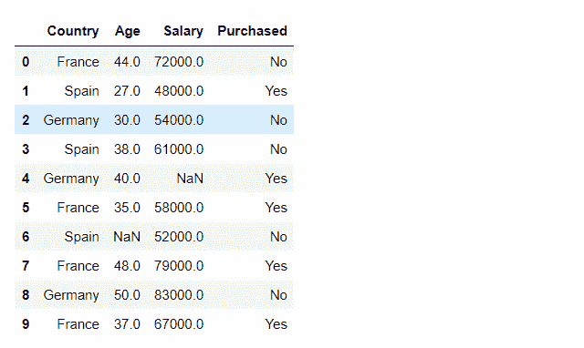
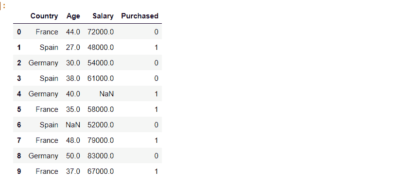

# 如何在 Python 中将分类字符串数据转换为数值？

> 原文:[https://www . geesforgeks . org/如何在 python 中将分类字符串数据转换为数字/](https://www.geeksforgeeks.org/how-to-convert-categorical-string-data-into-numeric-in-python/)

数据集具有数字和分类特征。分类特征指的是字符串数据类型，人类很容易理解。然而，机器不能直接解释分类数据。因此，分类数据必须转换成数字数据，以便进一步处理。

有许多方法可以将分类数据转换成数字数据。在本文中，我们将讨论两种最常用的方法，即:

*   虚拟变量编码
*   标签编码

在这两种方法中，我们使用相同的数据，到数据集的链接在这里是

## **方法 1:虚拟变量编码**

我们将使用[pandas . get _ dummes](https://www.geeksforgeeks.org/python-pandas-get_dummies-method/)函数将分类字符串数据转换为数字。

**语法:**

> pandas.get_dummies(数据，前缀=无，前缀 _sep='_ '，dummy _ na =假，列=无，稀疏=假，drop _ first =假，dtype =无)
> 
> **参数**:
> 
> *   **数据**:熊猫系列，或数据框
> *   **前缀**:字符串、字符串列表或字符串字典，默认为无。附加数据框列名的字符串
> *   **前缀 _sep** : str，默认' _ '。如果追加前缀，要使用的分隔符/分隔符。
> *   **dummy_na** : bool，默认 False。如果忽略假的国家/地区，则添加一列来指示国家/地区。
> *   **列**:列表式，默认无。要编码的数据帧中的列名。
> *   **稀疏** : bool，默认 False。伪编码列应该由稀疏数组(真)还是常规数组(假)支持。
> *   **drop_first** : bool，默认 False。是否通过移除第一个级别将 k-1 假人从 k 分类级别中移除。
> *   **数据类型**:数据类型，默认 np.uint8，指定新列的数据类型。
> 
> **返回**:数据帧

## 逐步实施

### 步骤 1:导入库

## 蟒蛇 3

```py
# importing pandas as pd
import pandas as pd
```

### 步骤 2:导入数据

## 蟒蛇 3

```py
# importing data using .read_csv() function
df = pd.read_csv('data.csv')

# printing DataFrame
df
```

**输出:**



### 步骤 3:将分类数据列转换为数字。

我们将把“已购买”列从分类数据类型转换为数字数据类型。

## 蟒蛇 3

```py
# using .get_dummies function to convert
# the categorical datatype to numerical
# and storing the returned dataFrame
# in a new variable df1
df1 = pd.get_dummies(df['Purchased'])

# using pd.concat to concatenate the dataframes
# df and df1 and storing the concatenated
# dataFrame in df.
df = pd.concat([df, df1], axis=1).reindex(df.index)

# removing the column 'Purchased' from df
# as it is of no use now.
df.drop('Purchased', axis=1, inplace=True)

# printing df
df
```

**输出:**


## 方法 2:标签编码

我们将使用**。LabelEncoder()** 从 **sklearn** 库中将分类数据转换为数字数据。我们将在这个过程中使用函数 fit_transform()。

**语法:**

> fit_transform(y)
> 
> **参数:**
> 
> *   y:形状的数组状(n_samples)。目标值。
> 
> **返回** **:** 形状的数组(n_samples)。编码标签。

## 逐步实施

### 步骤 1:导入库

## 蟒蛇 3

```py
# importing pandas as pd
import pandas as pd
```

### 步骤 2:导入数据

## 蟒蛇 3

```py
#importing data using .read_csv() function
df = pd.read_csv('data.csv')

#printing DataFrame
df
```

**输出:**


### 步骤 3:将分类数据列转换为数字。

我们将把“已购买”列从分类数据类型转换为数字数据类型。

## 蟒蛇 3

```py
# Importing LabelEncoder from Sklearn
# library from preprocessing Module.
from sklearn.preprocessing import LabelEncoder

# Creating a instance of label Encoder.
le = LabelEncoder()

# Using .fit_transform function to fit label
# encoder and return encoded label
label = le.fit_transform(df['Purchased'])

# printing label
label
```

**输出:**

```py
array([0, 1, 0, 0, 1, 1, 0, 1, 0, 1])
```

### 步骤 4:将标签数组附加到我们的数据帧

## 蟒蛇 3

```py
# removing the column 'Purchased' from df
# as it is of no use now.
df.drop("Purchased", axis=1, inplace=True)

# Appending the array to our dataFrame
# with column name 'Purchased'
df["Purchased"] = label

# printing Dataframe
df
```

**输出:**

