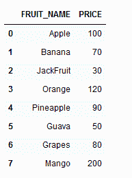

# 如何在 Python 中将 CSV 列转换为文本？

> 原文:[https://www . geesforgeks . org/how-convert-CSV-columns-to-text-in-python/](https://www.geeksforgeeks.org/how-to-convert-csv-columns-to-text-in-python/)

在本文中，我们将看到如何在 Python 中将 CSV 列转换为文本，我们还将看到如何将所有 CSV 列转换为文本。

**进场:**

*   阅读。使用熊猫数据帧的 CSV 文件。
*   使用 list()构造函数将特定列转换为列表
*   然后依次将列表中的每个元素转换为字符串，并使用特定的字符或空格将它们连接起来。

**对于我们的程序，我们将使用以下 CSV 文件:**



**代码:**

## 蟒蛇 3

```
# importing library
import pandas as pd

# Then loading csv file
df = pd.read_csv('datasets/Fruit.csv')

# converting ;FRUIT_NAME' column into list
a = list(df['FRUIT_NAME'])

# converting list into string and then joining it with space
b = ' '.join(str(e) for e in a)

# printing result
print(b)

# converting 'PRICE' column into list
d = list(df['PRICE'])

# another way for joining used
e = '\n'.join(map(str, d))

# printing result
print(e)
```

**输出:**

```
Apple Banana JackFruit Orange Pineapple Guava Grapes Mango

100
70
30
120
90
50
80
200
```

## 如何将所有 csv 列转换为文本？

为此，我们不需要导入任何库。

**代码:**

## 蟒蛇 3

```
# reading csv file
text = open("datasets/Fruit.csv", "r")

# joining with space content of text
text = ' '.join([i for i in text])  

# replacing ',' by space
text = text.replace(",", " ")  

#displaying result
print(text)
```

**输出:**

```
FRUIT_NAME PRICE
Apple 100
Banana 70
JackFruit 30
Orange 120
Pineapple 90
Guava 50
Grapes 80
Mango 200
```