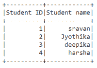
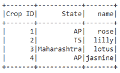

# 如何将字典列表转换成 Pyspark DataFrame？

> 原文:[https://www . geesforgeks . org/如何将字典列表转换为 pyspark-dataframe/](https://www.geeksforgeeks.org/how-to-convert-list-of-dictionaries-into-pyspark-dataframe/)

在本文中，我们将从字典列表中讨论 Pyspark 数据框的创建。

我们将在 createDataFrame()方法的帮助下，使用字典列表在 PySpark 中创建一个数据帧。数据属性采用字典列表，列属性采用名称列表。

> data frame = spark . createdata frame(数据，列)

**例 1:**

## 蟒蛇 3

```py
# importing module
import pyspark

# importing sparksession from
# pyspark.sql module
from pyspark.sql import SparkSession

# creating sparksession and giving
# an app name
spark = SparkSession.builder.appName('sparkdf').getOrCreate()

# list of dictionaries of students  data
data = [{"Student ID": 1, "Student name": "sravan"},
        {"Student ID": 2, "Student name": "Jyothika"},
        {"Student ID": 3, "Student name": "deepika"},
        {"Student ID": 4, "Student name": "harsha"}]

# creating a dataframe
dataframe = spark.createDataFrame(data)

# display dataframe
dataframe.show()
```

**输出:**



**例 2:**

## 蟒蛇 3

```py
# importing module
import pyspark

# importing sparksession from 
# pyspark.sql module
from pyspark.sql import SparkSession

# creating sparksession and giving 
# an app name
spark = SparkSession.builder.appName('sparkdf').getOrCreate()

# list of dictionaries of crop  data
data = [{"Crop ID": 1, "name": "rose", "State": "AP"},
        {"Crop ID": 2, "name": "lilly", "State": "TS"},
        {"Crop ID": 3, "name": "lotus", "State": "Maharashtra"},
        {"Crop ID": 4, "name": "jasmine", "State": "AP"}]

# creating a dataframe
dataframe = spark.createDataFrame(data)

# display dataframe
dataframe.show()
```

**输出:**



**例 3:**

## 蟒蛇 3

```py
# importing module
import pyspark

# importing sparksession from 
# pyspark.sql module
from pyspark.sql import SparkSession

# creating sparksession and giving 
# an app name
spark = SparkSession.builder.appName('sparkdf').getOrCreate()

# list of dictionaries of crop  data
data = [{"Crop ID": 1, "name": "rose", "State": "AP"},
        {"Crop ID": 2, "name": "lilly", "State": "TS"},
        {"Crop ID": 3, "name": "lotus", "State": "Maharashtra"},
        {"Crop ID": 4, "name": "jasmine", "State": "AP"}]

# creating a dataframe
dataframe = spark.createDataFrame(data)

# display dataframe count
dataframe.count()
```

**输出:**

```py
4
```