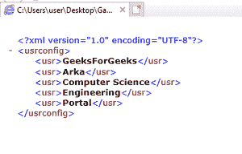
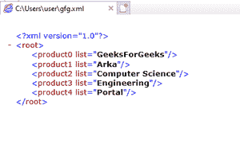

# 如何在 Python 中将列表转换成 XML？

> 原文:[https://www . geesforgeks . org/如何将列表转换为 python 中的 XML/](https://www.geeksforgeeks.org/how-to-convert-lists-to-xml-in-python/)

在本文中，任务是在 Python 中将给定的列表转换为 XML。但是首先，让我们讨论什么是 XML？

也可以是定义一组规则的术语，用于在人类可读和机器可读的格式中编码文档。XML 的设计目标专注于简单性、通用性和在网络上的实用性。它是一种文本格式，通过 Unicode 为各种人类语言提供了强大的支持。

更多信息可以参考文章[使用 Python](https://www.geeksforgeeks.org/create-xml-documents-using-python/) 创建 XML 文档。

**方法 1:使用元素树**

Python 有一个内置的库 ElementTree，它具有读取和操作 XMLs(以及其他类似结构的文件)的功能。元素树将整个 XML 文档表示为一棵树，在执行操作时有所帮助。元素表示此树中的单个节点。整个文档的读写都是在元素树级别完成的。与一个 XML 元素及其子元素的交互是在元素级别完成的。参考:[用 Python 修改 XML 文件](https://www.geeksforgeeks.org/modify-xml-files-with-python/)

```py
import xml.etree.ElementTree as ET
```

XML 文档有称为元素的部分，由开始和结束标记定义。标签是以< and ends with >开头的标记结构。

**采用的方法:**

1.  使用元素树插入列表项
2.  将根元素创建为“userconfig”
3.  创建子元素
4.  将列表条目插入子元素
5.  将树写入一个 XML 文件

## 蟒蛇 3

```py
# Firstly we have to import 'xml.etree.ElementTree' for creating a subtree
import xml.etree.ElementTree as ET

users_list = ["GeeksForGeeks", "Arka", "Computer Science", "Engineering", "Portal"]

def create_xml():

        # we make root element
        usrconfig = ET.Element("usrconfig")

        # create sub element
        usrconfig = ET.SubElement(usrconfig, "usrconfig")

        # insert list element into sub elements
        for user in range(len( users_list)):

                usr = ET.SubElement(usrconfig, "usr")
                usr.text = str(users_list[user])

        tree = ET.ElementTree(usrconfig)

        # write the tree into an XML file
        tree.write("Output.xml", encoding ='utf-8', xml_declaration = True)

create_xml()
```

***输出:***



**方法 2:** **使用 xml.dome**

xml.dom.minidom 模块为创建 dom 树提供了一个简单的解析器。DOM(文档对象模型)可以是来自 W3C，即万维网联盟的跨语言 API，用于访问和修改 XML 文档。Python 使您能够在 xml.dom.minidom 的帮助下解析 XML 文件，这是 dom 接口的最小实现。它比完整的 DOM API 更简单，将被视为更小。

要进一步参考给定的库，请访问[使用 Python 中的 Minidom 解析 XML](https://www.geeksforgeeks.org/parse-xml-using-minidom-in-python/)。

## 蟒蛇 3

```py
from xml.dom import minidom 
import os 

users_list = ["GeeksForGeeks", "Arka", "Computer Science", "Engineering", "Portal"]

# create file
root = minidom.Document() 

# creat root element
xml = root.createElement('root') 
root.appendChild(xml) 

for user in range(len( users_list)):

    # create child element
    productChild = root.createElement('product'+ str(user))

    # insert user data into element
    productChild.setAttribute('list', users_list[user] ) 
    xml.appendChild(productChild) 

xml_str = root.toprettyxml(indent ="\t") 

# save file
save_path_file = "gfg.xml"

with open(save_path_file, "w") as f: 
    f.write(xml_str) 
```

**输出:**

