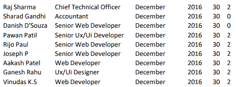
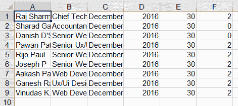
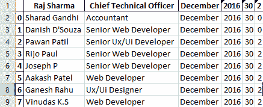

# 如何用 Python 将 PDF 文件转换成 Excel 文件？

> 原文:[https://www . geesforgeks . org/how-convert-pdf-file-to-excel-file-use-python/](https://www.geeksforgeeks.org/how-to-convert-pdf-file-to-excel-file-using-python/)

在本文中，我们将看到如何使用 Python 将 PDF 转换为 Excel 或 CSV 文件。它可以用各种方法来完成，下面是我们将要使用的一些方法。

**方法 1:使用 pdftables_api**

这里将使用 **pdftables_api** 模块将 PDF 文件转换为任何其他格式。这是一个简单的基于网络的 API，因此可以从任何编程语言中调用。

**安装:**

```py
pip install git+https://github.com/pdftables/python-pdftables-api.git
```

安装后，您需要一个应用编程接口密钥。前往[**【PDFTables.com】**](https://pdftables.com/)**注册，然后访问[**API 页面**](https://pdftables.com/pdf-to-excel-api) 查看你的 API KEY。**

**对于将 PDF 文件转换为 excel 文件，我们将使用 **xml()** 方法。**

****语法:****

```py
xml(pdf_path, xml_path)
```

****下面是实现:****

****使用的 PDF 文件:****

**

**PDF 文件**** 

## **蟒蛇 3**

```py
# Import Module
import pdftables_api

# API KEY VERIFICATION
conversion = pdftables_api.Client('API KEY')

# PDf to Excel 
# (Hello.pdf, Hello)
conversion.xlsx("pdf_file_path", "output_file_path")
```

****输出:****

**

**EXCEL 文件**** 

****方法二:用白板****

**这里将使用**白板**模块将 PDF 文件转换为任何其他格式。**

****安装:****

```py
pip install tabula-py
```

**在开始之前，首先我们需要安装 java，并在 PATH 变量中添加一个 java 安装文件夹。**

*   **安装 java [**点击这里**](https://www.oracle.com/in/java/technologies/javase-jre8-downloads.html)**
*   **将 java 安装文件夹**(C:\ Program Files(x86)\ Java \ JRE 1 . 8 . 0 _ 251 \ bin)**添加到环境路径变量中**

****进场:****

*   **使用 **read_pdf()** 方法读取 **PDF** 文件。**
*   **然后我们将使用**到 _excel()** 的方法将 PDF 文件转换成 Excel 文件。**

****语法:****

```py
read_pdf(PDF File Path, pages = Number of pages, **agrs)
```

****下面是实现:****

****使用的 PDF 文件:****

**

**PDF 文件**** 

## **蟒蛇 3**

```py
# Import Module 
import tabula

# Read PDF File
# this contain a list
df = tabula.read_pdf("PDF File Path", pages = 1)[0]

# Convert into Excel File
df.to_excel('Excel File Path')
```

****输出:****

**

**EXCEL 文件****