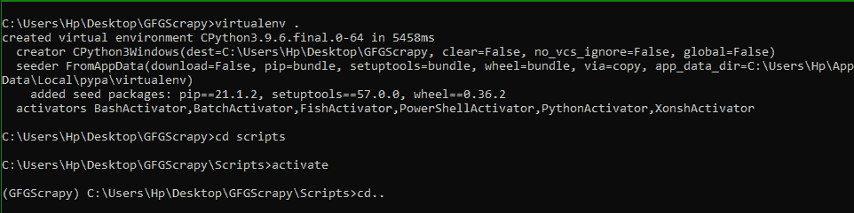
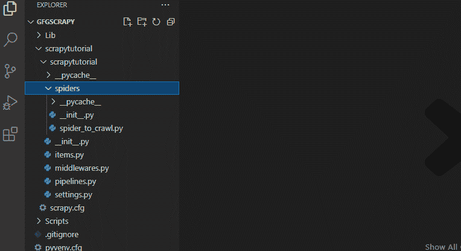
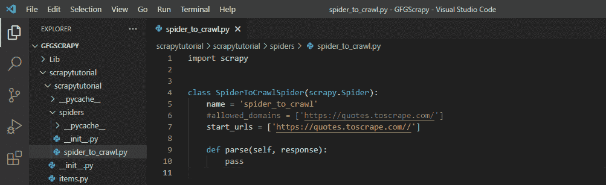
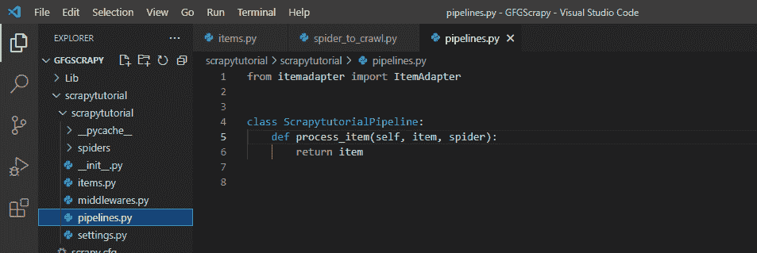
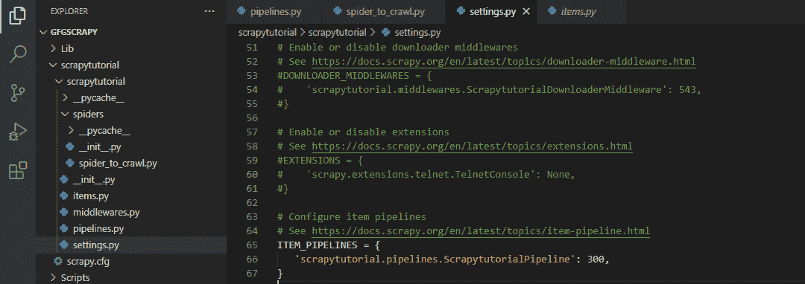
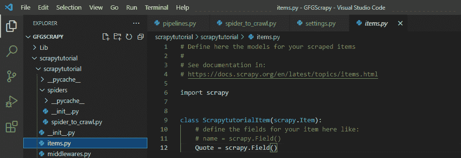
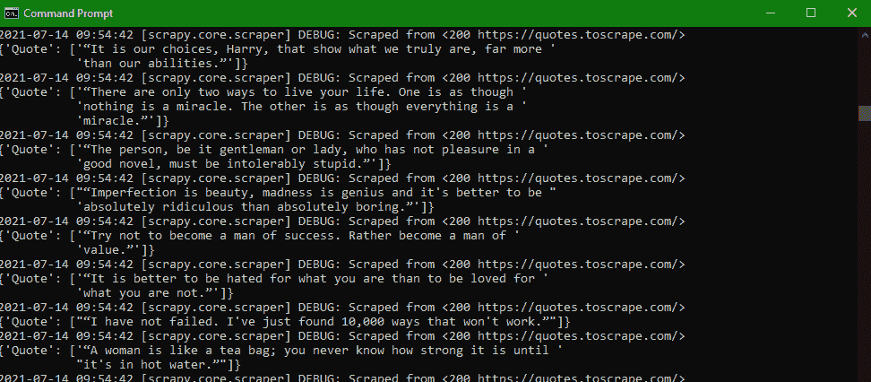
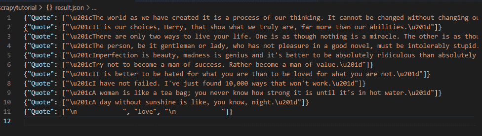

# 如何将剪贴簿项目转换为 JSON？

> 原文:[https://www . geesforgeks . org/how-convert-scrapy-item-to-JSON/](https://www.geeksforgeeks.org/how-to-convert-scrapy-item-to-json/)

**先决条件:**

*   [刺儿头](https://www.geeksforgeeks.org/implementing-web-scraping-python-scrapy/)
*   JSON

**Scrapy** 是一款用来收集网页数据的网页抓取工具，也可以用来修改和存储我们想要的任何形式的数据。每当数据被 scrapy 的蜘蛛抓取时，我们就把这些原始数据转换成 scarpy 的项目，然后我们会把这些项目传递给管道进行进一步的处理。在管道中，这些项目将被转换为 JSON 数据，我们可以打印它，也可以将其保存在另一个文件中。因此，我们可以从网络抓取的数据中检索 JSON 数据。

## **初始化目录和设置项目**

让我们首先创建一个零碎的项目。为此，请确保系统中安装了 Python 和 PIP。然后一个接一个地运行下面给出的命令，创建一个类似于我们将在本文中使用的项目。

*   让我们首先在名为 GFGScrapy 的文件夹中创建一个虚拟环境，并在那里激活该虚拟环境。

```
# To create a folder named GFGScrapy
mkdir GFGScrapy
cd GFGScrapy

# making virtual env there
virtualenv
cd scripts  

# activating it
activate
cd..
```

因此，在运行所有这些命令后，我们将获得如下所示的输出:



*   现在是时候创建一个项目了。为此，请确保系统中是否安装了 scrapy。如果没有安装，请使用下面给出的命令进行安装。

**语法:**

```
pip install scrapy
```

现在要创建一个剪贴簿项目，使用下面给出的命令，并创建一个蜘蛛。

> 剪贴簿开始项目剪贴簿//项目名称是剪贴簿
> 
> cd 剪贴簿
> 
> 刺儿头蜘蛛在 https://quotes.toscrape.com/爬行
> 
> //上面的链接提到了我们要抓取蜘蛛的网站。

一旦您使用 pip 安装程序创建了一个杂乱的项目，那么项目目录的输出看起来就像图像中给出的一样。(如果你想更多地了解一个剪贴簿项目并熟悉它，请参考这个)。



目录结构由以下路径组成(示例)

```
C://<project-name>/<project-name>
```

上图中**项目名称**为**剪贴簿**，里面有很多文件，如图所示。

我们感兴趣的文件是 **spider_to_crawl.py** 文件(在这里我们曾经描述了我们的蜘蛛的方法)和 **pipelines.py** 文件，在这里我们将描述处理我们的进一步数据处理的组件，这些数据处理是用抓取的数据完成的。简单来说，这个文件用于描述对数据进行进一步操作的方法。第三个最重要的文件是 **settings.py** 文件，我们将在其中注册我们的组件(在管道中创建，。py 文件)有序。下一个最重要的文件是 **items.py** 文件。该文件用于描述数据将从 spider_to_crawl 流向 pipelines.py 文件的形式或字典结构。在这里，我们将给出一些钥匙，这些钥匙将出现在每个项目中。

让我们看看蜘蛛文件夹中的文件。这是我们在其中编写我们的蜘蛛必须爬行的网址的文件，也是一个名为 parse()的方法，用于描述应该如何处理蜘蛛抓取的数据。

该文件由上面使用的 **scrapy genspider** 命令自动生成。该文件以蜘蛛的名字命名。下面给出的是生成的默认文件。



请注意，我们对上面的默认文件做了一些更改，即注释掉了 allowed _ domains 行，我们还对 strat _ urls 做了一些更改(删除了“ **http://** ”)。

## 将剪贴簿转换为 JSON

管道是一种方法，我们可以通过它来转换、修改或存储抓取的数据项。因此，让我们先来谈谈它的一些组件。

默认的管道. py 文件如下所示:



为了对项目执行不同的操作，我们必须声明一个独立的组件(文件中的类)，它由各种方法组成，用于执行操作。默认情况下，管道文件有一个以项目名称命名的类。我们还可以创建自己的类来编写它们必须执行的操作。

pipelines.py 文件的每个组件都由一个名为 **process_item()的默认方法组成。**

**语法:**

> process_item(自身、项目、蜘蛛):

该方法引入了三个变量，一个是对自身对象的引用，另一个是蜘蛛发送的抓取数据项，第三个是蜘蛛本身。此方法用于修改或存储蜘蛛抓取的数据项。我们必须提到的方式，如何收到的项目包是修改这种方法。

这是默认方法，总是在 pipelines.py 文件类中调用。

除此之外，我们还可以创建自己的方法，用于修改或对数据项进行其他更改。因此，由于我们必须将收集到的数据转换成 JSON 格式，所以我们需要一个组件(类)来完成我们各自的工作。但在此之前，我们必须完成两件主要的事情。

**1)** 首先，我们必须在我们的 **settings.py** 文件中注册管道组件的名称。语法如下。

**语法:**

> ITEM _ PIPELINES = {
> 
> my project . pipelines . component:
> 
> #许多其他组件
> 
> }

在这里，优先级数字是由 scrapy 调用组件的顺序。

因此，对于上述项目，将应用下面给出的格式。

> ITEM _ PIPELINES = {
> 
> scrapytutorial . pipelines . scrapytutorial pipeline ':300，
> 
> }

**2)** 我们必须执行的另一件事是声明项目的格式，我们必须使用该格式将数据传递给管道。为此，我们将使用我们的 **items.py** 文件。

下面给出的代码在我们的 **items.py** 文件中创建了一个带有一个名为“**Quote”**的关键变量的项目。然后我们必须在我们的 **spider_to_crawl.py** 文件中导入这个文件(如示例所示)。

## 蟒蛇 3

```
# Define here the models for your scraped items
#
# See documentation in:
# https://docs.scrapy.org/en/latest/topics/items.html

import scrapy

class ScrapytutorialItem(scrapy.Item):
    # define the fields for your item here like:
    # name = scrapy.Field()
    Quote = scrapy.Field()  # only one field that it of Quote.
```

上面的代码只用一个键创建项目，我们可以用多个键创建项目。

既然我们已经看到了如何在 pipelines.py 文件中实现组件，以及如何完成设置和声明项目。现在我们准备好了一个例子，在这个例子中，我们将把我们收集的数据项转换成 JSON 格式。为了转换 JSON 格式的数据，我们将使用 python 的 JSON 库及其[转储](https://www.geeksforgeeks.org/json-dump-in-python/)属性。我们的想法是将抓取的数据放入 pipelines.py 文件中，然后打开一个文件，将所有的 JSON 数据写入其中。所以方法命名为:

*   **当蜘蛛开始爬行时，会调用 open_spider()** 打开文件( **result.json** )。
*   **当 spider 关闭，刮除结束时，会调用 close_spider()** 关闭文件。
*   **process_item()** 将一直被调用(因为是默认的)，主要负责将数据转换为 JSON 格式，并将数据打印到文件中。我们将使用 python web 框架的概念，即它们如何将后端检索到的数据转换为 JSON 和其他格式。

因此，我们的**pipeline . py**中的代码看起来像:

## 蟒蛇 3

```
from itemadapter import ItemAdapter
import json  # Json package of python module.

class ScrapytutorialPipeline:
    def process_item(self, item, spider):  # default method
        # calling dumps to create json data.
        line = json.dumps(dict(item)) + "\n"
        # converting item to dict above, since dumps only intakes dict.
        self.file.write(line)                    # writing content in output file.
        return item

    def open_spider(self, spider):
        self.file = open('result.json', 'w')

    def close_spider(self, spider):
        self.file.close()
```

我们的蜘蛛看起来像

## 蟒蛇 3

```
import scrapy
from ..items import ScrapytutorialItem   

class SpiderToCrawlSpider(scrapy.Spider):
    name = 'spider_to_crawl'

    start_urls = ['https://quotes.toscrape.com/']

    def parse(self, response):

        # creating items dictionary
        items = ScrapytutorialItem()   
        Quotes_all = response.xpath('//div/div/div/span[1]')

        # These paths are based on the selectors

        for quote in Quotes_all: #extracting data
            items['Quote'] = quote.css('::text').extract()
            yield items
```

我们的**设置. py** 文件看起来像:



我们的**项目. py** 文件看起来像



在使用命令“**scrapy crawl spider _ to _ crawl**”后，下面给出的步骤将会发生。

*   由于创建了 result.json 文件，蜘蛛被爬网。现在蜘蛛抓取网页，收集 **Quotes_all** 变量中的数据。然后从变量中提取每个数据，并作为键值传递给文件中声明的项目，即**报价。**最后在产量中我们称 pipelines.py 文件为进一步处理。
*   我们在 **pipelines.py** 文件中从 spider 接收项目变量，然后使用 dumps 方法将其转换为 JSON，然后将输出写入打开的文件中。
*   文件被关闭，我们可以看到输出。



*   已创建 JSON 文件

**输出:**

