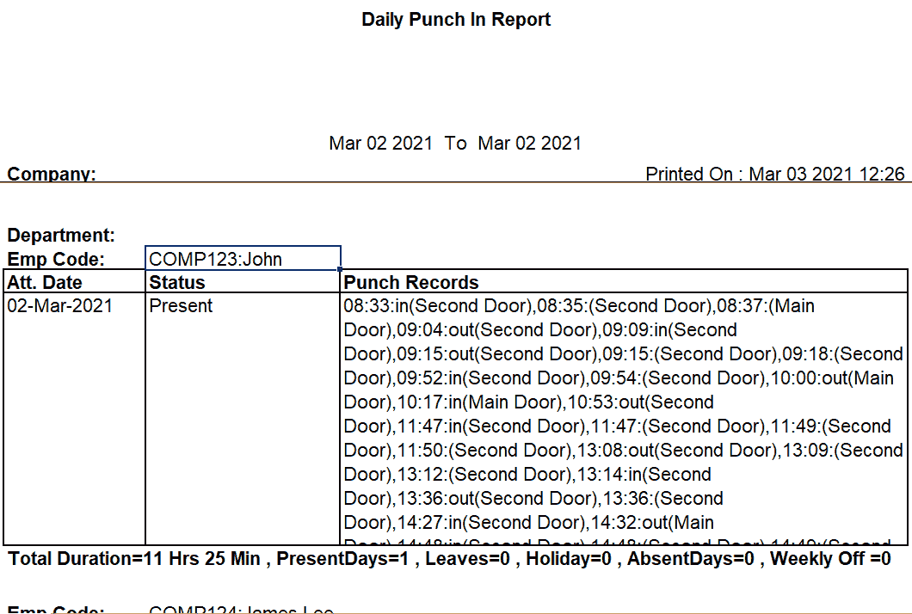
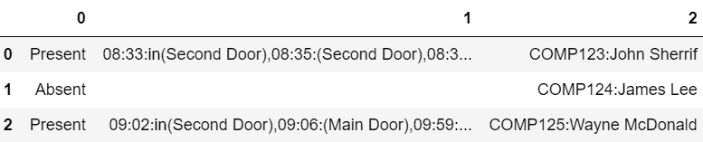
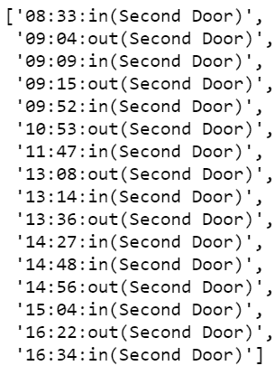
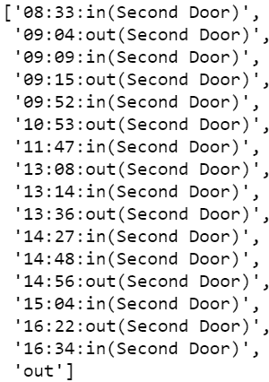
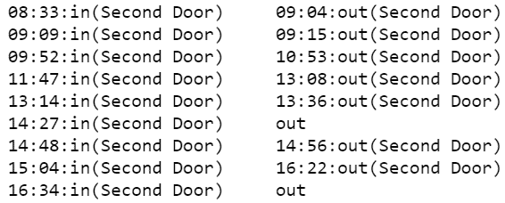
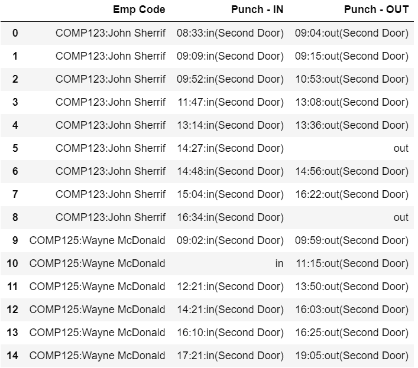

# 如何使用 Python 将非结构化数据转换为结构化数据？

> 原文:[https://www . geesforgeks . org/如何使用 python 将非结构化数据转换为结构化数据/](https://www.geeksforgeeks.org/how-to-convert-unstructured-data-to-structured-data-using-python/)

**先决条件:** [什么是非结构化数据？](https://www.geeksforgeeks.org/what-is-unstructured-data/)

有时机器以不太容易解释的非结构化方式生成数据。例如，生物识别数据，其中一名员工因错误而多次打卡或打卡。除非是表格形式，否则我们无法分析数据并找出错误。在本文中，我们将采用非结构化生物特征数据，并将其转换为表格形式的有用信息。

### 数据集:

在这里，我们将使用每日打卡报告。数据如下。为主门和第二门捕获的打孔记录。正门为室外门，二门为项目室门。我们需要确定哪个员工在项目室或第二门花了多少时间。我们要使用的数据集是 [Bio.xlsx](https://github.com/SuryaSD/Handling-Unstructured-Data-in-Python-Biometric-Data/blob/main/bio.xlsx) :



这是约翰·谢里夫的生物识别数据，他给出了主门和第二门的打卡记录。

<figure class="table">

| **部门:** |
| --- |
| 电磁脉冲代码:康普 123:约翰·谢里夫 |
| **Att。日期〔t1〕** | **状态** | **打卡记录** |
| 2021 年 3 月 2 日 | 礼物 | 08:33:入(二门)，08:35:(二门)，08:37:(正门)，09:04:出(二门)，09:09:入(二门)，09:15:出(二门)，09:15:(二门)，09:18:(二门)，09:52:入(二门)，09:54:(二门)，10:00:出(正门)，10:17:入(正门)，10:53:出(二门)，11:47:入(二门)，11:47:(二门)，11:49:(二门)，11:50:(二门)，13:08:出(二门)，13:09:(二门)，13:12:(二门)，13:14:进(二门)，13:36:出(二门)，13:36:(二门)，14:27:进(二门)，14:32:出(正门)，14:48:进(二门)，14:48:(二门)，14:49:(二门)，14:52:(正门)，14:56:出(二门)，

14:57:(第二门)，14:59:(第二门)，15:04:进(第二门)，16:22:出(第二门)，16:34:进(第二门)，19:58:出去(正门)， |

</figure>

以上数据分析起来并不深刻。我们期望的输出是:

<figure class="table">

| **电磁脉冲代码** | **打卡进入** | **打卡退出** |
| --- | --- | --- |
| 治安官 | 08:33:in(第二门) | 09:04:外出(第二门) |
| 治安官 | 09:09:in(第二门) | 09:15:出去(第二道门) |
| 治安官 | 09:52:in(第二门) | 10:53:出去(第二道门) |
| 治安官 | 11:47:in(第二门) | 13:08:出去(第二道门) |
| 治安官 | 13:14:in(第二门) | 13:36:出去(第二道门) |
| 治安官 | 14:27:in(第二门) | 在外 |
| 治安官 | 14:48:in(第二门) | 14:56:出去(第二道门) |
| 治安官 | 15:04:in(第二门) | 16:22:出去(第二道门) |
| 治安官 | 16:34:in(第二门) | 在外 |

</figure>

**了解数据:**约翰·舍里夫第一次打卡是 08:33，第一次打卡是 09:04。约翰在 14:27 打卡上班，但忘了打卡下班。“进”表示他/她忘记打卡，“出”表示他/她忘记打卡。

### 实施:

*   数据清理&为状态、打孔代码和电磁脉冲代码创建表格。

## 蟒蛇 3

```
import pandas as pd

# load data
df = pd.read_excel('bio.xlsx')

# removing NA values from the
# dataframe df
df = df.fillna("")

# removing all the blank rows
df1 = df.dropna(how='all')

# picking the rows where present
# or absent values are there from
# 14 no column
df1 = df1[df1['Unnamed: 14'].str.contains('sent')]

# Extracting only the Employee
# Names
df_name = df.dropna(how='all')

# from column no 3 we are picking
# Employee names
df_name = df_name[df_name['Unnamed: 3'].str.contains('Employee')]

# creating a new dataframe for Status,
# Punch Records and Employee Codes
zippedList = list(
    zip(df1['Unnamed: 14'], df1['Unnamed: 15'], df_name['Unnamed: 7']))

abc = pd.DataFrame(zippedList)
abc.head()
```

**输出:**



*   仅提取第二门的数据。

## 蟒蛇 3

```
# Splitting the values by comma in 1
# no column (punch records)
for i in range(len(abc)):
    abc[1][i] = abc[1][i].split(",")

second_door = []

for i in range(len(abc)):
    s_d = []

    # Extracting all the values which contains
    # only :in(Second Door) or :out(Second Dorr)
    for j in range(len(abc[1][i])):
        if ':in(Second Door)' in abc[1][i][j]:
            s_d.append(abc[1][i][j])

        if 'out(Second Door)' in abc[1][i][j]:
            s_d.append(abc[1][i][j])

    second_door.append(s_d)
(second_door[0])
```

**输出:**



*   打孔记录应以“输入”开始，以“输出”结束。如果它不遵循，就创建模式。

## 蟒蛇 3

```
# Punch Records should start with
# the keyword 'in'. If it doesn't
# follow then we wil add 'in' and it
# significants that the employee forgot
# to do punch in
in_time = []
for i in range(len(second_door)):
    try:
        if ':in(Second Door)' not in second_door[i][0]:
            second_door[i].insert(0, 'in')

    except:
        pass

# Punch Records should end with the keyword
# 'out'. If it doesn't follow then we wil
# add 'out' and it  significants that the
# employee forgot to do punch out
out_time = []
for i in range(len(second_door)):
    try:

        if ':out(Second Door)' not in second_door[i][(len(second_door[i]))-1]:
            second_door[i].insert(((len(second_door[i]))), 'out')
    except:
        pass
second_door[0]
```

**输出:**



*   创建“进-出-进-出”模式…..-出去。如果有人忘记打卡，我们就输入，如果有人忘记打卡，我们就输出。

## 蟒蛇 3

```
# final_in contains PUNCH - IN
# records for all employees
final_in = []

# final_out contains PUNCH - OUT
# records for all employees
final_out = []

for k in range(len(second_door)):
    in_gate = []
    out_gate = []

    # even position should be for Punch-
    # IN and odd position should be for
    # Punch - OUT if it doesn't follow
    # then we will create the pattern by
    # putting 'in' or 'out'
    for i in range(len(second_door[k])):
        if i % 2 == 0 and 'in' in second_door[k][i]:
            in_gate.append(second_door[k][i])
            try:
                if 'out' not in second_door[k][i+1]:
                    out_gate.append('out')
            except:
                pass
        if i % 2 != 0 and 'out' in second_door[k][i]:
            out_gate.append(second_door[k][i])
            try:
                if 'in' not in second_door[k][i+1]:
                    in_gate.append('in')
            except:
                pass
        if i % 2 != 0 and 'in' in second_door[k][i]:
            in_gate.append(second_door[k][i])

            try:
                if 'out' not in second_door[k][i+1]:
                    out_gate.append('out')
            except:
                pass

        if i % 2 == 0 and 'out' in second_door[k][i]:
            out_gate.append(second_door[k][i])

            try:
                if 'in' not in second_door[k][i+1]:
                    in_gate.append('in')
            except:
                pass
    final_in.append(in_gate)
    final_out.append(out_gate)

# final_in or final_out keep the
# records as a list under list form.
# to solve the problem we will merge the list

# aa contains merged list of Punch - IN
aa = final_in[0]
for i in range(len(final_in)-1):
    aa = aa + final_in[i+1]

# bb contains merged list of Punch - OUT
bb = final_out[0]
for i in range(len(final_out)-1):
    bb = bb + final_out[i+1]

for i in range(len(final_in[0])):
    print(final_in[0][i], '   ', final_out[0][i])
```

**输出:**



*   创建最终表格。

## 计算机编程语言

```
# Creating a dataframe called df_final
df_final = []
df_final = pd.DataFrame(df_final)

# Merging the Employee Names
Name = []
for i in range(len(abc)):
    for j in range(len(final_in[i])):
        Name.append(abc[2][i])
df_final['Name'] = Name

# Zipping the Employee Name, Punch -IN
# records and Punch - OUT records
zippedList2 = list(zip(df_final['Name'], aa, bb))
abc2 = pd.DataFrame(zippedList2)

# Renaming the dataframe
abc2.columns = ['Emp Code', 'Punch - IN', 'Punch - OUT']
abc2.to_excel('output.xlsx', index=False)

# Print the table
display(abc2)
```

**输出:**



因此，原始生物测定数据已经被结构化并被转换成有用的信息。