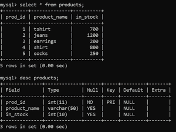
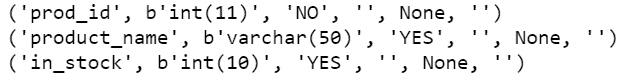

# 如何用 Python 在 MySQL 中复制一个表定义？

> 原文:[https://www . geeksforgeeks . org/如何使用 python 复制 mysql 中的表定义/](https://www.geeksforgeeks.org/how-to-copy-a-table-definition-in-mysql-using-python/)

Python 需要一个接口来访问数据库服务器。Python 支持多种接口与各种数据库交互。为了与 MySQL 数据库通信，使用了 [MySQL 连接器 Python](https://www.geeksforgeeks.org/mysql-connector-python-module-in-python/) 模块，这是一个纯粹用 Python 编写的应用编程接口。这个模块是自给自足的，这意味着它没有依赖关系，只需要标准的 Python 库。

#### 在 SQL 中复制表定义:

使用 CREATE 和 SELECT 语句，可以将现有表中的定义和数据复制到新表中。

**语法:**

```
CREATE TABLE new_table AS 
SELECT * FROM original_table;
```

这里，现有表(original_table)的内容被复制到新表(new_table)中。CREATE 语句创建一个具有 SELECT 语句定义的结构的新表，并用选定的列填充新表(*表示所有列都已选定)。

**注意:**与原始表关联的数据库对象，如索引、键约束等。，不重复。

要复制一个表及其相关的数据库对象，需要使用 CREATE、LIKE 和 INSERT 语句。

**语法:**

```
CREATE TABLE new_table 
LIKE original_table;

INSERT new_table 
SELECT * FROM original_table;
```

首先，CREATE 语句创建一个新表( *new_table* )，该表具有与现有表( *original_table* )相同的结构和从属对象。然后，INSERT 语句用从原始表中选择的值填充新表。只使用 CREATE 语句而不使用 INSERT，将创建一个空表，该表具有现有表的结构和相关对象。

#### **使用 Python 的步骤:**

1.  与数据库服务器建立连接并创建一个游标对象。
2.  使用游标对象执行 CREATE-SELECT 或 CREATE-LIKE-INSERT 语句来复制表。
3.  检查表定义是否已被复制。

让我们看一些例子，以便更好地理解。

**正在使用的数据库:**



我们将使用一个*商店*数据库，其中有一个*产品*表，描述产品和可用库存。

**示例 1:** 使用 CREATE-SELECT 语句复制表定义

使用 *connect()* 功能建立与数据库服务器的连接，使用 cursor() 功能创建一个 cursor 对象。使用此光标对象，执行 CREATE-SELECT 语句，使用 *execute()* 功能创建*产品*表新*库存*表的副本。要检查新创建的表是否具有与原始表相同的表定义，请使用 DESC 语句描述结构，并使用 SELECT 语句检查表内容。

## 计算机编程语言

```
# Import required packages
import mysql.connector

# Establish connection to MySQL database
db = mysql.connector.connect(
    host = "localhost",
    user = "username",
    password = "geeksforgeeks",
    database = "store"
)

# Create a cursor object
cursor = db.cursor()

# MySQL query for copying existing table,
# selecting new table data and
# describing new table structure
queries = "CREATE TABLE inventory1 AS SELECT * FROM products;\
           DESC inventory1;"

# Execute the query 
results = cursor.execute(queries, multi = True)

# Print data and description of newly created table
for result in results:
    if result.with_rows:
        for row in result:
            print(row)

# Close database connection
db.close()
```

**输出:**



所有来自*产品*表的数值都被复制到*库存*表中。结构，即数据类型和列被保留。但是，不保留像 *prod_id* 的主键约束这样的数据库对象。

**示例 2:** 使用 CREATE-SELECT 语句复制没有表内容的表定义

使用与上述示例相同的代码来建立连接和验证。要简单地复制表定义而不是内容，请在 SELECT 语句中添加一个 WHERE 子句，这样它将返回一个空集合，并且不会复制任何值，如下所示。

## 计算机编程语言

```
# Import required packages
import mysql.connector

# Establish connection to MySQL database
db = mysql.connector.connect(
    host="localhost",
    user="username",
    password="geeksforgeeks",
    database="store"
)

# Create a cursor object
cursor = db.cursor()

# MySQL queries for copying existing table
# without copying its data,
# selecting new table data and
# describing new table structure
queries = "CREATE TABLE inventory2 AS \
           SELECT * FROM products \
           WHERE 1=0; \
           DESC inventory2;"

# Execute the query
results = cursor.execute(queries, multi=True)

# Print data and description of newly created table
for result in results:
    if result.with_rows:
        for row in result:
            print(row)

# Close database connection
db.close()
```