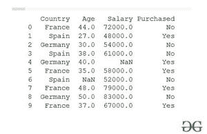
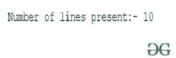

# 如何在 Python 中统计一个 CSV 文件的行数？

> 原文:[https://www . geesforgeks . org/如何计算 python 中的 csv 文件行数/](https://www.geeksforgeeks.org/how-to-count-the-number-of-lines-in-a-csv-file-in-python/)

**CSV** (逗号分隔值)是一个简单的文件  格式用于存储表格数据，如电子表格或数据库。CSV 文件以纯文本形式存储表格数据(数字和文本)。文件的每一行都是数据记录。每条记录由一个或多个字段组成，用逗号分隔。使用逗号作为字段分隔符是这种文件格式的名称来源。

在本文中，我们将讨论使用 Python 计算 CSV 文件行数的各种方法。

我们将使用下面的[数据集](https://drive.google.com/file/d/13913tIUQW78o4Rs4sgvtACnCvFhtspYk/view?usp=sharing)来执行所有操作:

## 蟒蛇 3

```
# import module
import pandas as pd

# read the csv file
results = pd.read_csv('Data.csv')

# display dataset
print(results)
```

**输出:**



为了计算 CSV 文件中的行数，我们有两种不同类型的方法:

*   使用 *len()* 功能。
*   使用计数器。

### **使用** ***len()*** **功能**

在这种方法下，我们需要使用 pandas 库读取 CSV 文件，然后对导入的 CSV 文件使用 *len()* 函数，该函数将返回 CSV 文件中存在的若干行/行的 *int* 值。

## 蟒蛇 3

```
# import module
import pandas as pd

# read CSV file
results = pd.read_csv('Data.csv')

# count no. of lines
print("Number of lines present:-", 
      len(results))
```

**输出:**



### **使用计数器**

在这种方法下，我们将在开始时将整数*行数*初始化为-1(而不是 0，因为迭代将从标题而不是第一行开始)，并迭代整个文件，并将*行数*增加 1。最后，我们将打印*行数*值。

## 蟒蛇 3

```
#Setting initial value of the counter to zero
rowcount  = 0
#iterating through the whole file
for row in open("Data.csv"):
  rowcount+= 1
 #printing the result
print("Number of lines present:-", rowcount)
```

**输出:**

