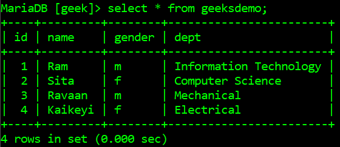
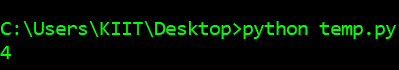
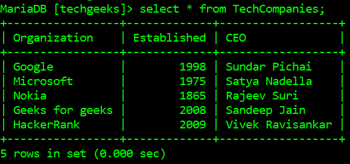
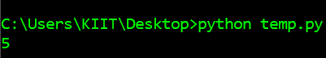

# 如何用 Python 统计一个 MySQL 表的行数？

> 原文:[https://www . geesforgeks . org/如何计算 python 中 mysql 表的行数/](https://www.geeksforgeeks.org/how-to-count-the-number-of-rows-in-a-mysql-table-in-python/)

MySQL 服务器是一个开源的关系数据库管理系统，是对基于网络的应用程序的主要支持。数据库和相关表格是许多网站和应用程序的主要组成部分，因为数据是通过网络存储和交换的。为了从网络服务器访问 MySQL 数据库，我们使用 Python 中的各种模块，如 PyMySQL、mysql.connector 等。

在本文中，我们将获取数据库中特定 MySQL 表的行数。首先，我们将连接到一个包含 MySQL 表的数据库。将要使用的 SQL 查询是:

```
*SELECT * FROM table-name*

```

*A* nd 最后，显示表格中的行数。

**下面是一些描述如何计算数据库中 MySQL 表行数的程序:**

**例 1**

下面是数据库*极客*中的表*极客数据库*，它将被 Python 脚本访问:



下面是获取 MySQL 表中行数的程序:

## 蟒蛇 3

```
# import required modules
import pymysql
pymysql.install_as_MySQLdb()
import MySQLdb

# connect python with mysql with your hostname, 
# username, password and database
db= MySQLdb.connect("localhost", "root", "", "geek")

# get cursor object
cursor= db.cursor()

# get number of rows in a table and give your table
# name in the query
number_of_rows = cursor.execute("SELECT * FROM geeksdemo")

# print the number of rows
print(number_of_rows)
```

**输出:**



**例 2:**

下面是从给定数据库的表中获取行数的另一个示例，下面是表方案和行数:



下面是从表*中获取行数的 python 脚本:*

## 蟒蛇 3

```
# import required modules
import pymysql
pymysql.install_as_MySQLdb()
import MySQLdb

# connect python with mysql with your hostname, 
# username, password and database
db= MySQLdb.connect("localhost", "root", "", "techgeeks")

# get cursor object
cursor= db.cursor()

# get number of rows in a table and give your table
# name in the query
number_of_rows = cursor.execute("SELECT * FROM techcompanies")

# print the number of rows
print(number_of_rows)
```

**输出:**

