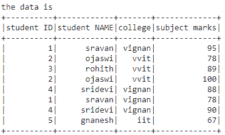

# 如何统计 PySpark 数据框中 groupBy 后的唯一 ID？

> 原文:[https://www . geesforgeks . org/how-count-unique-id-after-group by-in-pyspark-data frame/](https://www.geeksforgeeks.org/how-to-count-unique-id-after-groupby-in-pyspark-dataframe/)

在本文中，我们将讨论如何在 PySpark Dataframe 中对分组后的唯一 ID 进行计数。

**为此，我们将使用两种不同的方法:**

*   使用 distinct()。count()方法。
*   使用 SQL 查询。

但首先，让我们创建数据框架进行演示:

## 蟒蛇 3

```py
# importing module
import pyspark

# importing sparksession from pyspark.sql
# module
from pyspark.sql import SparkSession

# creating sparksession and giving an app name
spark = SparkSession.builder.appName('sparkdf').getOrCreate()

# list  of students  data
data = [["1", "sravan", "vignan", 95],
        ["2", "ojaswi", "vvit", 78],
        ["3", "rohith", "vvit", 89],
        ["2", "ojaswi", "vvit", 100],
        ["4", "sridevi", "vignan", 88],
        ["1", "sravan", "vignan", 78],
        ["4", "sridevi", "vignan", 90],
        ["5", "gnanesh", "iit", 67]]

# specify column names
columns = ['student ID', 'student NAME',
           'college', 'subject marks']

# creating a dataframe from the lists of data
dataframe = spark.createDataFrame(data, columns)

print("the data is ")
dataframe.show()
```

**输出:**



**方法 1 :** 使用 groupBy()和 distinct()。count()方法

**groupBy():** 用于根据列名对数据进行分组

> **语法:**data frame = data frame . group by(' column _ name 1 ')。sum('列名 2 ')

**截然不同的()。count():** 用于计数和显示数据框中的不同行

> **语法:** dataframe.distinct()。计数()

**例 1:**

## 蟒蛇 3

```py
# group by studentID by marks 
dataframe = dataframe.groupBy(
  'student ID').sum('subject marks')

# display count of unique ID
print("Unique ID count after Group By : ",
      dataframe.distinct().count())

print("the data is ")

# display  values  of unique ID
dataframe.distinct().show()
```

**输出:**

```py
Unique ID count after Group By :  5
the data is 
+----------+------------------+
|student ID|sum(subject marks)|
+----------+------------------+
|         3|                89|
|         5|                67|
|         1|               173|
|         4|               178|
|         2|               178|
+----------+------------------+
```

**示例 2:** 计数并显示单个列的唯一标识:

## 蟒蛇 3

```py
# group by studentID by marks 
dataframe = dataframe.groupBy(
  'student ID').sum('subject marks')

# display count of unique ID
print("Unique ID count after Group By : ",
      dataframe.distinct().count())

print("the data is ")

# display  values  of unique ID
dataframe.select('student ID').distinct().show()
```

**输出:**

```py
Unique ID count after Group By :  5
the data is 
+----------+
|student ID|
+----------+
|         3|
|         5|
|         1|
|         4|
|         2|
+----------+
```

**方法二:**使用 SQL 查询

我们可以通过使用 spark.sql 获得一个唯一的 ID 计数

**语法**:

> spark . SQL(“SQL 查询”)。显示()

## 蟒蛇 3

```py
# importing module
import pyspark

# importing sparksession from pyspark.sql 
# module
from pyspark.sql import SparkSession

# creating sparksession and giving an app name
spark = SparkSession.builder.appName('sparkdf').getOrCreate()

# list  of students  data
data = [["1", "sravan", "vignan", 95],
        ["2", "ojaswi", "vvit", 78],
        ["3", "rohith", "vvit", 89],
        ["2", "ojaswi", "vvit", 100],
        ["4", "sridevi", "vignan", 88],
        ["1", "sravan", "vignan", 78],
        ["4", "sridevi", "vignan", 90],
        ["5", "gnanesh", "iit", 67]]

# specify column names
columns = ['student ID', 'student NAME',
           'college', 'subject marks']

# creating a dataframe from the lists of data
dataframe = spark.createDataFrame(data, columns)

# group by studentID by marks
dataframe = dataframe.groupBy('student ID').sum('subject marks')

# create view for the ablve dataframe and
# view name is "DATA"
dataframe.createOrReplaceTempView("DATA")

# count unique data with sql query
spark.sql("SELECT DISTINCT(COUNT('student ID'))  \
FROM DATA GROUP BY 'subject marks'").show()
```

**输出:**

```py
+-----------------+
|count(student ID)|
+-----------------+
|                5|
+-----------------+
```