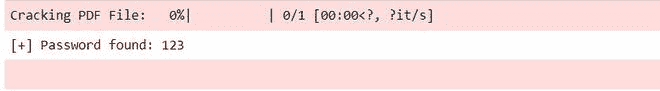

# 如何破解 Python 中的 PDF 文件？

> 原文:[https://www . geesforgeks . org/how-破解-pdf-files-in-python/](https://www.geeksforgeeks.org/how-to-crack-pdf-files-in-python/)

**先决条件:** [**tqdm**](https://www.geeksforgeeks.org/python-create-progress-bar-using-tqdm-module/)

在本文中，我们将学习如何使用 Python 破解受保护的 PDF 文件。这里我们将使用蛮力方法，使用 Python 中的**pikedf**模块破解一个 PDF 文件。

**所需模块:**

*   **pikepdf** 是一个 Python 模块，用于创建、操作和修复 pdf 文件。

```py
pip install pikepdf
```

*   **tqdm** 是 python 中进度条的更全面的包之一，对于那些您想要构建脚本以让用户了解您的应用程序状态的情况来说非常方便。

```py
pip install tqdm
```

我们不会为此使用 **pikepdf** ，我们只需要打开受密码保护的 pdf 文件，如果成功，这意味着它是一个正确的密码，否则它将引发密码错误异常。

**了解分步实施:**

*   这里我们将使用一个包含密码列表的文本文件，获取它[这里](https://github.com/x4nth055/pythoncode-tutorials/blob/master/ethical-hacking/pdf-cracker/wordlist.txt)。
*   我们将遍历所有密码列表，并尝试用每个密码打开文件，绕过 **open()** 方法的**密码**参数，如果密码不匹配，将引发 PasswordError。
*   最后一步是进度，比如还剩多少字，为了展示进度我们就用 **tqdm** 模块。

**以下是完整实现:**

## 蟒蛇 3

```py
# Import Required Module
import pikepdf
from tqdm import tqdm

# Empty password list
passwords = []

# Contain passwords in text file
password_text_file = "Password Text File"

# Iterate through each line
# and store in passwords list
for line in open(password_text_file):
    passwords.append(line.strip())

# iterate over passwords
for password in tqdm(passwords, "Cracking PDF File"):
    try:

        # open PDF file and check each password
        with pikepdf.open("Protected PDF File",
                          password = password) as p:

            # If password is correct, break the loop
            print("[+] Password found:", password)
            break

    # If password will not match, it will raise PasswordError
    except pikepdf._qpdf.PasswordError as e:

        # if password is wrong, continue the loop
        continue
```

**输出:**

