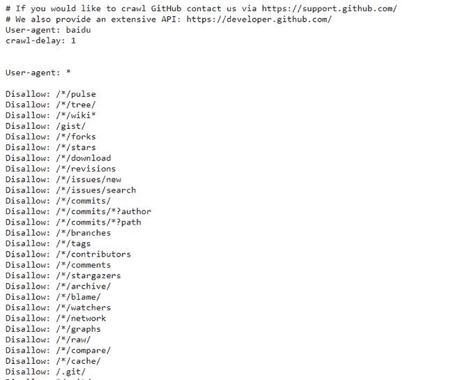
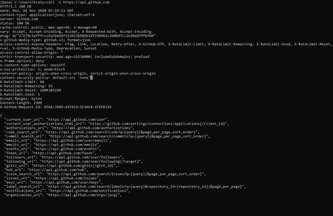
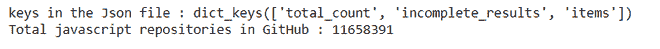
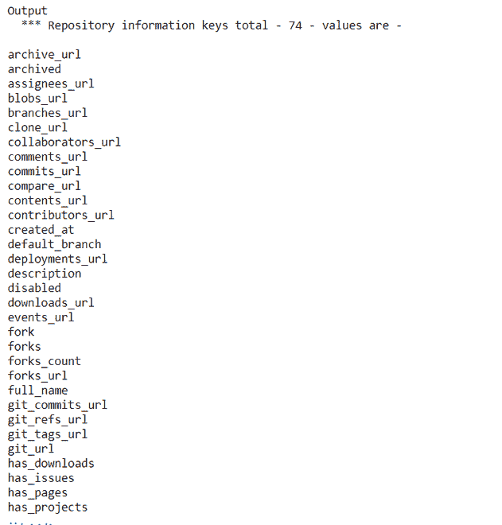
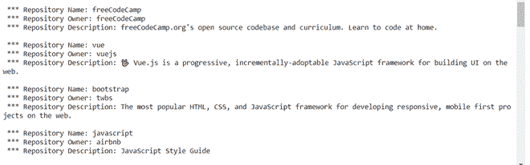

# 如何使用 Python 创建条形图并保存在 pptx 中？

> 原文:[https://www . geeksforgeeks . org/如何使用 python 创建条形图并保存在 pptx 中/](https://www.geeksforgeeks.org/how-to-create-a-bar-chart-and-save-in-pptx-using-python/)

万维网拥有大量的可用数据，这些数据在数量和形式上都在持续增长。Python API 允许我们从万维网上收集感兴趣的数据/信息。API 对于数据科学家、web 开发人员，甚至任何想要通过编程来查找和提取信息的普通人来说，都是一个非常有用的工具。

### **API vs 网页抓取**

大多数网站都提供了以结构化格式共享数据的应用编程接口，但是，它们通常会限制可用的数据，并且可能会限制数据的访问频率。此外，网站开发人员可能会更改、删除或限制后端应用编程接口。

另一方面，有些网站不提供共享数据的应用编程接口。网站开发团队可以随时更改、删除或限制后端 API。简而言之，我们不能依赖 API 来访问我们可能想要的在线数据。因此，我们可能需要依靠刮网技术。

### **Python 版**

说到有效的 API，Python 通常是首选的编程语言。对于许多任务来说，使用一种拥有非常丰富的工具生态系统的编程语言是很容易的。如果你用其他语言编程，你会发现学习 Python 很容易，而且你可能永远不会回去。

Python 软件基金会已经宣布 Python 2 将在 2020 年逐步停止开发和支持。为此，我们将通过帖子使用 Python 3 和 Jupyter 笔记本。更具体地说，我的 python 版本是:

## 蟒蛇 3

```py
from platform import python_version

print(python_version())
```

**Output**

```py
3.6.10
```

### **目标网站结构**

在试图通过应用编程接口或网络爬行访问网站内容之前，我们应该始终了解目标网站的结构。网站的网站地图和 robots.txt 除了像谷歌搜索和世界卫生组织这样的外部工具之外，还能帮助我们获得一些重要的信息。

### **验证 robots.txt 文件**

嗯，网站(大部分)定义了一个 robots.txt 文件，当用户访问他们的网站时，会注意到这些限制。然而，这些限制只是指导方针，强烈建议遵守它们的指导方针。您应该始终验证和尊重 robots.txt 内部的内容，以了解网站的结构并最大限度地减少被阻止的机会。

在决定编写网络爬虫程序或使用应用编程接口之前，robots.txt 文件是一个有价值的验证资源。

### **理解问题**

在这篇文章中，现在从以 Github 闻名的脸书开发者那里收集具有最高星级的 JavaScript 库，所以让我首先签出他们的 robots.txt 文件。

以下内容(仅前几行)来自网站的 robots.txt 文件–[https://github.com/robots.txt](https://github.com/robots.txt)。



从文件中可以清楚地看到，Github 希望使用一个 API 来使用它的内容。解决我们的问题的一种方法是将我们的搜索标准放在 Github 搜索框中，然后按回车键，然而，这是一个手动活动。

有益的是，Github 将这种搜索功能公开为我们可以从自己的应用程序中使用的 API。Github 的搜索 API 让我们可以访问内置的搜索功能。这包括使用逻辑运算符和范围运算符，如“or”和“user”。

在我们进入代码之前，您应该了解一些关于公共存储库、私有存储库和访问限制的知识。公共存储库通常对公众开放，没有任何限制，而私有存储库只限于所有者和他们选择的合作者。

**第 1 步:**用 cURL 验证。

现在，让我们先快速验证对 Github 的访问，然后再努力编写一个应用编程接口。因此，要做到这一点，一个简单的命令行 HTTP 工具 cURL 是一个完美的选择。cURL 通常安装在大多数 Linux 机器上，如果没有，您可以使用轻松完成。–***百胜安装收拢***

对于 windows，从“[https://curl.haxx.se/download.html](https://curl.haxx.se/download.html)获取一份副本。

现在运行如下所示的命令:



> cURL 给了我们很多信息:
> 
> 1.  ***HTTP/1.1 200 OK***–代码当您的请求目的地网址和相关参数正确时，GitHub 将以 200 状态响应(成功)。
> 2.  ***【X-Rate Limit-Limit】***–每小时允许的最大请求数。
> 3.  ***X-速率限制-剩余***–当前速率限制窗口中剩余的请求数量。
> 4.  ***X-限速-重置***–当前限速窗口重置的时间，以世界协调时纪元秒为单位。
> 5.  “***repository _ search _ URL***”:这是我们将在这篇文章中用来查询存储库的一个。

**第二步:**认证

通常，在向 Github API 发出请求时，有两种方法可以进行身份验证——使用用户名和密码(HTTP Basic)以及使用 OAuth 令牌。这篇文章不会涉及认证细节。

由于 Github 允许我们在没有任何认证的情况下访问公共内容，我们将坚持在没有 API 的情况下搜索公共存储库。这意味着我们将编写一个不需要身份验证的应用编程接口，所以我们将只搜索公共存储库。

**第三步:**用 Python 进行 Github 响应

## 蟒蛇 3

```py
# 1 - imports
import requests

# 2 - set the siteurl
site_url = 'https://api.github.com/search/repositories?q=language:javascript&sort=stars'

# 3 - set the headers
headers = {'Accept': 'application/vnd.github.v3+json'}

# 4 - call the url with headers and save the response
response = requests.get(site_url, headers=headers)

# 5 - Get the response
print(f"Response from {site_url} is {response.status_code} ")
```

**输出:**


我们从导入请求开始(如果它缺少使用 pip 安装请求的安装)，然后用我们感兴趣的 url 分配一个变量 site_url。如果你想搜索带有最大星数排序(降序)的 JavaScript 库。

Github 目前在它的 API 的第三个版本上，所以为 API 调用定义了头，明确要求使用 API 的第三个版本。随时在这里查看最新版本–[https://docs . github . com/en/free-pro-team @ latest/developers/overview/about-githubs-API](https://docs.github.com/en/free-pro-team@latest/developers/overview/about-githubs-apis)。

然后调用 get()并将 site_url 和头传递给它，响应对象被分配给响应变量。来自 Github 的响应总是一个 JSON。响应对象有一个属性 status_code，它告诉响应是否成功(200)。

**步骤 4:** 将 JSON 响应转换为 Python 字典

## 蟒蛇 3

```py
response_json = response.json()
print(f"keys in the Json file : {response_json.keys()}")
print(f"Total javascript repositories in GitHub : {response_json['total_count']}" )
```

**输出:**



如前所述，响应是 JSON。对于这样一个小的应用编程接口，我们的 JSON 有三个键可以忽略“不完整的结果”。一个程序输出显示了 Github 中返回给我们的带有 response_json['total_count']的搜索的总存储库。

**步骤 5:** 查看我们的第一个存储库

## 蟒蛇 3

```py
repositories = response_json['items']
first_repo   = repositories[0]

print(f"Output \n  *** Repository information keys total - {len(first_repo)} - values are -\n")
for keys in sorted(first_repo.keys()):
    print(keys)

print(f" *** Repository name - {first_repo['name']}, Owner - {first_repo['owner']['login']},  total watchers - {first_repo['watchers_count']} ")
```

**输出:**



以上代码不言自明。我们正在做的是显示字典中的所有关键字，然后在我们的第一个存储库中显示信息。

**第 6 步:**循环查看更多…

我们已经查看了一个存储库，因为更明显的是，我们需要遍历这个循环。

## 蟒蛇 3

```py
for repo_info in repositories:
    print(f"\n *** Repository Name: {repo_info['name']}")
    print(f" *** Repository Owner: {repo_info['owner']['login']}")
    print(f" *** Repository Description: {repo_info['description']}")
```

**输出:**



**第 7 步:**用 Plotly 可视化

可视化的时间到了，使用我们现在拥有的数据来展示 Github 上 JavaScript 项目的流行程度。直观地消化信息总是有帮助的。

在使用之前，您需要安装 Plotly 软件包。对于安装，在终端中运行此命令。

```py
pip install plotly
```

**代码:**

## 蟒蛇 3

```py
# imports
import requests
from plotly.graph_objs import Bar
from plotly import offline

# siteurl and headers
site_url = 'https://api.github.com/search/repositories?q=language:javascript&sort=stars'
headers = {'Accept': 'application/vnd.github.v3+json'}

# response and parsing the response.
response = requests.get(site_url, headers=headers)
response_json = response.json()

repositories = response_json['items']

# loop the repositories
repo_names, repo_stars = [], []
for repo_info in repositories:
    repo_names.append(repo_info['name'])
    repo_stars.append(repo_info['stargazers_count'])

# graph plotting   
data_plots = [{'type' : 'bar', 'x':repo_names , 'y': repo_stars}]
layout = {'title': 'GItHubs Most Popular Javascript Projects',
          'xaxis': {'title': 'Repository'},
          'yaxis': {'title': 'Stars'}}

# saving graph to a Most_Popular_JavaScript_Repos.png
fig = {'data': data_plots, 'layout': layout}
offline.plot(fig, image = 'png', image_filename='Most_Popular_JavaScript_Repos')
```