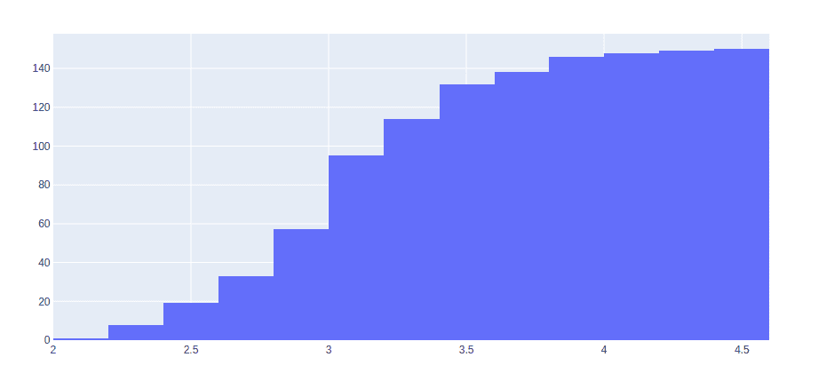
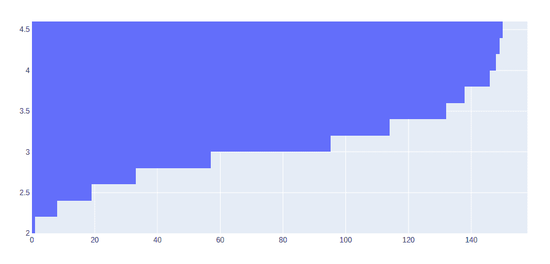

# 如何在 Plotly 中创建累积直方图？

> 原文:[https://www . geeksforgeeks . org/如何创建累积柱状图-in-plot/](https://www.geeksforgeeks.org/how-to-create-a-cumulative-histogram-in-plotly/)

[Plotly](https://www.geeksforgeeks.org/getting-started-with-plotly-python/) 是一个 Python 库，用来设计图形，尤其是交互图形。它可以绘制各种图形和图表，如直方图、条形图、箱线图、展开图等。它主要用于数据分析以及财务分析。plotly 是一个交互式可视化库。

## 创建累积直方图

累积直方图是统计案例范围内累积案例的直方图。可以通过将“真”传递给**累积 _ 启用的**参数来创建。

**示例 1:** 垂直累积直方图

## 蟒蛇 3

```
import plotly.express as px 
import plotly.graph_objects as go 

df = px.data.iris() 

fig = go.Figure(data=[go.Histogram(x=df['sepal_width'], 
                                   cumulative_enabled=True)]) 
fig.show()
```

**输出:**



**例 2:** 水平累计直方图

## 蟒蛇 3

```
import plotly.express as px 
import plotly.graph_objects as go 

df = px.data.iris() 

fig = go.Figure(data=[go.Histogram(y=df['sepal_width'], 
                                   cumulative_enabled=True)]) 
fig.show()
```

**输出:**

