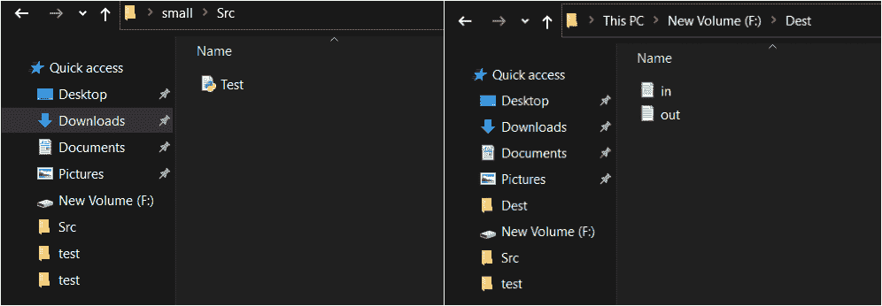
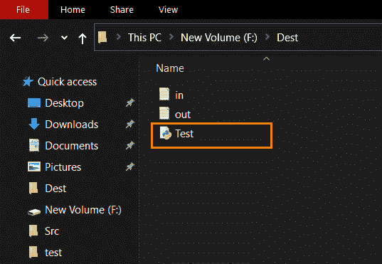

# 如何使用 Python 创建现有文件的复制文件？

> 原文:[https://www . geesforgeks . org/如何使用 python 创建现有文件的重复文件/](https://www.geeksforgeeks.org/how-to-create-a-duplicate-file-of-an-existing-file-using-python/)

在本文中，我们将讨论如何在 Python 中创建现有文件的副本。在目标文件夹中创建重复文件之前，下面是源文件夹和目标文件夹。



在目标文件夹中创建重复文件后，它看起来像下图。



为了在 Python 中自动复制和删除文件，使用了 [shutil](https://www.geeksforgeeks.org/shutil-module-in-python/) 模块。它对文件和文件集合提供了许多高级操作。使用 shutil 模块，我们可以复制文件以及整个目录。

## **方法 1 :** 使用 [shutil.copyfile()](https://www.geeksforgeeks.org/python-shutil-copyfile-method/)

它以最有效的方式将源文件的内容复制到目标文件。它不使用文件对象，也不复制元数据和权限。

> **语法:** shutil.copyfile(src，dst，* follow _ symlink = True)
> 
> **参数:**
> 
> *   **src–**这里的 src 是源文件的完整路径。
> *   **dest–**dest 是目标文件或目录的完整路径。目标位置必须是可写的。
> *   **follow _ symlink**(可选)–该参数的默认值为真。如果设置为假，并且 src 是一个符号链接，将创建一个新的符号链接，而不是复制文件 **src** 指向。
> 
> **返回类型:-** 返回新创建的重复文件的路径。

**代码:**

## 蟒蛇 3

```py
# Python program to create the duplicate of
# an already existing file
import os
D = r"F:\Dest"

# importing the shutil module
import shutil

print("Before copying file:")
print(os.listdir(D))

# src contains the path of the source file
src = r"C:\Users\YASH\OneDrive\Desktop\small\Src\Test.py"

# dest contains the path of the destination file
dest = r"F:\Dest\Test.py"

# create duplicate of the file at the destination,
# with the name mentioned
# at the end of the destination path
# if a file with the same name doesn't already
# exist at the destination,
# a new file with the name mentioned is created
path = shutil.copyfile(src,dest)

print("After copying file:")
print(os.listdir(D))

# print path of the newly created duplicate file
print("Path of the duplicate file is:")
print(path)
```