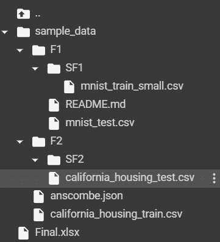

# 如何使用 Python 在 Excel 中创建文件、文件夹和子文件夹列表？

> 原文:[https://www . geesforgeks . org/如何使用 python 创建 excel 中的文件、文件夹和子文件夹列表/](https://www.geeksforgeeks.org/how-to-create-a-list-of-files-folders-and-subfolders-in-excel-using-python/)

在本文中，我们将学习如何创建文件、文件夹和子文件夹的列表，然后使用 Python 将它们导出到 Excel。我们将使用下面解释的一些文件夹遍历方法创建一个名称和路径列表，并使用 openpyxl 或 pandas 模块将它们存储在 Excel 工作表中。

**输入:**下图表示目录的结构。



注意:SF2 是一个空目录

### 遍历文件、文件夹和子文件夹

以下函数是遍历文件夹的方法，并将文件/文件夹的名称和路径存储在列表中。

**方法 1:使用 append_path_name(路径、名称 _list、路径 _list、glob)**

以下文件夹遍历函数中使用的一个重要函数。该函数的目的是检查给定的路径是 Windows 还是 Linux 操作系统，因为路径分隔符不同，并将文件或文件夹的名称和路径分别附加到名称列表和路径列表中。

**注意:** Windows 使用“\”，Linux 使用“/”作为路径分隔符，由于 python 将“\”视为无效字符，因此我们需要在路径中使用“\”而不是“\”。

**进场:**

*   该函数将首先使用以下命令查找路径是否包含“\ ”:

```py
# Returns the count if it finds 
# any "\\" in the given path.
path.find("\\")
```

**注意:**如果返回大于零的任意数字，则表示当前操作系统为 Windows，将执行第一块代码，否则执行代表 Linux 操作系统的第二块代码。

*   我们将根据当前操作系统分割路径，并将其存储在临时列表中。

```py
# Windows
temp = path.split("\\")

# Linux
temp = path.split("/")
```

*   我们将把文件或文件夹的名称和路径分别附加到名称列表和路径列表中。

```py
# temp[-1] gets the last value present in
# the temporary list that represents
# the file or folder name.
name_list.append(temp[-1])
path_list.append(path)
```

*   如果 glob 变量为 True，父路径将与在 glob.iglob()方法中递归遍历所需的正则表达式连接。

```py
# Windows
path = os.path.join(path, "**\\*")

# Linux
path = os.path.join(path, "**/*")
```

示例:

## 蟒蛇 3

```py
import os

# This function splits the path by checking
# if it is a windows os or linux os path and
# appends the name and path of directory (and
# files only for glob function).
def append_path_name(path, name_list, path_list, glob):

    # Checks if it is a windows path or linux 
    # path
    if path.find("\\") > 0:

        # Splits the windows path and stores the
        # list in a temp list and appends the last
        # value of temp_list in name_list as it
        # represents the name of file/ folder and
        # also appends the path to path_list.
        temp = path.split("\\")
        name_list.append(temp[-1])
        path_list.append(path)

        # If this function is called under 
        # find_using_glob then we return modified
        # path so that iglob can recursively 
        # traverse the folders.
        if glob == True:
            path = os.path.join(path, "**\\*")
            return path, name_list, path_list
    else:
        # Same explanation as above but the path splitting
        # is based on Linux
        temp = path.split("/")
        name_list.append(temp[-1])
        path_list.append(path)
        if glob == True:
            path = os.path.join(path, "**/*")
            return path, name_list, path_list
    return name_list, path_list

name_list, path_list = append_path_name("/content/sample_data", [], [], False)
print(name_list)
print(path_list)
```

**输出:**

> ['sample_data '，' anscombe.json '，' california_housing_train.csv '，' F2 '，' SF2 '，' california_housing_test.csv '，
> 
> 。ipynb_checkpoints '，'。ipynb_checkpoints '，' F1 '，' mnist_test.csv '，' README.md '，'。ipynb_checkpoints '，' SF1 '，
> 
> mnist_train_small.csv']
> 
> ['/content/sample_data '，'/content/sample _ data/ans comb . JSON '，
> 
> /content/sample _ data/California _ housing _ train . CSV '，'/content/sample_data/F2 '，
> 
> /content/sample_data/F2/SF2 '，'/content/sample _ data/F2/SF2/California _ housing _ test . CSV '，
> 
> /content/sample_data/F2/。ipynb_checkpoints '，'/content/sample_data/。ipynb_checkpoints '，
> 
> /content/sample_data/F1 '，'/content/sample _ data/F1/mnist _ test . CSV '，'/content/sample _ data/F1/readme . MD '，
> 
> /content/sample_data/F1/。ipynb_checkpoints '，'/content/sample_data/F1/SF1 '，
> 
> /content/sample _ data/F1/SF1/mnist _ train _ small . CSV ']

**方法二:使用 find_using_os_walk(路径、名称 _ 列表、路径 _ 列表)**

此方法通过在给定路径中自上而下或自下而上遍历目录树来生成目录树中的文件名。

> **语法:** os.walk( *路径*)

**进场:**

**1。**使用 os.walk(path)方法发起一个 for 循环，它生成一个元组，包含根目录下当前目录的路径和文件中的文件列表。

```py
for root, _, files in os.walk(path):
```

**2。**调用 append_path_name 函数，存储绕过当前目录路径的目录的名称和路径。

```py
name_list, path_list = append_path_name(
       root, name_list, path_list, False)
```

**3。**迭代文件并存储在文件夹中找到的文件的名称和路径。

```py
# Joins the folder path and the
# file name to generate file path
file_path = os.path.join(root, file_name)

# Appends file name and file path to
# name_list and path_list respectively.
name_list.append(file_name)
path_list.append(file_path)
```

**示例:**

## 蟒蛇 3

```py
import os

# This Function uses os.walk method to traverse folders
# recursively and appends the name and path of file/
# folders in name_list and path_list respectively.
def find_using_os_walk(path, name_list, path_list):
    for root, _, files in os.walk(path):

        # Function returns modified name_list and
        # path_list.
        name_list, path_list = append_path_name(
            root, name_list, path_list, False)

        for file_name in files:
            file_path = os.path.join(root, file_name)

            # Appends file name and file path to
            # name_list and path_list respectively.
            name_list.append(file_name)
            path_list.append(file_path)
    return name_list, path_list

name_list, path_list = find_using_os_walk("/content/sample_data", [], [])
print(name_list)
print(path_list)
```

**输出:**

> ['sample_data '，' anscombe.json '，' california_housing_train.csv '，' F2 '，' SF2 '，' california_housing_test.csv '，
> 
> 。ipynb_checkpoints '，'。ipynb_checkpoints '，' F1 '，' mnist_test.csv '，' README.md '，'。ipynb_checkpoints '，' SF1 '，
> 
> mnist_train_small.csv']
> 
> ['/content/sample_data '，'/content/sample _ data/ans comb . JSON '，
> 
> /content/sample _ data/California _ housing _ train . CSV '，'/content/sample_data/F2 '，
> 
> /content/sample_data/F2/SF2 '，'/content/sample _ data/F2/SF2/California _ housing _ test . CSV '，
> 
> /content/sample_data/F2/。ipynb_checkpoints '，'/content/sample_data/。ipynb_checkpoints '，
> 
> /content/sample_data/F1 '，'/content/sample _ data/F1/mnist _ test . CSV '，'/content/sample _ data/F1/readme . MD '，
> 
> /content/sample_data/F1/。ipynb_checkpoints '，'/content/sample_data/F1/SF1 '，
> 
> /content/sample _ data/F1/SF1/mnist _ train _ small . CSV ']

**方法三:使用 find_using_scandir(路径、名称列表、路径列表)**

这个函数返回一个操作系统的迭代器。对应于由路径给出的目录中的条目的目录条目对象。

> **语法:** os.scandir( *path*

**进场:**

**1。**调用 append_path_name 函数，通过传递当前目录路径来存储目录的名称和路径。

```py
name_list, path_list = append_path_name(
      path, name_list, path_list, False)
```

**2。**使用 os.scandir(path)方法启动 for 循环，返回包含文件/文件夹当前名称和路径的对象。

```py
for curr_path_obj in os.scandir(path):
```

**3。**如果当前路径是一个目录，那么函数调用自身递归遍历文件夹并存储步骤 1 中的文件夹名称和路径。

```py
if curr_path_obj.is_dir() == True:
   file_path = curr_path_obj.path
   find_using_scandir(file_path, name_list, path_list)
```

**4。**否则文件名和路径分别存储在名称列表和路径列表中。

```py
file_name = curr_path_obj.name
file_path = curr_path_obj.path
name_list.append(file_name)
path_list.append(file_path)
```

**示例:**

## 蟒蛇 3

```py
import os

# This Function uses os.scandir method to traverse
# folders recursively and appends the name and path of
# file/folders in name_list and path_list respectively.
def find_using_scandir(path, name_list, path_list):

    # Function returns modified name_list and path_list.
    name_list, path_list = append_path_name(
        path, name_list, path_list, False)

    for curr_path_obj in os.scandir(path):

        # If the current path is a directory then the
        # function calls itself with the directory path
        # and goes on until a file is found.
        if curr_path_obj.is_dir() == True:
            file_path = curr_path_obj.path
            find_using_scandir(file_path, name_list, path_list)
        else:

            # Appends file name and file path to
            # name_list and path_list respectively.
            file_name = curr_path_obj.name
            file_path = curr_path_obj.path
            name_list.append(file_name)
            path_list.append(file_path)
    return name_list, path_list

name_list, path_list = find_using_scandir("/content/sample_data", [], [])
print(name_list)
print(path_list)
```