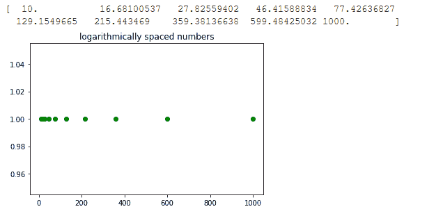

# 如何用 Python 用对数刻度创建等间距数字列表？

> 原文:[https://www . geeksforgeeks . org/如何使用 python 对数标度创建等间距数字列表/](https://www.geeksforgeeks.org/how-to-create-a-list-of-uniformly-spaced-numbers-using-a-logarithmic-scale-with-python/)

在本文中，我们将使用对数刻度创建一个均匀间隔的数字列表。这意味着在对数标度上，两个相邻样本之间的差异是相同的。使用 Python Numpy 库中的两个不同函数可以实现这个目标。

### **使用的功能:**

*   **numpy.logspace:** 此函数返回在对数刻度上均匀缩放的数字。

> **参数:**
> 
> *   开始:序列的起始值是基数* *开始
> *   停止:如果端点为真，则序列的结束值为基数* *停止
> *   数字(可选):指定要生成的样本数量
> *   端点(可选):它可以是真或假，默认值为真
> *   基数(可选):指定日志序列的基数。默认值为 10。
> *   数据类型(可选):指定输出数组的类型
> *   轴(可选):结果中存储样本的轴。
> 
> **返回:**返回对数刻度上等距分布的样本数组。

*   **numpy.geomspace:** 这个函数类似于 logspace 函数，区别只是直接指定了端点。在输出样本中，每个输出都是通过将先前的输出乘以相同的常数获得的。

> **参数:**
> 
> 开始:是序列的起始值
> 
> 停止:如果端点为真，则它是序列的结束值
> 
> 数字(可选):指定要生成的样本数量
> 
> 端点(可选):它可以是真或假，默认值为真
> 
> 数据类型(可选):指定输出数组的类型
> 
> 轴(可选):结果中存储样本的轴。
> 
> **返回:**返回对数刻度上等距分布的样本数组。

**示例 1:** 本示例使用对数空间函数。在本例中，起点作为 1 传递，终点作为 3 传递，基数为 10。所以序列的起点将是 10**1 = 10，序列的终点将是 10**3 = 1000。

## 蟒蛇 3

```
# importing the library
import numpy as np
import matplotlib.pyplot as plt

# Initializing variable
y = np.ones(10)

# Calculating result
res = np.logspace(1, 3, 10, endpoint = True)

# Printing the result
print(res)

# Plotting the graph
plt.scatter(res, y, color = 'green')
plt.title('logarithmically spaced numbers')
plt.show()
```

**输出:**



**示例 2:** 本示例使用 geomspace 函数生成与上一示例相同的列表。这里我们直接通过了 10 和 1000 作为起点和终点

## 蟒蛇 3

```
# importing the library
import numpy as np
import matplotlib.pyplot as plt

# Initializing variable
y = np.ones(10)

# Calculating result
res = np.geomspace(10, 1000, 10, endpoint = True)

# Printing the result
print(res)

# Plotting the graph
plt.scatter(res, y, color = 'green')
plt.title('logarithmically spaced numbers')
plt.show()
```

**输出:**


**示例 3:** 在此示例中，endpoint 被设置为 false，因此它将生成 n+1 个样本，并且仅返回前 n 个样本，即 stop 将不包含在序列中。

## 蟒蛇 3

```
# importing the library
import numpy as np
import matplotlib.pyplot as plt

# Initializing variable
y = np.ones(10)

# Calculating result
res = np.logspace(1, 3, 10, endpoint = False)

# Printing the result
print(res)
```

**输出:**

```
[ 10\.          15.84893192  25.11886432  39.81071706  63.09573445
 100\.         158.48931925 251.18864315 398.10717055 630.95734448]
```