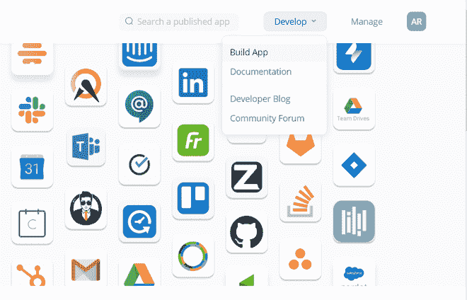
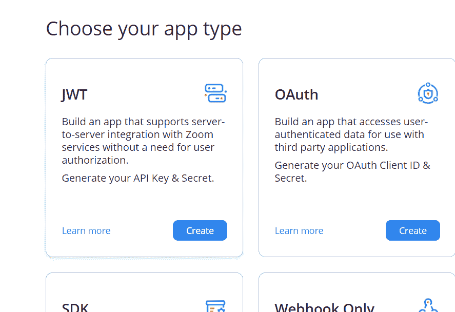

# 如何用 Python 中的 zoom API 创建会议？

> 原文:[https://www . geeksforgeeks . org/如何使用 python 中的 zoom-api 创建会议/](https://www.geeksforgeeks.org/how-to-create-a-meeting-with-zoom-api-in-python/)

在本文中，我们将讨论如何使用 Python 借助 zoom API 创建缩放会议。为了集成 zoom API，我们需要创建它。遵循相同的给定步骤:

*   要使用缩放应用编程接口，首先访问[https://marketplace.zoom.us/](https://marketplace.zoom.us/)，注册或登录您的缩放帐户。
*   现在点击开发，然后点击构建应用。



*   单击同意 Zoom 的应用编程接口许可和使用条款。
*   选择应用类型为 JWT，因为 JWT 很容易使用。



*   输入应用程序的名称，然后单击创建。
*   现在填写一些强制性的详细信息，如您的公司名称、开发人员姓名和电子邮件地址，对于公司名称，您可以输入您的姓名，完成后单击继续。
*   现在转到应用凭证选项卡，复制您的**应用编程接口密钥**和您的**应用编程接口密钥**，并将其保存在某个地方。

在开始之前，您需要安装这两个 python 包:

*   [**Requests**](https://www.geeksforgeeks.org/python-requests-tutorial/) 库是 Python 的一个组成部分，用于向指定的 URL 发出 HTTP 请求。无论是 REST APIs 还是 Web 报废，都必须了解请求，以便进一步使用这些技术。当一个人向 URI 提出请求时，它会返回一个响应。Python 请求提供了管理请求和响应的内置功能。
*   一个 **JSON** 网络令牌(JWT)是 JSON 对象，用于在网络上(双方之间)安全地传输信息。它可以用于认证系统，也可以用于信息交换。令牌主要由报头、有效载荷、签名组成。

这里我们将创建两个函数:第一个函数 **generateToken()** 将生成一个 JWT 令牌，因此我们可以进行身份验证，稍后在第二个函数 **createMeeting()** 中使用这个令牌，它将发出 POST 请求来创建会议。

由于我们正在创建一个会议，我们需要向缩放应用编程接口发送一些额外的信息，如会议标题和开始时间等。，这就是为什么我们在这里创建了一些名为 **meetingdetails** 的 JSON 数据。

**程序:**

## 蟒蛇 3

```
import jwt
import requests
import json
from time import time

# Enter your API key and your API secret
API_KEY = 'Your API key'
API_SEC = 'Your API secret'

# create a function to generate a token 
# using the pyjwt library
def generateToken():
    token = jwt.encode(

        # Create a payload of the token containing 
        # API Key & expiration time
        {'iss': API_KEY, 'exp': time() + 5000},

        # Secret used to generate token signature
        API_SEC,

        # Specify the hashing alg
        algorithm='HS256'
    )
    return token

# create json data for post requests
meetingdetails = {"topic": "The title of your zoom meeting",
                  "type": 2,
                  "start_time": "2019-06-14T10: 21: 57",
                  "duration": "45",
                  "timezone": "Europe/Madrid",
                  "agenda": "test",

                  "recurrence": {"type": 1,
                                 "repeat_interval": 1
                                 },
                  "settings": {"host_video": "true",
                               "participant_video": "true",
                               "join_before_host": "False",
                               "mute_upon_entry": "False",
                               "watermark": "true",
                               "audio": "voip",
                               "auto_recording": "cloud"
                               }
                  }

# send a request with headers including 
# a token and meeting details
def createMeeting():
    headers = {'authorization': 'Bearer %s' % generateToken(),
               'content-type': 'application/json'}
    r = requests.post(
        f'https://api.zoom.us/v2/users/me/meetings', 
      headers=headers, data=json.dumps(meetingdetails))

    print("\n creating zoom meeting ... \n")
    # print(r.text)
    # converting the output into json and extracting the details
    y = json.loads(r.text)
    join_URL = y["join_url"]
    meetingPassword = y["password"]

    print(
        f'\n here is your zoom meeting link {join_URL} and your \
        password: "{meetingPassword}"\n')

# run the create meeting function
createMeeting()
```

**输出:**

> 正在创建缩放会议…
> 
> 这是你的缩放会议链接 https://us04web.zoom.us/j/73327261770?pwd = auxvyuiwnjzea2oxy5ve m0yzlautt 09 和您的密码:“WS0wwu”