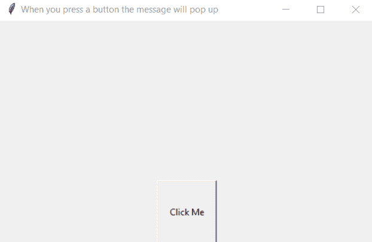
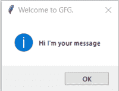
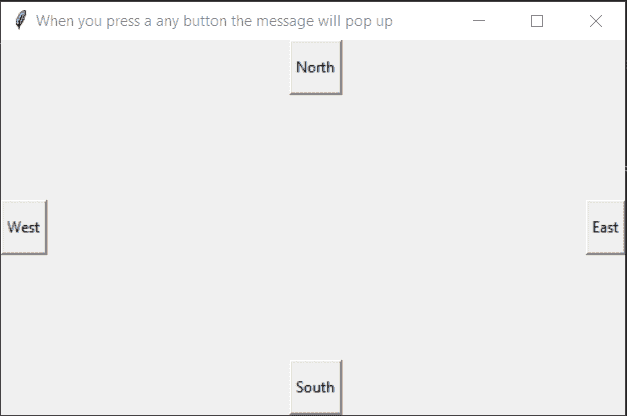
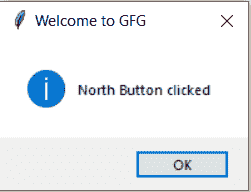
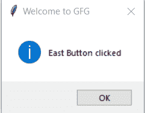

# 如何在 Python–Tkinter 中创建按钮被按下时弹出的消息？

> 原文:[https://www . geeksforgeeks . org/如何在 python 中创建按钮按下时弹出消息-tkinter/](https://www.geeksforgeeks.org/how-to-create-a-pop-up-message-when-a-button-is-pressed-in-python-tkinter/)

在本文中，我们将看到如何创建一个按钮，以及如何在 Python 中按下按钮时显示弹出消息。 [**Tkinter**](https://www.geeksforgeeks.org/python-gui-tkinter/) 是一个创建 GUI 应用的标准 Python 包。Tkinter 可能是一组包装器，将 Tk 小部件实现为 Python 类。当 Python 与 Tkinter 相结合时，它提供了一种快速而直接的方法来创建 GUI 应用程序。

**使用 Tkinter 在 Python 中创建简单图形用户界面的步骤:**

1.  导入 Tkit 包及其所有模块。
2.  创建一个图形用户界面应用程序根窗口(根= Tk())，小部件将在主窗口内。
3.  使用 mainloop()调用窗口的循环。如果您忘记调用此函数，用户将看不到任何内容。该窗口将等待任何用户交互，直到我们关闭它。

> **语法:** W =按钮(根，选项)
> 
> **main:** 代表根窗口。
> 
> **选项:**用于小部件。它可以用作由逗号分隔的键值对。

**例 1:**

## 蟒蛇 3

```py
# import everything from tkinter module
from tkinter import *

# import messagebox from tkinter module
import tkinter.messagebox

# create a tkinter root window
root = tkinter.Tk()

# root window title and dimension
root.title("When you press a button the message will pop up")
root.geometry('500x300')

# Create a messagebox showinfo

def onClick():
    tkinter.messagebox.showinfo("Welcome to GFG.",  "Hi I'm your message")

# Create a Button
button = Button(root, text="Click Me", command=onClick, height=5, width=10)

# Set the position of button on the top of window.
button.pack(side='bottom')
root.mainloop()
```

**输出:**



**点击“点击我”后输出**



**例 2:**

## 蟒蛇 3

```py
# import everything from tkinter module
from tkinter import *

# import messagebox from tkinter module
import tkinter.messagebox

# create a tkinter root window
root = tkinter.Tk()

# root window title and dimension
root.title("When you press a any button the message will pop up")
root.geometry('500x300')

# Create a messagebox showinfo

def East():
    tkinter.messagebox.showinfo("Welcome to GFG", "East Button clicked")

def West():
    tkinter.messagebox.showinfo("Welcome to GFG", "West Button clicked")

def North():
    tkinter.messagebox.showinfo("Welcome to GFG", "North Button clicked")

def South():
    tkinter.messagebox.showinfo("Welcome to GFG", "South Button clicked")

# Create a Buttons

Button1 = Button(root, text="West", command=West, pady=10)
Button2 = Button(root, text="East", command=East, pady=10)
Button3 = Button(root, text="North", command=North, pady=10)
Button4 = Button(root, text="South", command=South, pady=10)

# Set the position of buttons
Button1.pack(side=LEFT)
Button2.pack(side=RIGHT)
Button3.pack(side=TOP)
Button4.pack(side=BOTTOM)

root.mainloop()
```

**输出 2:**



**点击“北”后输出**



**点击“东”后输出**

