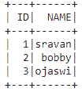

# 如何从多个列表中创建 PySpark 数据帧？

> 原文:[https://www . geeksforgeeks . org/如何从多个列表创建一个 py spark-data frame/](https://www.geeksforgeeks.org/how-to-create-a-pyspark-dataframe-from-multiple-lists/)

在本文中，我们将讨论如何从多个列表中创建 Pyspark 数据帧。

### **接近**

*   从多个列表中创建数据，并在另一个列表中给出列名。因此，为了完成我们的任务，我们将使用 zip 方法。

> zip(列表 1、列表 2、。，列表 n)

*   将此压缩数据传递给 spark.createDataFrame()方法

> data frame = spark . createdata frame(数据，列)

### 例子

**示例 1:** Python 程序创建两个列表，并使用这两个列表创建数据框

## 蟒蛇 3

```py
# importing module
import pyspark

# importing sparksession from 
# pyspark.sql module
from pyspark.sql import SparkSession

# creating sparksession and giving 
# an app name
spark = SparkSession.builder.appName('sparkdf').getOrCreate()

# list  of college data with dictionary
# with two lists in three elements each
data = [1, 2, 3]
data1 = ["sravan", "bobby", "ojaswi"]

# specify column names
columns = ['ID', 'NAME']

# creating a dataframe by zipping the two lists
dataframe = spark.createDataFrame(zip(data, data1), columns)

# show data frame
dataframe.show()
```

**输出:**



**示例 2:** 创建 4 个列表并创建数据框的 Python 程序

## 蟒蛇 3

```py
# importing module
import pyspark

# importing sparksession from 
# pyspark.sql module
from pyspark.sql import SparkSession

# creating sparksession and giving 
# an app name
spark = SparkSession.builder.appName('sparkdf').getOrCreate()

# list  of college data with dictionary
# with four lists in three elements each
data = [1, 2, 3]
data1 = ["sravan", "bobby", "ojaswi"]
data2 = ["iit-k", "iit-mumbai", "vignan university"]
data3 = ["AP", "TS", "UP"]

# specify column names
columns = ['ID', 'NAME', 'COLLEGE', 'ADDRESS']

# creating a dataframe by zipping 
# the two lists
dataframe = spark.createDataFrame(
  zip(data, data1, data2, data3), columns)

# show data frame
dataframe.show()
```

**输出:**

