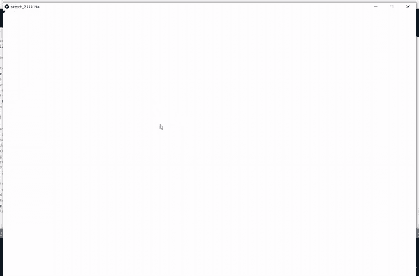

# 如何在 Python 模式的加工中创建简单的画板？

> 原文:[https://www . geeksforgeeks . org/如何用 python 模式创建一个简单的画板/](https://www.geeksforgeeks.org/how-to-create-a-simple-drawing-board-in-processing-with-python-mode/)

**处理**是一种编程语言，也是一种开发环境。这是一个开源软件，使用编程创建**视觉艺术、图形和动画**。它支持大约 8 种不同的模式，在本文中，我们将使用 **Python 模式**。

在本文中，我们将使用 Python 模式的**处理来创建一个简单的画板。如果您还没有安装处理软件，请跟随本文到[下载安装处理，设置 Python 模式](https://www.geeksforgeeks.org/how-to-set-up-python-mode-for-processing/)。**

### **进场:**

*   首先打开加工软件，选择 Python 模式。
*   然后在编码部分，我们要定义三个函数， **setup()，draw()** ，以及 **mouseDragged()**
*   **程序开始前调用 setup()** 函数。这里我们要设置**背景色**和**大小**的窗口。
*   在 **mouseDragged()** 函数中，我们只需将 **0** 分配给全局变量**值**。当**鼠标被拖动**时，即当用户点击并按住并移动鼠标按钮时，调用该功能。
*   **draw()** 方法在整个程序执行过程中被调用。在这个方法中，我们将检查**值**是否为 0(即鼠标是否被拖动)。如果是真的，那么我们就去**在光标的位置画一个圆**(使用**椭圆()**功能)。**填充(0)** 用于用**黑色**颜色填充圆圈。我们可以使用变量 **mouseX** 和 **mouseY** 获得光标的 **X 和 Y 坐标**。画完圆后，将该值设置为 1(即为鼠标的当前位置画圆)。
*   每当用户拖动鼠标时，draw 方法中的 if 条件变为 true，并在光标移动的整个过程中重复绘制圆，从而创建绘图效果。

**下面是实现:**

下面是上述方法的 Python 代码。现在在代码编辑器中键入以下代码。

## 蟒蛇 3

```
# global variable
value = 1

# function to setup size of
# output window
def setup():

    # to set background color of window
    # to white color
    background(255)

    # to set width and height of window
    # to 1500px and 1200px respectively
    size(1500, 1200)

# function to draw on the window
def draw():

    # referring to the global value
    global value

    # if mouse is dragged then
    # the value will be set to 0
    # so here by checking if value equal to 0,
    # we are confirming that the mouse is being
    # dragged
    if value == 0:

        # width of circle
        r = 10

        # to fill the color of circle to black
        fill(0)

        # to create a circle at the position of
        # mouse clicked mouseX and mouseY coordinates
        # represents x and y coordinates of mouse
        # respectively when it is being dragged.
        ellipse(mouseX, mouseY, r, r)

        # setting value to 1, which means a circle
        # is drawn at current position and waiting
        # for the mouse to be dragged.
        value = 1

# this function is called when
# mouse is being dragged (mouse click+ hold + move)
def mouseDragged():

    # referring to global value
    global value

    # setting value to 0
    value = 0
```

**输出:**



用 Python 模式处理