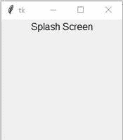

# 如何使用 Tkinter 创建闪屏？

> 原文:[https://www . geesforgeks . org/如何使用-tkinter/](https://www.geeksforgeeks.org/how-to-create-a-splash-screen-using-tkinter/) 创建闪屏

**先决条件:** [Python 图形用户界面–tkinter](https://www.geeksforgeeks.org/python-gui-tkinter/)

Python 为开发图形用户界面提供了多种选择。在所有的 GUI 方法中， *tkinter* 是最常用的方法。它是 Python 附带的 Tk 图形用户界面工具包的标准 Python 接口。

## 什么是闪屏？

*tkinter* 中的闪屏是一个 *tkinter* 窗口，在一段固定的时间后消失，然后进行特定的操作。要创建闪屏，我们将使用 *after()* 和 *destroy()* 方法。

*   在() 之后的 ***方法指定一个时间段(作为参数)，在该时间段之后，特定的操作发生，该操作被转换为函数，并作为参数在()***方法之后的*中传递。*

**语法:**

```py
root.after(time in millisecond, function name)
```

*   使用**方法关闭当前的 tkinter 窗口。**

****语法:****

```py
root.destroy()
```

**下面是一个创建两个普通 that 窗口的程序。较小的窗口充当闪屏，但不会消失。**

## **蟒蛇 3**

```py
# Import module
from tkinter import *

# Create object
splash_root = Tk()

# Adjust size
splash_root.geometry("200x200")

# Set Label
splash_label = Label(splash_root, text="Splash Screen", font=18)
splash_label.pack()

# main window function
def main():
    # Create object
    root = Tk()

    # Adjust size
    root.geometry("400x400")

# Call main function
main()

# Execute tkinter
mainloop()
```

****输出:****

**

**主窗口**** **

**飞溅窗**** 

**现在我们将使用以下方法:**

*   ****摧毁()****
*   ****在()**之后**

**在 *tkinter* 中创建闪屏。**

**下面是一个在 *tkinter* 中使用 *after()* 和 *destroy()* 方法创建闪屏的程序。**

## **蟒蛇 3**

```py
# Import module
from tkinter import *

# Create object
splash_root = Tk()

# Adjust size
splash_root.geometry("200x200")

# Set Label
splash_label = Label(splash_root,text="Splash Screen",font=18)
splash_label.pack()

# main window function
def main(): 
    # destroy splash window
    splash_root.destroy()

    # Execute tkinter
    root = Tk()

    # Adjust size
    root.geometry("400x400")

# Set Interval
splash_root.after(3000,main)

# Execute tkinter
mainloop()
```

****输出:****

**<video class="wp-video-shortcode" id="video-506656-1" width="640" height="360" preload="metadata" controls=""><source type="video/mp4" src="https://media.geeksforgeeks.org/wp-content/uploads/20201030173557/splash_screen.mp4?_=1">[https://media.geeksforgeeks.org/wp-content/uploads/20201030173557/splash_screen.mp4](https://media.geeksforgeeks.org/wp-content/uploads/20201030173557/splash_screen.mp4)</video>**

**这里会创建一个闪屏，并停留一段特定的时间，然后进行下一个操作，即生成一个新窗口。**