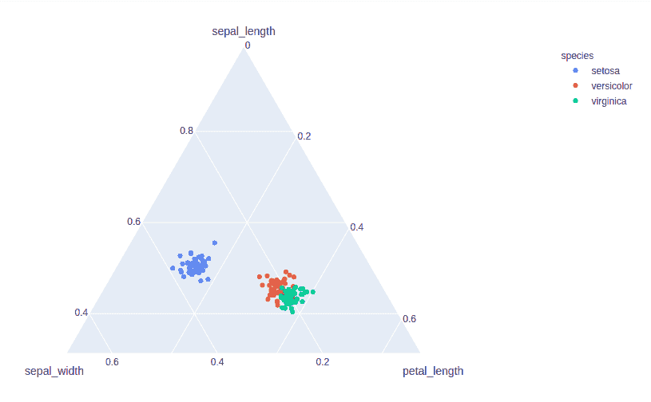
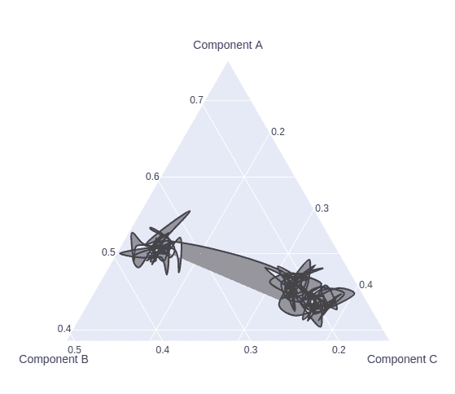

# 如何使用 Plotly 创建三元叠加？

> 原文:[https://www . geeksforgeeks . org/如何使用 plotly 创建三值叠加/](https://www.geeksforgeeks.org/how-to-create-a-ternary-overlay-using-plotly/)

Plotly 是一个 Python 库，用于设计图形，尤其是交互式图形。它可以绘制各种图形和图表，如直方图、条形图、箱线图、展开图等。它主要用于数据分析以及财务分析。plotly 是一个交互式可视化库

## 创建三元散点图

三元散点图是一种三元图，其中每个位置的符号基于所需的类别列，并且任意行中三个数据点(X + Y + Z)的总和必须等于 100%。

> **语法:**散点 _ 三元(a =无，b =无，c =无，颜色=无，标签={}，宽度=无，高度=无)
> 
> **参数:**
> 
> **a:** 来自该列或 array_like 的值用于在三元坐标中沿 a 轴定位标记。
> 
> **b:** 来自该列或 array_like 的值用于在三元坐标中沿 b 轴定位标记。
> 
> **c:** 来自该列或 array_like 的值用于在三元坐标中沿 c 轴定位标记。
> 
> **颜色:**data _ frame 中列的名称，或者 pandas Series 或 array_like 对象。此列或 array_like 中的值用于为标记指定颜色。
> 
> **宽度:**以像素为单位的图形宽度。
> 
> **高度:**以像素为单位的图形高度。

**示例:**

## 蟒蛇 3

```
import plotly.express as px

df = px.data.iris()
fig = px.scatter_ternary(df, a="sepal_length",
                         b="sepal_width", c="petal_length",
                         color="species", size_max=20)
fig.show()
```

**输出:**



## 创建三元等高线图

三元等高线图是一种图形表示，通过在二维格式上绘制称为等高线的恒定 z 切片来显示三维表面。

**示例:**

## 蟒蛇 3

```
import plotly.express as px
import plotly.graph_objects as go

df = px.data.iris()
fig = go.Figure(go.Scatterternary({
    'mode': 'lines',
    'a': df['sepal_length'],
    'b': df['sepal_width'],
    'c': df['petal_length'],
    'line': {'color': '#444', 'shape': 'spline'},
    'marker': {
        'color': 'green',
        'size': 14,
        'line': {'width': 2}
    }
}))

fig.show()
```

