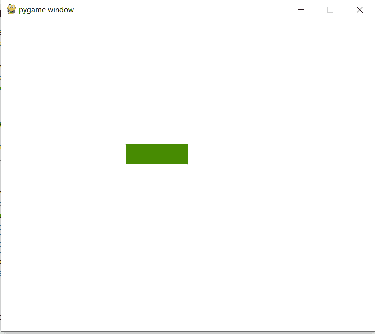

# 如何用 Pygame 创建文字输入框？

> 原文:[https://www . geesforgeks . org/如何用 pygame 创建文本输入框/](https://www.geeksforgeeks.org/how-to-create-a-text-input-box-with-pygame/)

在本文中，我们将讨论如何使用 PyGame 创建一个文本输入框。

### 装置

在初始化 pygame 库之前，我们需要安装它。这个库可以使用 Python 为其库安装提供的 *pip* 工具安装到系统中。Pygame 可以通过将这些行写入终端来安装。

我们可以使用命令安装 Pygame:

```py
pip install pygame 
```

Pygame 可以用来创建一个文本输入框，这将在本文中逐步解释。

#### 方法

1.  使用 pygame.init()初始化所有导入的模块。
2.  设置屏幕尺寸。
3.  设置用户将要键入的文本的字体。
4.  根据用户密钥创建条件。
5.  另外，声明两个变量，这两个变量将包含进一步用于输入颜色的颜色名称。
6.  此外，将输入存储在变量中以显示在屏幕上。
7.  现在画一个矩形，传递一个应该在屏幕上的参数。
8.  另外，设置要渲染的屏幕大小。
9.  使用 clock.tick()，这意味着每秒最多应该传递给定的帧。

#### 使用的功能

<figure class="table">

| 功能 | 描述 |
| --- | --- |
| 时钟.滴答() | 它用于在给定的秒内刷新帧 |
| pygame.exit() | 它是用来退出游戏的 |
| pygame.init() | 它用于初始化所有导入的模块 |
| 皮游戏字体字体 | 从文件创建新的字体对象 |
| pygame.display.flip() | 它将只更新屏幕的一部分，而不是整个区域 |
| screen.fill((r，g，b，a)) | 它将设置屏幕的背景颜色。范围在 0 到 255 之间。 |

</figure>

#### 履行

## 蟒蛇 3

```py
# import sys module
import pygame
import sys

# pygame.init() will initialize all
# imported module
pygame.init()

clock = pygame.time.Clock()

# it will display on screen
screen = pygame.display.set_mode([600, 500])

# basic font for user typed
base_font = pygame.font.Font(None, 32)
user_text = ''

# create rectangle
input_rect = pygame.Rect(200, 200, 140, 32)

# color_active stores color(lightskyblue3) which
# gets active when input box is clicked by user
color_active = pygame.Color('lightskyblue3')

# color_passive store color(chartreuse4) which is
# color of input box.
color_passive = pygame.Color('chartreuse4')
color = color_passive

active = False

while True:
    for event in pygame.event.get():

      # if user types QUIT then the screen will close
        if event.type == pygame.QUIT:
            pygame.quit()
            sys.exit()

        if event.type == pygame.MOUSEBUTTONDOWN:
            if input_rect.collidepoint(event.pos):
                active = True
            else:
                active = False

        if event.type == pygame.KEYDOWN:

            # Check for backspace
            if event.key == pygame.K_BACKSPACE:

                # get text input from 0 to -1 i.e. end.
                user_text = user_text[:-1]

            # Unicode standard is used for string
            # formation
            else:
                user_text += event.unicode

    # it will set background color of screen
    screen.fill((255, 255, 255))

    if active:
        color = color_active
    else:
        color = color_passive

    # draw rectangle and argument passed which should
    # be on screen
    pygame.draw.rect(screen, color, input_rect)

    text_surface = base_font.render(user_text, True, (255, 255, 255))

    # render at position stated in arguments
    screen.blit(text_surface, (input_rect.x+5, input_rect.y+5))

    # set width of textfield so that text cannot get
    # outside of user's text input
    input_rect.w = max(100, text_surface.get_width()+10)

    # display.flip() will update only a portion of the
    # screen to updated, not full area
    pygame.display.flip()

    # clock.tick(60) means that for every second at most
    # 60 frames should be passed.
    clock.tick(60)
```

**输出:**

