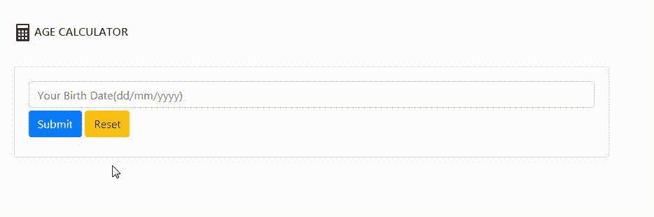

# 如何用 Python 创建 AGE 计算器 Web App PyWebIO？

> 原文:[https://www . geeksforgeeks . org/如何创建年龄-计算器-web-app-pywebio-in-python/](https://www.geeksforgeeks.org/how-to-create-age-calculator-web-app-pywebio-in-python/)

在本文中，我们将创建一个年龄计算器，它将在当前日期的帮助下以年、月和日显示您的年龄。我们将使用 PyWebIO 模块在网络上创建一个简单的交互式界面。这是一个 python 模块，主要用于使用 Python 编程在网络上创建简单的交互式界面。可以使用以下命令安装:

```py
pip install pywebio
```

**分步实施:**

**步骤 1:** 导入所有需要的模块。

## 蟒蛇 3

```py
# Import the following modules
from dateutil.relativedelta import relativedelta
from datetime import datetime
from time import strptime
from pywebio.input import *
from pywebio.output import *
from pywebio.session import *
import time
```

**第二步:**获取当前时间并从用户处获取输入。

## 蟒蛇 3

```py
# Getting Current time.
date = datetime.now().strftime("%d/%m/%Y")  

# Taking age from the user
DOB = input("", placeholder = "Your Birth Date(dd/mm/yyyy)")
```

**第三步:**检查年龄的格式是否正确。

## 蟒蛇 3

```py
try:
    # Check whether the input age format 
    # is same as given format
    val = strptime(DOB, "%d/%m/%Y")
except:

    # If format is different, then through 
    # an error.
    put_error("Alert! This is not the right format")
    time.sleep(3)  # sleep for 3 seconds
    continue
```

**第 4 步:**将用户的出生日期和当前日期除以“/”。然后将所有拆分的部分类型转换为整数。用月份和年份交换用户的出生日期和当前日期。

## 蟒蛇 3

```py
# Split the age by '/'
in_date = DOB.split('/')

# split the todays date by '/'
date = date.split('/')  

# Typecast all the converted part 
# into the int.
in_date = [int(i) for i in in_date] 
date = [int(i) for i in date] 
newdate = []  

# Swap days with years
in_date[0], in_date[2] = in_date[2], in_date[0]  

# Swap days with years
date[0], date[2] = date[2], date[0]
```

**步骤 5:** 检查当前年度是否小于用户的营业日年度。如果当前年份小于通过错误。

## 蟒蛇 3

```py
if in_date <= date:
        now = datetime.strptime(DOB, "%d/%m/%Y")

        # Display output in a pop window
        popup("Your Age",k
              [put_html("<h4>"f"{relativedelta(datetime.now(),now).years} Years</br> \
              {relativedelta(datetime.now(),now).months} Months</br>\
              {relativedelta(datetime.now(),now).days} Days""</h4>"), put_buttons(
                  ['Close'], onclick=lambda _: close_popup())], implicit_close=True)
else:
        # If you input the year greater than current year
        put_warning(
            f"No result found, this is {date[0]}, and you can't be in {in_date[0]}.")
```

**完整代码:**

## 蟒蛇 3

```py
# Import the following modules
from dateutil.relativedelta import relativedelta
from datetime import datetime
from time import strptime
from pywebio.input import *
from pywebio.output import *
from pywebio.session import *
import time

# Run infinite loop
while True:  
    clear() 

    # Put a heading Age Calculator
    put_html("<p align=""left""><h4> AGE CALCULATOR</h4></p>
")

    # Getting Current time.
    date = datetime.now().strftime("%d/%m/%Y")  

    # Taking age from the user
    DOB = input("", placeholder="Your Birth Date(dd/mm/yyyy)")
    try:

        # Check whether the input age
        # format is same as given format
        val = strptime(DOB, "%d/%m/%Y")
    except:

        # If format is different, then through an error.
        put_error("Alert! This is not the right format")

        # sleep for 3 seconds
        time.sleep(3)  
        continue
    in_date = DOB.split('/') 
    date = date.split('/')  

    # Typecast all the converted part into the int.
    in_date = [int(i) for i in in_date]
    date = [int(i) for i in date]

    # Define an empty list
    newdate = []  

    # Swap days with years
    in_date[0], in_date[2] = in_date[2], in_date[0]  

    # Swap days with years
    date[0], date[2] = date[2], date[0]  
    if in_date <= date:
        now = datetime.strptime(DOB, "%d/%m/%Y")

        # Display output
        popup("Your Age",
              [put_html("<h4>"f"{relativedelta(datetime.now(),now).years} Years</br> \
              {relativedelta(datetime.now(),now).months} Months</br>\
              {relativedelta(datetime.now(),now).days} Days""</h4>"), put_buttons(
                  ['Close'], onclick=lambda _: close_popup())], implicit_close=True)
    else:

        # If you input the year greater than current year
        put_warning(
            f"No result found, this is {date[0]}, and you can't be in {in_date[0]}.")
        time.sleep(3)
    clear()
    # Give user a choice
    choice = radio("Do you want to calculate again?",
                   options=['Yes', 'No'], required=True)
    if choice.lower() == 'yes':
        continue
    else:
        clear()

        # Show a toast notification
        toast("Thanks a lot!")  
        exit()
```

**输出:**

