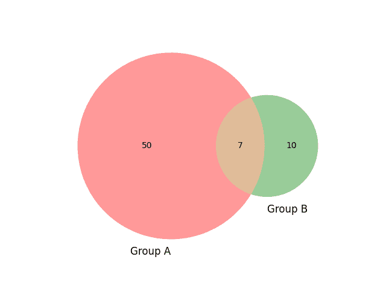
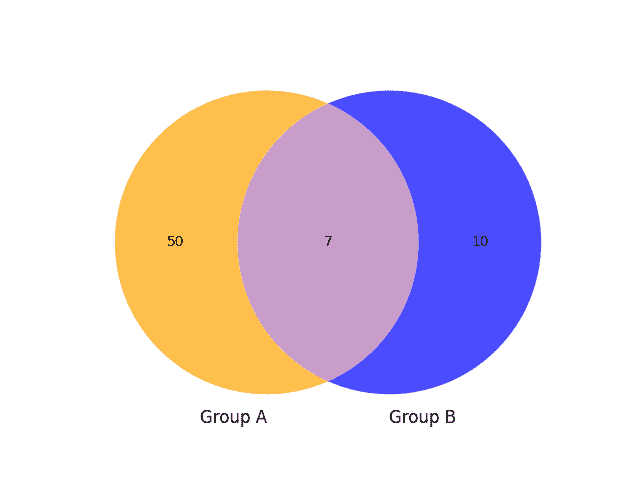
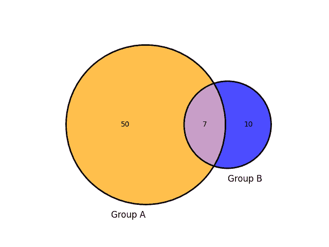
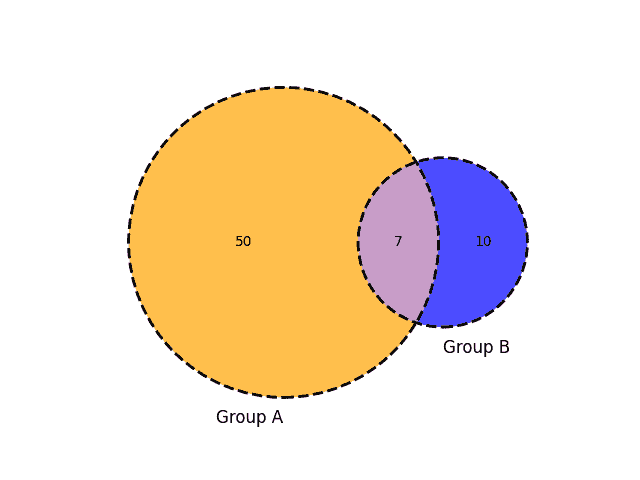
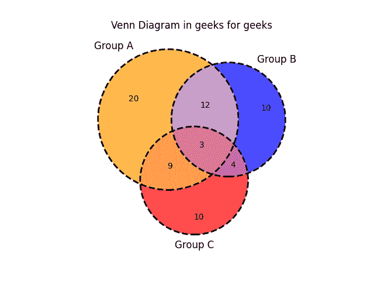
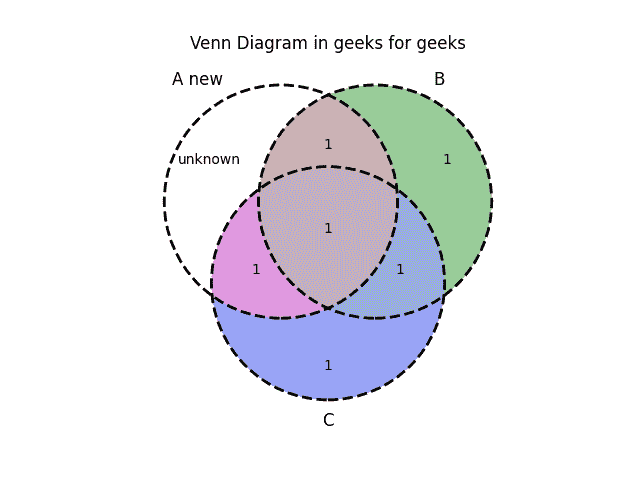

# 如何在 Python 中创建和定制文氏图？

> 原文:[https://www . geesforgeks . org/如何创建和定制 python 中的 venn 图/](https://www.geeksforgeeks.org/how-to-create-and-customize-venn-diagrams-in-python/)

文氏图有助于说明两个或更多组之间的关系。我们很容易看到不同群体之间的共性和差异。在本文中，我们将讨论如何在 Python 中创建和定制文氏图:

**简单维恩图:**



**安装:**

在你的电脑中安装 **matplotlib-venn** 库(这里我们使用了工具 **Pycharm** )前往终端并使用以下命令。

```py
pip install matplotlib-venn
```

安装库后，创建一个新的 python 文件，并按照以下程序中的说明导入库:

## 蟒蛇 3

```py
# import modules
from matplotlib_venn import venn2 
from matplotlib import pyplot as plt

# depict venn diagram
venn2(subsets = (50, 10, 7), set_labels = ('Group A', 'Group B'))
plt.show()
```

**输出:**


语句 **venn2(子集= (30，10，5)，set _ labels =(' A 组'，' B 组')** 是指子集的参数是 3 元素列表，其中数字 50，10，7 对应于 aB，AB，Ab。

> Ab =包含在 A 组中，但不包含在 B 组中
> 
> aB =包含在 B 组，但不包含在 A 组
> 
> AB =包含在 A 组和 B 组中

*****set _ labels*****参数允许您在维恩图中标记您的两个组。matplotlib 库 pyplot 模块中的 **show()** 功能用于显示所有图形。****

******以下是描述如何创建和定制文氏图的各种示例:******

******例 1:******

****文氏图根据分配项目的大小自动确定圆的大小。但是，我们可以通过使用未加权的维恩图来禁用它，因此无论分配了什么项目，圆圈都以相同的大小出现。****

****维恩图的默认颜色是红色和绿色现在我们将使用 **set_colors** 参数自定义颜色橙色和蓝色。**α**参数用于控制透明度。****

## ****蟒蛇 3****

```py
**# import modules
from matplotlib_venn import venn2_unweighted 
from matplotlib import pyplot as plt

# depict venn diagram
venn2_unweighted(subsets = (50, 10, 7),
                 set_labels = ('Group A', 
                               'Group B'),
                 set_colors=("orange",
                             "blue"),alpha=0.7)
plt.show()**
```

******输出:******

********

******例 2:******

****我们可以自定义圆的轮廓，注意它在加权文氏图上工作，如下图所示。****

## ****蟒蛇 3****

```py
**# import modules
from matplotlib_venn import venn2,venn2_circles
from matplotlib import pyplot as plt

# depict venn diagram
venn2(subsets = (50, 10, 7),
      set_labels = ('Group A', 
                    'Group B'),
      set_colors=("orange",
                  "blue"),alpha=0.7)

# add outline
venn2_circles(subsets=(50,10,7)) 
plt.show()**
```

******输出:******

********

******例 3:******

****我们还可以使用虚线样式和线宽自定义圆的轮廓:****

## ****蟒蛇 3****

```py
**# import modules
from matplotlib_venn import venn2, venn2_circles
from matplotlib import pyplot as plt

# depict venn diagram
venn2(subsets=(50, 10, 7), 
      set_labels=('Group A', 'Group B'),
      set_colors=("orange", "blue"), alpha=0.7)

# outline of the circle with defined 
# line style and line width
venn2_circles(subsets=(50, 10, 7), 
              linestyle="dashed", linewidth=2)
plt.show()**
```

******输出:******

********

******例 4:******

****可以使用 **title()** 方法为文氏图分配一个标题。****

## ****蟒蛇 3****

```py
**# import modules
from matplotlib_venn import venn2, venn2_circles
from matplotlib import pyplot as plt

# depict venn diagram
venn2(subsets=(50, 10, 7), 
      set_labels=('Group A', 'Group B'),
      set_colors=("orange", "blue"), alpha=0.7)

# add outline
venn2_circles(subsets=(50, 10, 7), 
              linestyle="dashed", 
              linewidth=2)

# assign title of the venn diagram
plt.title("Venn Diagram in geeks for geeks")  
plt.show()**
```

******输出:******

********

******例 6:******

****让我们使用 **venn3** 、 **venn3_circles** 模块绘制三个 Venn 图。****

## ****蟒蛇 3****

```py
**# import module
from matplotlib_venn import venn3, venn3_circles
from matplotlib import pyplot as plt

# depict venn diagram
venn3(subsets=(20, 10, 12, 10, 9, 4, 3), 
      set_labels=('Group A', 'Group B', 'Group C'), 
      set_colors=("orange", "blue", "red"), alpha=0.7)

# outline of circle line style and width
venn3_circles(subsets=(20, 10, 12, 10, 9, 4, 3),
              linestyle="dashed", linewidth=2)

# title of the venn diagram
plt.title("Venn Diagram in geeks for geeks")
plt.show()**
```

******输出:******

********

******例 7:******

****让我们用 **get_patch_by_id()** 方法自定义图表各区域的颜色。****

## ****蟒蛇 3****

```py
**#import module
from matplotlib_venn import venn3, venn3_circles
from matplotlib import pyplot as plt

# depict venn diagram
v = venn3(subsets=(1, 1, 1, 1, 1, 1, 1), 
          set_labels=('A', 'B', 'C'))

# set color to defined path id
v.get_patch_by_id("100").set_color("white")
# set text to defined label id
v.get_label_by_id("100").set_text("unknown")
# set text to defined label id "A"
v.get_label_by_id('A').set_text('A new')

# add outline
venn3_circles(subsets=(1, 1, 1, 1, 1, 1, 1), 
              linestyle="dashed", linewidth=2)

# assign title
plt.title("Venn Diagram in geeks for geeks")
plt.show()**
```

******输出:******

********