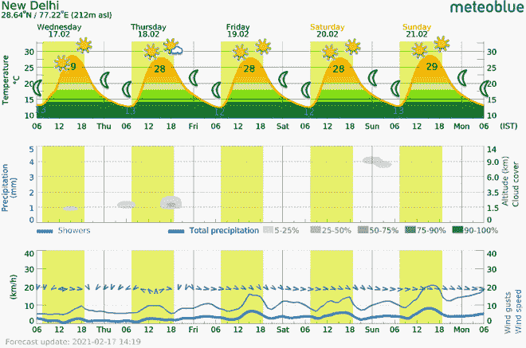

# 如何创建动画气象图 Python？

> 原文:[https://www . geeksforgeeks . org/如何创建-动画-气象图-python/](https://www.geeksforgeeks.org/how-to-create-animated-meteogram-python/)

**气象图**也称为气象图，它是一个或多个气象变量相对于时间的图形表示，无论是对特定位置的观测还是预测。

## 气象图的结构

在气象图中，时间沿 X 轴绘制，而不同天气参数的值沿 Y 轴绘制。最常见的天气参数是降水、温度、气压、云量、风速和风向。

**每帧包含 5 天气象图，每个气象图基于天气参数有不同的图形，如下所示:**

*   还将显示从日出到日落的时间的温度象形图，
*   不同态度的云层
*   风速预报将显示风向。

## 创建动画气象图

在我们开始创建气象图之前，您应该在气象网站上注册，并订阅关于您的**地理位置的时事通讯。**要获得一些你喜欢的位置的气象图，需要几天时间才能给你气象图。然后，我们等待几天，以获得几乎 7-8 天的地理位置气象图，并在我们通过电子邮件收到气象图后下载附件。在这种情况下，我们收集了大约 9 个气象图，并创建了一个气象图动画。

## 需要的模块

使用 **imageio 库**创建动画气象图，具有各种功能，允许我们读取和写入包括动画图像在内的各种图像数据。可以使用命令 **pip 安装库。**

**Pathlib** 是 Python 中的一个模块，提供了用于处理文件和目录的对象 API。

```
imageio
pathlib
```

在我们的内核中，导入文件夹或目录中的气象图，并给出您选择的文件夹的标题。这里的标题是**“气象图”。****图像库**支持各种图像格式。要读取存储在文件夹/目录中的所有图像，请使用 **imread()方法**执行以下命令，该方法用于为具有 RGBA 值的所有图像创建 NumPy 数组，然后将气象图存储在列表 **image_list 中。**

将气象图样本附件存储在目录中，并将文件夹命名为气象图**、**，然后使用 **imageio** 包为目录中存储的附件/图像制作动画或创建 GIF，从而制作气象图动画。这里，我们导入 **imageio** 库和**路径库**模块，然后检查存储在电子邮件中的图像路径，即 **image_path** 。

*   **image_path.glob('*。png’):**glob 是目录**‘source _ images’**中的给定模式，由这个路径表示，产生所有匹配的任何类型的文件。 ***** 这个模式意味着它是递归全局化的。

> **语法:** Path.glob(模式)

*   **imageio.imread(file _ name):**要从指定的 URI 读取图像，我们必须使用 imageio . imread()方法。然后，这个图像被添加到图像列表中，然后用于编写图像来制作图像动画(气象图)

> **语法:** imageio.imread(“文件名或路径”)
> 
> **参数-**
> 
> **文件名/路径:**图像文件的绝对或相对路径。
> 
> **返回:** numpy 数组，该数组的元属性包含一组元数据。

**代码:**

## 蟒蛇 3

```
# importing path library from pathlib package
from pathlib import Path

# extracting meteograms by specifying
# path of the folder
image_path = Path('../input/meteogram')

# images from folder is stored in image_list
images = list(image_path.glob('*.png'))
image_list = []
for file_name in images:

  # imread() creating numpy array
  # of every image stored in image_list
    image_list.append(imageio.imread(file_name))
```

**image_list** 命令将以数组的形式显示每个气象图的数据。现在继续使用 **mimwrite()方法**创建动画气象图，之后动画气象图将保存在您指定的目录中，并位于**中。gif 格式。**

**imageio.mimwrite():** 使用此功能将图像写入指定文件**动画 _ metegraph . gif**取自**图像 _ 列表**

> **语法:** imageio.mimwrite(uri、ims、format=None、**kwargs)
> 
> **参数:**
> 
> **uri:** 文件名或文件对象。ImageIO 会将一些图像写入这个文件。(例如:动画 _from_images.gif)
> 
> **ims:** 图像数据列表。可以通过 imageio.imread()函数读取的每个图像数据
> 
> **格式:**uri 的格式，可以是。巴布亚新几内亚。gif 等

**代码:**

## 蟒蛇 3

```
imageio.mimwrite('animated_meteogram.gif', image_list)
```

执行上述代码后，将创建气象图动画，并将输出以**动画 _ 气象图. gif** 的名称保存在根目录中，然后将气象图动画化。

### 下面是完整的 Python 实现:

## 蟒蛇 3

```
# Import imageio packages
# Generate GIF/animation of meteogram
import imageio
from pathlib import Path

image_path = Path('../input/meteogram')
images = list(image_path.glob('*.png'))

# create an array to
# store meteogram images
image_list = []
for file_name in images:
    image_list.append(imageio.imread(file_name))

# to verify all images are read
image_list

# using this function will write images to a
# specified file animated_meteogram.gif
imageio.mimwrite('animated_meteogram.gif', image_list)
```

**输出:**



现在让我们执行我们编写的 python 程序，这将显示我们通过从电子邮件中提取附件而收集的气象图的动画。在下面的视频中，我们可以看到创建了一个 GIF 文件，它是上面执行的动画气象图。

<video class="wp-video-shortcode" id="video-566024-1" width="640" height="360" preload="metadata" controls=""><source type="video/mp4" src="https://media.geeksforgeeks.org/wp-content/uploads/20210301182627/bandicam-2021-03-01-15-32-29-015_9fUYZRwE_HHY4.mp4?_=1">[https://media.geeksforgeeks.org/wp-content/uploads/20210301182627/bandicam-2021-03-01-15-32-29-015_9fUYZRwE_HHY4.mp4](https://media.geeksforgeeks.org/wp-content/uploads/20210301182627/bandicam-2021-03-01-15-32-29-015_9fUYZRwE_HHY4.mp4)</video>