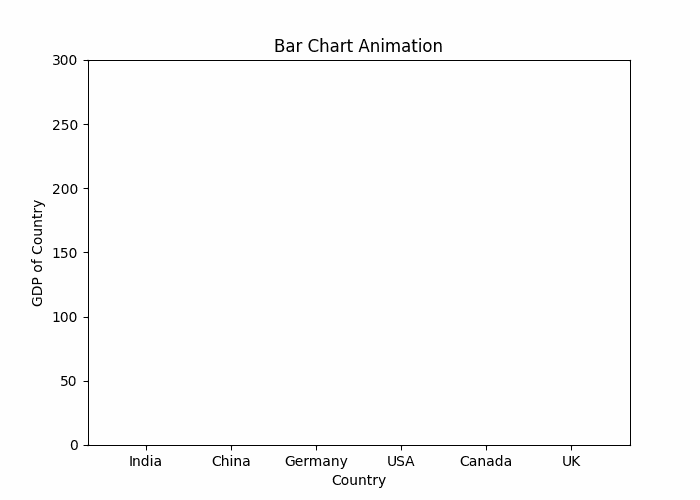
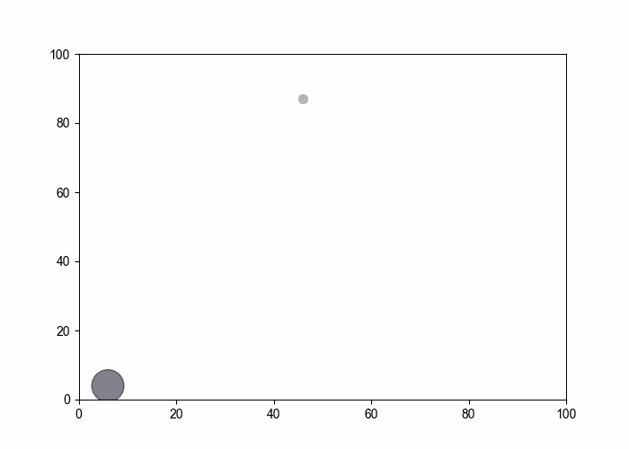
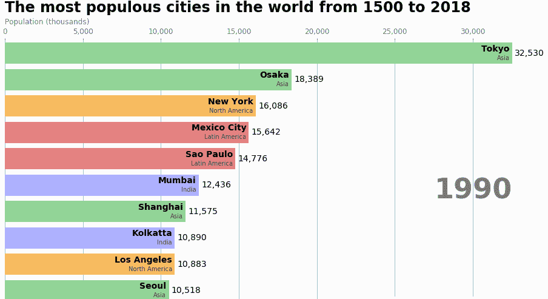

# 如何用 Python 创建动画？

> 原文:[https://www . geesforgeks . org/如何用 python 创建动画/](https://www.geeksforgeeks.org/how-to-create-animations-in-python/)

动画是使可视化更具吸引力和用户吸引力的好方法。它帮助我们以有意义的方式展示数据可视化。Python 帮助我们使用现有的强大 Python 库创建创建动画可视化。 **Matplotlib** 是一个非常流行的数据可视化库，通常用于数据的图形表示，也用于使用内置函数的动画。

使用 Matplotlib 创建动画有两种方法:

*   使用暂停()功能
*   使用 function 动漫()函数

## **方法一:使用暂停()功能**

matplotlib 库中 pyplot 模块中的[**暂停()**](https://www.geeksforgeeks.org/matplotlib-pyplot-pause-in-python/) 功能用于暂停参数中提到的间隔秒。考虑下面的例子，我们将使用 matplotlib 创建一个简单的线性图，并在其中显示动画:

*   创建 2 个数组，X 和 Y，并存储从 1 到 100 的值。
*   使用 Plot()函数绘制 X 和 Y 图。
*   添加适当时间间隔的暂停()功能
*   运行程序，你会看到动画。

## 计算机编程语言

```py
from matplotlib import pyplot as plt

x = []
y = []

for i in range(100):
    x.append(i)
    y.append(i)

    # Mention x and y limits to define their range
    plt.xlim(0, 100)
    plt.ylim(0, 100)

    # Ploting graph
    plt.plot(x, y, color = 'green')
    plt.pause(0.01)

plt.show()
```

**输出:**


同样，您可以使用暂停()功能在各种绘图中创建动画。

## **方法二:使用 fun 动漫()功能**

这个[函数动画()](https://www.geeksforgeeks.org/matplotlib-animation-funcanimation-class-in-python/)函数并不自己创建动画，而是根据我们传递的一系列图形创建动画。

> **语法:** FuncAnimation(图，animation _ func，frames =无，init _ func =无，fargs =无，save _ count =无，* cache _ frame _ data =真，**kwargs)

现在，您可以使用功能动画功能制作多种类型的动画:

### 线性图形动画:

在这个例子中，我们正在创建一个简单的线性图，它将显示一条线的动画。同样，使用功能动画，我们可以创建许多类型的动画视觉表示。我们只需要在一个函数中定义我们的动画，然后用合适的参数传递给**function animation**。

## 计算机编程语言

```py
from matplotlib import pyplot as plt
from matplotlib.animation import FuncAnimation
import numpy as np

x = []
y = []

figure, ax = plt.subplots()

# Setting limits for x and y axis
ax.set_xlim(0, 100)
ax.set_ylim(0, 12)

# Since plotting a single graph
line,  = ax.plot(0, 0) 

def animation_function(i):
    x.append(i * 15)
    y.append(i)

    line.set_xdata(x)
    line.set_ydata(y)
    return line,

animation = FuncAnimation(figure,
                          func = animation_function,
                          frames = np.arange(0, 10, 0.1), 
                          interval = 10)
plt.show()
```

**输出:**


### Python 中的条形图比赛动画

在本例中，我们创建了一个简单的条形图动画，它将显示每个条形图的动画。

## 计算机编程语言

```py
from matplotlib import pyplot as plt
from matplotlib.animation import FuncAnimation, writers
import numpy as np

fig = plt.figure(figsize = (7,5))
axes = fig.add_subplot(1,1,1)
axes.set_ylim(0, 300)
palette = ['blue', 'red', 'green', 
           'darkorange', 'maroon', 'black']

y1, y2, y3, y4, y5, y6 = [], [], [], [], [], []

def animation_function(i):
    y1 = i
    y2 = 5 * i
    y3 = 3 * i
    y4 = 2 * i
    y5 = 6 * i
    y6 = 3 * i

    plt.xlabel("Country")
    plt.ylabel("GDP of Country")

    plt.bar(["India", "China", "Germany", 
             "USA", "Canada", "UK"],
            [y1, y2, y3, y4, y5, y6],
            color = palette)

plt.title("Bar Chart Animation")

animation = FuncAnimation(fig, animation_function, 
                          interval = 50)
plt.show()
```

**输出:**



### Python 中的散点图动画:

在本例中，我们将使用[随机](https://www.geeksforgeeks.org/random-numbers-in-python/)功能在 python 中制作[散点图](https://www.geeksforgeeks.org/pandas-scatter-plot-dataframe-plot-scatter/)的动画。我们将遍历**动画函数**，迭代时我们将绘制 x 轴和 y 轴的随机值。

## 计算机编程语言

```py
from matplotlib import pyplot as plt
from matplotlib.animation import FuncAnimation
import random
import numpy as np

x = []
y = []
colors = []
fig = plt.figure(figsize=(7,5))

def animation_func(i):
    x.append(random.randint(0,100))
    y.append(random.randint(0,100))
    colors.append(np.random.rand(1))
    area = random.randint(0,30) * random.randint(0,30)
    plt.xlim(0,100)
    plt.ylim(0,100)
    plt.scatter(x, y, c = colors, s = area, alpha = 0.5)

animation = FuncAnimation(fig, animation_func, 
                          interval = 100)
plt.show()
```

**输出:**



### 条形图比赛中的水平移动:

*   在这里，我们将使用城市数据集中的最高人口绘制条形图比赛。
*   不同的城市将有不同的条形图，条形图竞赛将从 1990 年迭代到 2018 年。
*   我们选择了一些国家，从这些国家的数据集中选出人口最多的城市。

**数据集可从这里下载:** [城市 _ 人口](https://media.geeksforgeeks.org/wp-content/cdn-uploads/20210901121516/city_populations.csv)

## 计算机编程语言

```py
import pandas as pd
import matplotlib.pyplot as plt
import matplotlib.ticker as ticker
from matplotlib.animation import FuncAnimation

df = pd.read_csv('city_populations.csv',
                 usecols=['name', 'group', 'year', 'value'])

colors = dict(zip(['India','Europe','Asia',
                   'Latin America','Middle East',
                   'North America','Africa'],
                    ['#adb0ff', '#ffb3ff', '#90d595',
                     '#e48381', '#aafbff', '#f7bb5f', 
                     '#eafb50']))

group_lk = df.set_index('name')['group'].to_dict()

def draw_barchart(year):
    dff = df[df['year'].eq(year)].sort_values(by='value',
                                              ascending=True).tail(10)
    ax.clear()
    ax.barh(dff['name'], dff['value'],
            color=[colors[group_lk[x]] for x in dff['name']])
    dx = dff['value'].max() / 200

    for i, (value, name) in enumerate(zip(dff['value'],
                                          dff['name'])):
        ax.text(value-dx, i,     name,           
                size=14, weight=600,
                ha='right', va='bottom')
        ax.text(value-dx, i-.25, group_lk[name],
                size=10, color='#444444', 
                ha='right', va='baseline')
        ax.text(value+dx, i,     f'{value:,.0f}', 
                size=14, ha='left',  va='center')

    # polished styles
    ax.text(1, 0.4, year, transform=ax.transAxes, 
            color='#777777', size=46, ha='right',
            weight=800)
    ax.text(0, 1.06, 'Population (thousands)',
            transform=ax.transAxes, size=12,
            color='#777777')

    ax.xaxis.set_major_formatter(ticker.StrMethodFormatter('{x:,.0f}'))
    ax.xaxis.set_ticks_position('top')
    ax.tick_params(axis='x', colors='#777777', labelsize=12)
    ax.set_yticks([])
    ax.margins(0, 0.01)
    ax.grid(which='major', axis='x', linestyle='-')
    ax.set_axisbelow(True)
    ax.text(0, 1.12, 'The most populous cities in the world from 1500 to 2018',
            transform=ax.transAxes, size=24, weight=600, ha='left')

    ax.text(1, 0, 'by @pratapvardhan; credit @jburnmurdoch', 
            transform=ax.transAxes, ha='right', color='#777777', 
            bbox=dict(facecolor='white', alpha=0.8, edgecolor='white'))
    plt.box(False)
    plt.show()

fig, ax = plt.subplots(figsize=(15, 8))
animator = FuncAnimation(fig, draw_barchart, 
                         frames = range(1990, 2019))
plt.show()
```

**输出:**

