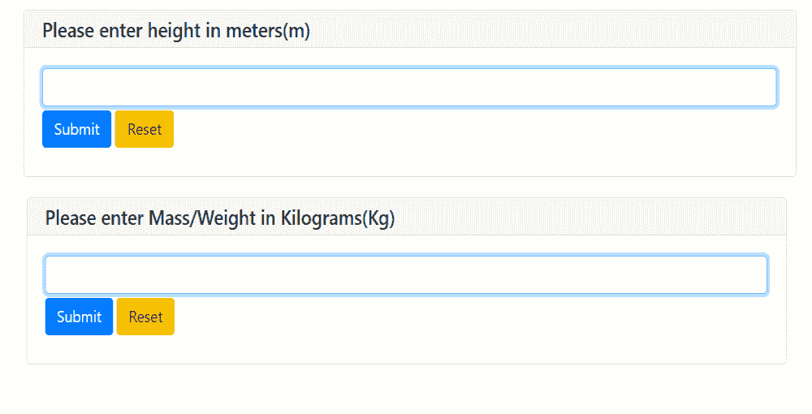
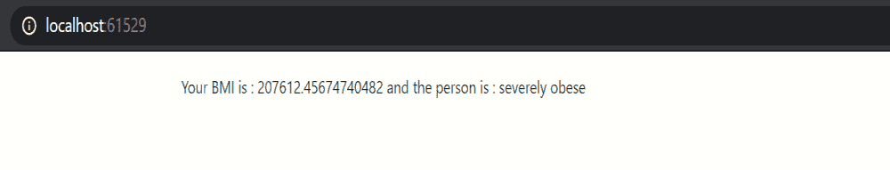

# 如何使用 Python 和 PyWebIO 创建身体质量指数计算器 Web App？

> 原文:[https://www . geesforgeks . org/how-create-BMI-calculator-web-app-use-python-and-pywebio/](https://www.geeksforgeeks.org/how-to-create-bmi-calculator-web-app-using-python-and-pywebio/)

在本文中，我们将使用 **PyWebIO** 模块创建一个身体质量指数计算器。这是一个 python 模块，主要用于使用 Python 编程在网络上创建简单的交互式界面。可以使用以下命令安装:

```
pip install pywebio
```

在创建计算器之前，让我们简单了解一下身体质量指数，身体质量指数(身体质量指数)是通过将一个人的体重(以千克为单位)除以其身高平方而获得的值。身体质量指数的国际单位是千克/米 <sup>2</sup> 。身体质量指数与个人体重成正比，与个人身高的平方成反比。

**公式:**

```
BMI = Mass of person /  (height)2 
where,
Mass in Kilograms(Kg), height in meters(m)
```

现在，我们使用 Python 和一个非常有趣的库 **PyWebIO 创建了一个身体质量指数计算器。**

### **分步实施:**

导入所需的模块。为了使用 python 库 PyWebIO，我们必须从这个库中导入一些重要的模块:

## 计算机编程语言

```
# importing modules
from pywebio.input import *
from pywebio.output import *
```

正如我们在上面的 python 程序中看到的，我们首先从 PyWebIO 库中导入所需的模块。然后我们创建一个类**计算**，其中我们创建**体重计算器()**方法根据作为参数传递的身体质量指数对一个人进行分类

## 计算机编程语言

```
# classify and compute BMI
class calculation:

    # defining method
    def BMIcalculator(self, Height, Mass):

        # compute BMI
        BMI = (Mass)/(Height*Height)

        # classify
        for t1, t2 in [(16, 'severely underweight'), 
                       (18.5, 'underweight'), 
                       (25, 'normal'), (30, 'overweight'), 
                       (35, 'moderately obese'), 
                       (float('inf'), 'severely obese')]:

            if BMI <= t1:
                put_text('Your BMI is', BMI, 'and the person is :', t2)
                break
```

之后，我们从用户那里获得两个输入，作为计算，我们需要身高、体重，然后我们使用身体质量指数公式计算结果身体质量指数，并将它们作为参数传递给 BMIcalculator()，BMi calculator()计算身体质量指数，并根据身体质量指数的结果对体重类别进行分类。

## 计算机编程语言

```
# height input
Height = input("Please enter height in meters(m)", type=FLOAT)

# Mass input
Mass = input("Please enter Mass/Weight in Kilograms(Kg)", type=FLOAT)

obj = calculation()
obj.BMIcalculator(Height, Mass)
```

**下面是完整的程序:**

## 计算机编程语言

```
# importing modules
from pywebio.input import *
from pywebio.output import *

# classify person
class calculation:

    # defining method
    def BMIcalculator(Height, Mass):

        for t1, t2 in [(16, 'severely underweight'),
                       (18.5, 'underweight'),
                       (25, 'normal'),
                       (30, 'overweight'),
                       (35, 'moderately obese'),
                       (float('inf'), 'severely obese')]:
            if BMI <= t1:
                put_text('Your BMI is', BMI, 'and the person is :', t2)
                break

# classify and compute BMI
class calculation:

    # defining method
    def BMIcalculator(self, Height, Mass):

        # compute BMI
        BMI = (Mass)/(Height*Height)

        # classify
        for t1, t2 in [(16, 'severely underweight'),
                       (18.5, 'underweight'),
                       (25, 'normal'), (30, 'overweight'),
                       (35, 'moderately obese'),
                       (float('inf'), 'severely obese')]:

            if BMI <= t1:
                put_text('Your BMI is', BMI, 'and the person is :', t2)
                break

# height input
Height = input("Please enter height in meters(m)", type=FLOAT)

# Mass input
Mass = input("Please enter Mass/Weight in Kilograms(Kg)", type=FLOAT)

obj = calculation()
obj.BMIcalculator(Height, Mass)
```

**输出:**

 

在输出中，我们得到了输入时的高度(1.7 米)和质量(60 公斤)，我们可以在输出中看到计算出的身体质量指数和它们的类型。