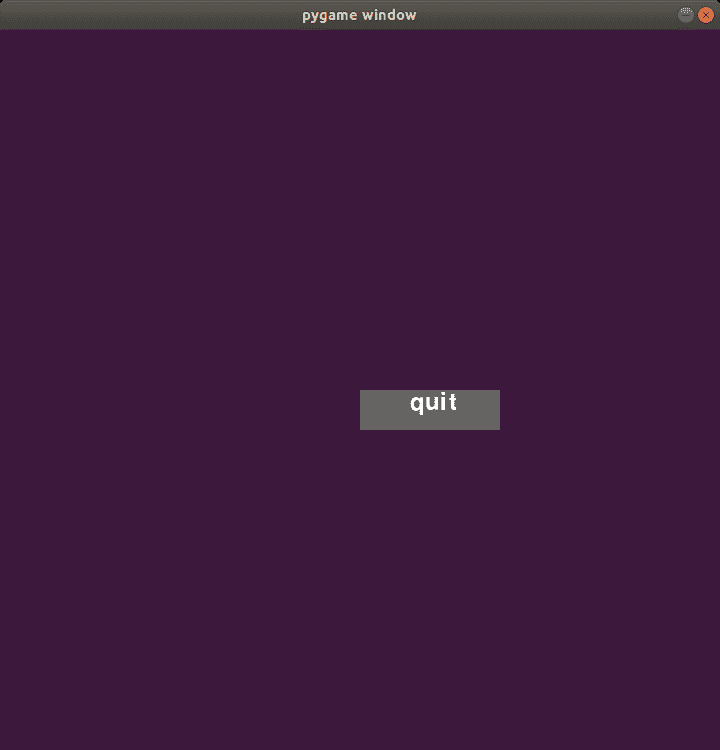

# 如何使用 PyGame 在游戏中创建按钮？

> 原文:[https://www . geeksforgeeks . org/如何使用 pygame 创建游戏中的按钮/](https://www.geeksforgeeks.org/how-to-create-buttons-in-a-game-using-pygame/)

**[Pygame](https://www.geeksforgeeks.org/introduction-to-pygame/)** 是一个 Python 库，可以专门用来设计和构建游戏。Pygame 仅支持使用不同形状/图像(称为精灵)构建的 2D 游戏。Pygame 并不是设计游戏的最佳选择，因为它使用起来非常复杂，并且缺乏像 unity 游戏引擎这样合适的图形用户界面，但是它确实为更大的项目构建了逻辑。

#### 装置

在初始化 pygame 库之前，我们需要安装它。这个库可以使用 Python 为其库安装提供的 *pip* 工具安装到系统中。Pygame 可以通过将这些行写入终端来安装。

```py
pip install pygame
```

## 使用 pygame 创建棘手的按钮

一个游戏必须有可交互的按钮，可以控制游戏中的不同事件，以使游戏更容易控制，并在其中添加适当的图形用户界面。这些可以在 pygame 中创建，方法是在屏幕上创建一个矩形，然后在上面叠加指示文本。为此，我们将使用各种功能，如`draw.rect()`、`screen.blit()`等。为了给它增加更多的活力，我们可以在鼠标悬停在按钮上时改变按钮的颜色。

这可以通过使用更新鼠标指针的 x 和 y 位置的函数并将其作为元组存储在变量中来实现。然后，我们可以将矩形的边界设置为相应的变量，并检查鼠标是否在这些边界中，如果是，块的颜色将更改为较浅的阴影，以指示按钮是可交互的。

下面是实现。

```py
import pygame
import sys

# initializing the constructor
pygame.init()

# screen resolution
res = (720,720)

# opens up a window
screen = pygame.display.set_mode(res)

# white color
color = (255,255,255)

# light shade of the button
color_light = (170,170,170)

# dark shade of the button
color_dark = (100,100,100)

# stores the width of the
# screen into a variable
width = screen.get_width()

# stores the height of the
# screen into a variable
height = screen.get_height()

# defining a font
smallfont = pygame.font.SysFont('Corbel',35)

# rendering a text written in
# this font
text = smallfont.render('quit' , True , color)

while True:

    for ev in pygame.event.get():

        if ev.type == pygame.QUIT:
            pygame.quit()

        #checks if a mouse is clicked
        if ev.type == pygame.MOUSEBUTTONDOWN:

            #if the mouse is clicked on the
            # button the game is terminated
            if width/2 <= mouse[0] <= width/2+140 and height/2 <= mouse[1] <= height/2+40:
                pygame.quit()

    # fills the screen with a color
    screen.fill((60,25,60))

    # stores the (x,y) coordinates into
    # the variable as a tuple
    mouse = pygame.mouse.get_pos()

    # if mouse is hovered on a button it
    # changes to lighter shade 
    if width/2 <= mouse[0] <= width/2+140 and height/2 <= mouse[1] <= height/2+40:
        pygame.draw.rect(screen,color_light,[width/2,height/2,140,40])

    else:
        pygame.draw.rect(screen,color_dark,[width/2,height/2,140,40])

    # superimposing the text onto our button
    screen.blit(text , (width/2+50,height/2))

    # updates the frames of the game
    pygame.display.update()
```

**输出:**

