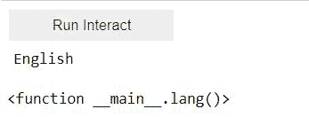

# 如何在 Jupyter 中创建按钮？

> 原文:[https://www . geesforgeks . org/how-to-create-buttons-in-jupyter/](https://www.geeksforgeeks.org/how-to-create-buttons-in-jupyter/)

在本文中，我们将学习如何使用 Python 程序在 Jupyter 中创建一个交互式按钮。交互式按钮是当用户点击时执行特定功能的按钮。对于下面的任务，我们需要**ipywidget**库模块。**ipywidget**，也称为 jupyter-widgets 或简称 widgets，是 jupyter 笔记本和 IPython 内核的交互式 HTML 小部件。

如果您的控制台没有该模块，您可以使用以下命令进行安装:

```
pip install ipywidgets
```

大多数情况下，安装 Python ipywidgets 包也会自动配置经典的 Jupyter Notebook 和 JupyterLab 3.0 来显示 ipywidget。

**示例 1:** 创建一个简单的按钮。

> **语法:**小部件。按钮(描述=“我的按钮”)

**代码:**

## 蟒蛇 3

```
# import module
import ipywidgets as widgets

# creating button
widgets.Button(description = 'My Button')
```

**输出:**


**例 2:**

在这里，我们将创建一个交互式按钮，帮助我们从给定的语言列表中选择一种随机语言。

*   **interaction _ manual()**:自动创建用户界面控件，用于交互探索代码和数据。
*   **choice():** 返回从指定序列中随机选择的元素。

**代码:**

## 蟒蛇 3

```
import ipywidgets as widgets
from ipywidgets import interact, interact_manual, fixed

from random import choice

def lang():
  langSelect = ["English","Deustche","Espanol","Italiano","한국어","日本人"]
  print(choice(langSelect))

interact_manual(lang)
```

**输出:**

