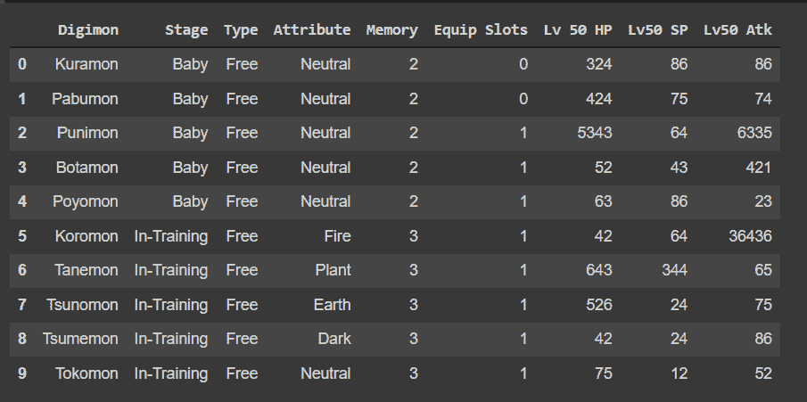
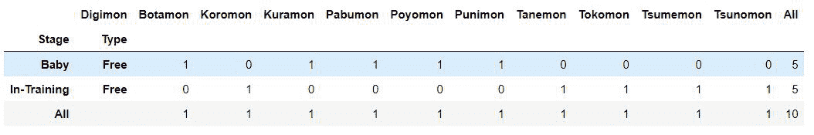
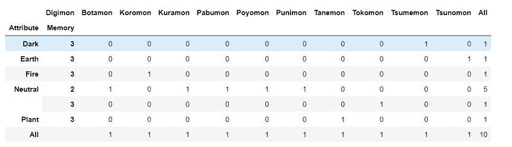

# 如何用 Python 从字典创建交叉表？

> 原文:[https://www . geeksforgeeks . org/如何从 python 字典创建交叉表/](https://www.geeksforgeeks.org/how-to-create-crosstabs-from-a-dictionary-in-python/)

在本文中，我们将看到如何在 Python 中从字典创建交叉表。pandas 交叉表功能建立了一个交叉列表，可以显示特定数据组出现的频率。

该方法用于计算两个(或多个)因素的简单交叉列表。默认情况下，会计算因子的频率表，除非传递了值数组和聚合函数。

> **语法:**pandas . crosstable(索引，列，值=无，行名=无，列名=无，aggfunc =无，边距=假，边距 _name= '全部'，dropna =真，normalize =假)
> 
> **论据:**
> 
> *   索引:类似数组、系列或数组/系列列表，行中的分组依据值。
> *   列:类似数组、系列或数组/系列列表，列中的分组依据值。
> *   值:类似数组的可选值数组，根据因子进行聚合。要求指定“aggfunc”。
> *   行名:序列，默认无，如果传递，必须与传递的行数组数匹配。
> *   列名:序列，默认为无，如果传递，必须与传递的列数组数匹配。
> *   aggfunc:函数，可选，如果指定，还需要指定“值”。
> *   边距:布尔值，默认为 False，添加行/列边距(小计)。
> *   margins_name : str，默认为“全部”，当 margins 为 True 时，将包含总计的行/列的名称。
> *   dropna : bool，默认为 True，不包括条目全部为 NaN 的列。

```py
*** QuickLaTeX cannot compile formula:

*** Error message:
Error: Nothing to show, formula is empty

```

### **分步实施:**

**第一步:**创建字典。

## 蟒蛇 3

```py
raw_data = {'Digimon': ['Kuramon', 'Pabumon', 'Punimon',
                        'Botamon', 'Poyomon', 'Koromon', 
                        'Tanemon', 'Tsunomon', 'Tsumemon', 
                        'Tokomon'],
            'Stage': ['Baby', 'Baby', 'Baby', 'Baby', 'Baby',
                      'In-Training', 'In-Training', 'In-Training',
                      'In-Training', 'In-Training'],
            'Type': ['Free', 'Free', 'Free', 'Free', 'Free', 'Free',
                     'Free', 'Free', 'Free', 'Free'],
            'Attribute': ['Neutral', 'Neutral', 'Neutral',
                          'Neutral', 'Neutral', 'Fire', 'Plant',
                          'Earth', 'Dark', 'Neutral'],

            'Memory': [2, 2, 2, 2, 2, 3, 3, 3, 3, 3],
            'Equip Slots': [0, 0, 1, 1, 1, 1, 1, 1, 1, 1],
            'Lv 50 HP': [324, 424, 5343, 52, 63, 42,
                         643, 526, 42, 75],
            'Lv50 SP': [86, 75, 64, 43, 86, 64, 344,
                        24, 24, 12],
            'Lv50 Atk': [86, 74, 6335, 421, 23, 36436, 
                         65, 75, 86, 52]}
print(raw_data)
```

**输出:**

> {'Digimon': ['Kuramon '，' Pabumon '，'布尼兽'，'黑球兽'，' Poyomon '，' Koromon '，' Tanemon '，' Tsumemon '，' Tokomon']，' Stage': ['Baby '，' Baby '，' Baby '，' Baby '，' Baby '，' Baby '，' In-Training '，' In-Training']，' Type': ['Free '，' Free '，' Free '，' Free '，' Free '，' Free '，' Free '，' Attribute '[' neural '，' neural '，' neura Lv50 SP': [86，75，64，43，86，64，344，24，24，12]，' Lv50 Atk': [86，74，6335，421，23，36436，65，75，86，52]}
> 
> ```py
> *** QuickLaTeX cannot compile formula:
>  
> 
> *** Error message:
> Error: Nothing to show, formula is empty
> 
> ```

**步骤 2:** 使用熊猫数据框功能创建数据框。

## 蟒蛇 3

```py
import pandas as pd
raw_data_df = pd.DataFrame(raw_data,columns= ['Digimon','Stage',
                                            'Type', 'Attribute',
                                            'Memory','Equip Slots',
                                            'Lv 50 HP','Lv50 SP',
                                            'Lv50 Atk'])
print(raw_data_df)
```

**输出:**



**第三步:**使用交叉表。

## 蟒蛇 3

```py
import pandas as pd
raw_data_df=pd.DataFrame(raw_data,columns= ['Digimon','Stage',
                                            'Type',
                                            'Attribute','Memory',
                                            'Equip Slots',
                                            'Lv 50 HP','Lv50 SP',
                                            'Lv50 Atk'])
print(raw_data_df)
```

**输出:**



您也可以向交叉表添加多个索引(行)。这可以通过将变量列表传递给交叉表函数来实现，如果您想按区域和季度细分项目，您可以将它们传递给 index 参数。

## 蟒蛇 3

```py
raw_data_fd = pd.crosstab(
    [raw_data_df['Attribute'], raw_data_df['Memory']],
  raw_data_df['Digimon'], margins=True)
raw_data_fd
```

**输出**

