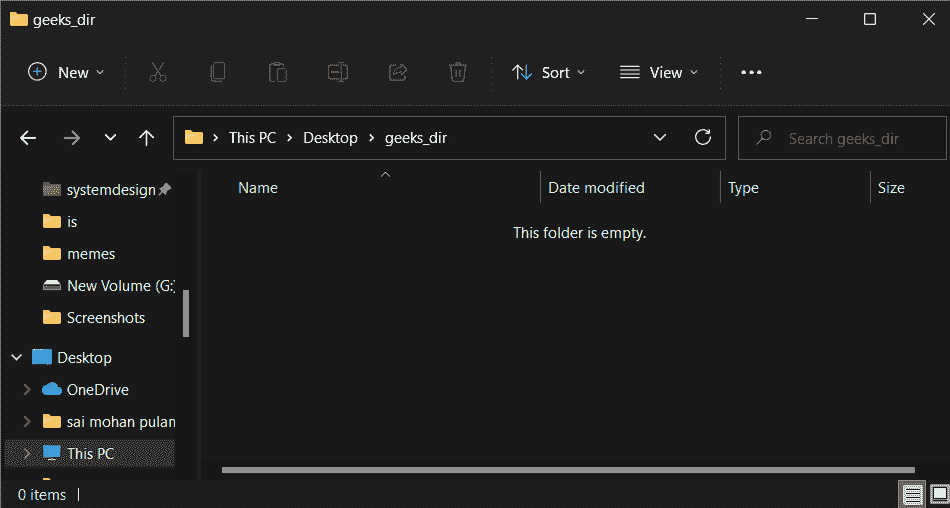
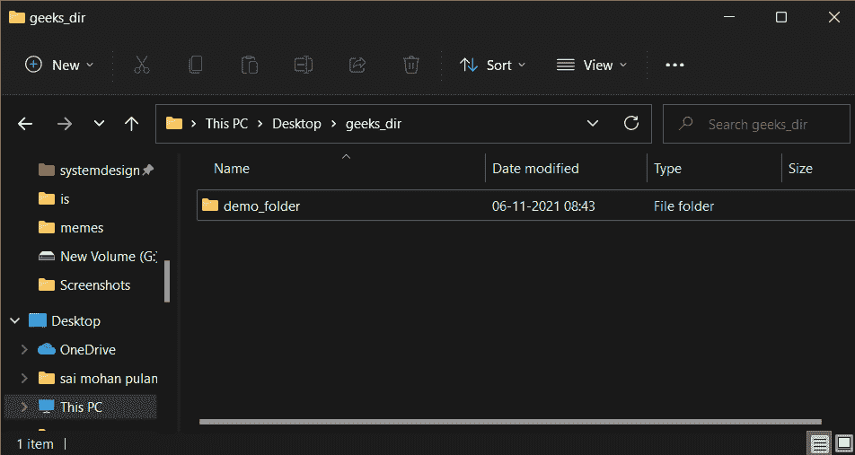
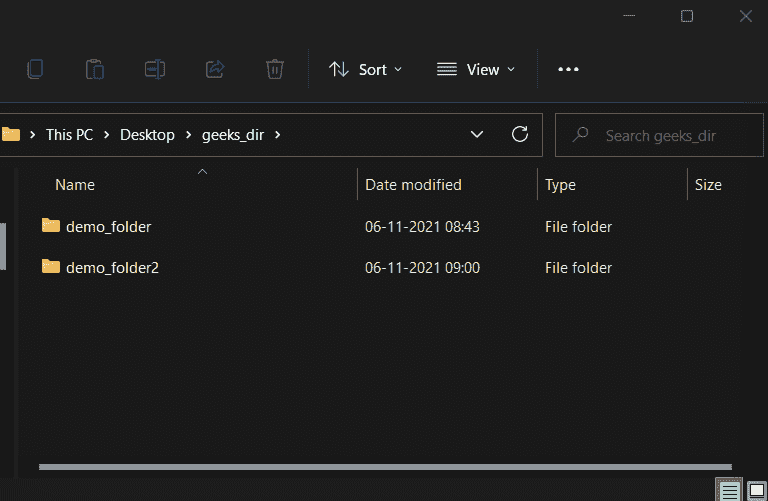

# 如果目录不存在如何使用 Python 创建目录？

> 原文:[https://www . geesforgeks . org/如何使用 python 创建不存在的目录/](https://www.geeksforgeeks.org/how-to-create-directory-if-it-does-not-exist-using-python/)

在本文中，我们将学习如何使用 Python 创建一个不存在的目录。

## **方法 1:** 使用 [os.path.exists()](https://www.geeksforgeeks.org/python-os-path-exists-method/) 和 [os.makedirs()](https://www.geeksforgeeks.org/python-os-makedirs-method/) 方法

在此方法下，我们将使用 exists()方法，该方法以 demo_folder 的路径为参数，如果目录存在，则返回 true，如果目录不存在，则返回 false。makedirs()方法用于递归地创建 demo_folder 目录，即在创建 demo_folder 时，如果缺少任何中间级目录，那么它将创建所有那些中间缺少的目录。在上面的例子中，如果极客目录不存在，那么它将首先创建极客目录，然后创建演示文件夹

**使用的目录:**



## 蟒蛇 3

```
import os

# checking if the directory demo_folder 
# exist or not.
if not os.path.exists("path/to/demo_folder"):

    # if the demo_folder directory is not present 
    # then create it.
    os.makedirs("path/to/demo_folder")
```

**输出:**



## **方法二:**使用 [isdir()](https://www.geeksforgeeks.org/python-os-path-isdir-method/) 和 [makedirs()](https://www.geeksforgeeks.org/python-os-makedirs-method/)

在此方法中，我们将使用 isdir()方法，该方法以 demo_folder2 的路径为参数，如果目录存在，则返回 true，如果目录不存在，则返回 false，并且 makedirs()方法用于递归创建 demo_folder2 目录，即在创建 demo_folder2 时，如果缺少任何中间级别的目录，则创建所有这些中间缺少的目录。在上面的例子中，如果 geeks_dir 不存在，那么它将首先创建 geeks_dir，然后创建 demo_folder2。

**使用的目录:**


## 蟒蛇 3

```
import os

# checking if the directory demo_folder2 
# exist or not.
if not os.path.isdir("path/to/demo_folder2"):

    # if the demo_folder2 directory is 
    # not present then create it.
    os.makedirs("path/to/demo_folder2")
```

**输出:**

