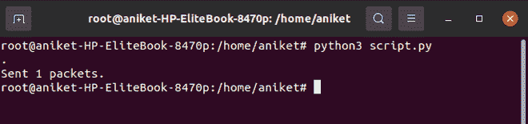
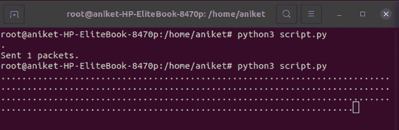
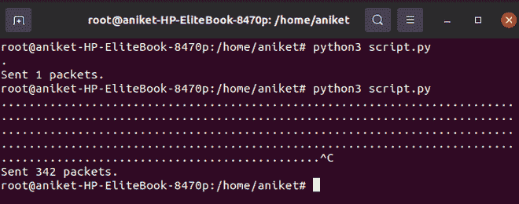

# 如何用 Python 中的 Scapy 创建伪接入点？

> 原文:[https://www . geeksforgeeks . org/如何使用 python 中的 scapy 创建假接入点/](https://www.geeksforgeeks.org/how-to-create-fake-access-points-using-scapy-in-python/)

在本文中，我们将讨论如何使用 python 中的 *scapy* 模块创建假接入点

这个任务可以在 python 包 *scapy-fakeap* 的帮助下完成。使用该库的目的不仅是制作假接入点，而且是测试 802.11 协议及其实现。

**Scapy** 是一个 python 模块，用于与网络上的数据包进行交互。它有几个功能，通过它们我们可以很容易地伪造和操纵数据包。这是一个强大的交互式数据包处理程序。它能够伪造或解码各种协议的数据包，通过网络发送、捕获、匹配请求和回复等等。 *Scapy* 可以轻松处理大多数经典任务，如扫描、跟踪路由、探测、单元测试、攻击或网络发现。可以替代 *hping、arp 欺骗、arp-sk、arping、p0f* 甚至 *Nmap、tcpdump、*和 *tshark* 的部分部件。

**安装:**

要使用这个库，您需要在系统中安装以下 python 包:

*   scapy！scapy
*   互联网协议（Internet Protocol 的缩写）
*   伊蒙-ng
*   dnsmasq(可选)

这些都是 python 包，可以通过运行以下命令以简单的步骤安装:

```
pip3 install scapy-fakeap
```

**注:**

*   为了深入研究代码，我们都需要让您的设备或网络进入监控模式。
*   确保您已经进入了基于 Unix 或 Linux 的系统。

为了更好地监控我们的系统，我们使用了一些实用程序，例如 *aircrack-ng* 。可以使用以下命令安装:

```
apt-get install aircrack-ng
```

**进入监控模式的步骤:**

*   使用 *airmon-ng* 命令启用监控模式
*   首先，使用以下命令终止系统的所有进程:

```
airmon-ng check kill
```

*   为此启用您的无线局域网，运行命令 *ifconfig* 检查系统中的活动网络，然后运行以下命令:

```
airmon-ng start (your WLAN name)
```

这将激活无线局域网的连接。

**你们都已经准备好进一步建设假接入点了**

现在，我们将生成一个随机的 MAC 地址，并设置我们想要创建的接入点的名称，然后创建一个 802.11 帧，字段如下:

1.  **类型=0:** 这将表明这是一个管理帧。
2.  **子类型:**这将指示该管理帧是信标帧。
3.  **地址 1 :** 指的是目的 mac 地址。
4.  **地址 2 :** 这将指源媒体访问控制地址或发送方的媒体访问控制地址。
5.  **地址 3 :** 指接入点的媒体访问控制地址。

现在我们将使用 *addr2* 和 *addr3* 的相同 MAC 地址，因为发送方是接入点。然后我们将使用 *ssid 信息*创建信标帧，然后堆叠在一起，并使用 *scapy* 模块的 *sendp()* 方法发送它们。下面是实现:

## 蟒蛇 3

```
# Import module
from scapy.all import *

# Make an variable interface and assign 
# this name of wlan connection name "my-Wlan"
interface = "my_Wlan"

# This will be sender's MAC address 
# This is there random MAC address generated
sender = RandMAC()

# Assign access point name
access_point_name = "Test"

# Here we will define 802.11 frame
dot11 = Dot11(type=0, subtype=8, 
              addr1="ff:ff:ff:ff:ff:ff",
              addr2=sender, addr3=sender)
beacon = Dot11Beacon()

# Assign ssid in frame
e_SSID = Dot11Elt(ID="SSID", info=access_point_name,
                  len=len(access_point_name))

# stack all the layers and add a RadioTap 
frame = RadioTap()/dot11/beacon/e_SSID

# Send the frame in layer 2 every 100 milliseconds 
# using the iface interface
sendp(frame, inter=0.1, iface=interface, loop=1)
```

**输出:**

<video class="wp-video-shortcode" id="video-535882-1" width="640" height="360" preload="metadata" controls=""><source type="video/mp4" src="https://media.geeksforgeeks.org/wp-content/uploads/20201231221625/gfg.mp4?_=1">[https://media.geeksforgeeks.org/wp-content/uploads/20201231221625/gfg.mp4](https://media.geeksforgeeks.org/wp-content/uploads/20201231221625/gfg.mp4)</video>

当您到达脚本的最后一行并且**循环=0** 时，您的系统将只发送 1 个数据包作为接入点。



当你到达最后一行代码和**循环=1 时，由于系统作为接入点连续发送数据包，将会产生如下输出**。



按下 **ctrl+c** 时，您的系统将停止发送数据包。

