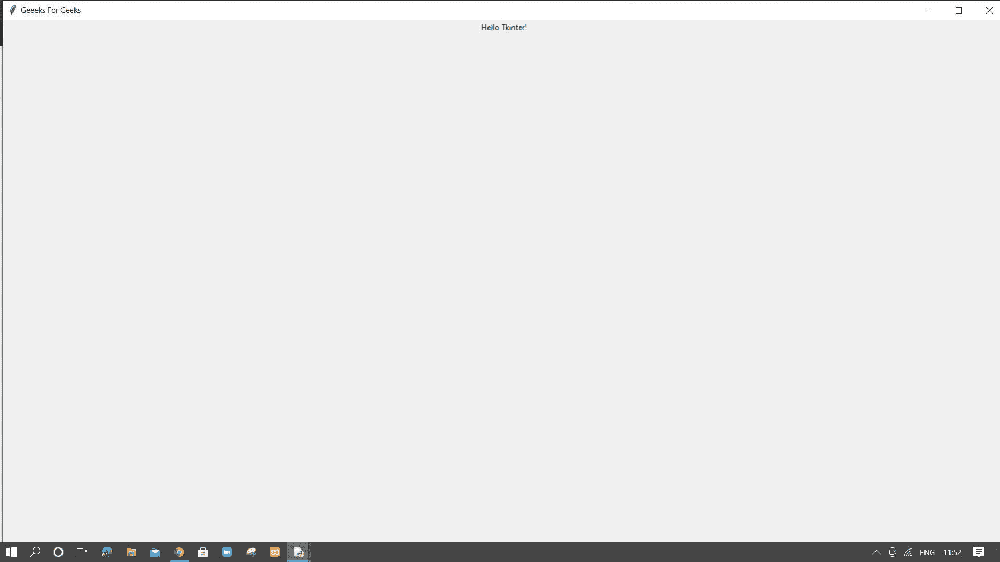

# 如何在 Tkinter 中创建全屏窗口？

> 原文:[https://www . geesforgeks . org/如何创建全屏窗口-in-tkinter/](https://www.geeksforgeeks.org/how-to-create-full-screen-window-in-tkinter/)

**先决条件:**[Tkit](https://www.geeksforgeeks.org/python-gui-tkinter/)

使用标准 python 库创建 GUI 应用程序，有两种方法可以在 tkinter 中创建全屏窗口。

### 方法一:**使用属性()函数**

**语法:**

```py
window_name.attributes('-fullscreen',True)
```

我们将属性()的参数***'-全屏】*** 设置为 ***【真】*** ，将窗口大小设置为全屏，否则设置为假。

**进场:**

*   正在导入 tkinter 包
*   用窗口名称创建 tkinter 窗口
*   将窗口属性全屏设置为真
*   给窗口命名，这里是“极客为极客”
*   创建带有文本“Hello Tkinter”的标签(仅在此向用户显示)
*   使用 pack()放置标签小部件
*   通过调用 mainloop()关闭窗口的循环

**劣势:**

我们得到一个没有工具栏的输出 tkinter WINDOW。这个缺点被下一个方法覆盖了。

**程序**

## 蟒蛇 3

```py
# importing tkinter for gui
import tkinter as tk

# creating window
window = tk.Tk()

# setting attribute
window.attributes('-fullscreen', True)
window.title("Geeks For Geeks")

# creating text label to display on window screen
label = tk.Label(window, text="Hello Tkinter!")
label.pack()

window.mainloop()
```

**输出:**


### 方法 2:使用几何()函数

我们得到一个输出 tkinter 窗口，上面有工具栏和窗口标题。

**语法:**

> width = window _ name . winfo _ screenwidth()
> 
> height = window _ name . winfo _ screen height()
> 
> window_name.geometry("%dx%d" %(宽度、高度))

我们可以将 ***【几何】(*** 的参数设置为与我们原始窗口的屏幕宽度*高度相同，以获得我们的全屏 tkinter 窗口，而不会使工具栏不可见。我们可以分别使用*****winfo _ screen width()**和**winfo _ screen height()***函数得到我们桌面屏幕的宽度和高度。**

****进场:****

*   **正在导入 tkinter 包**
*   **用窗口名称创建 tkinter 窗口**
*   **分别使用宽度可变的 winfo_screenwidth()和高度可变的 winfo_screenheight()获取桌面屏幕的宽度和高度。**
*   **通过设置与 width xh8 相等的尺寸，使用 geometry()设置 tkinter 窗口的大小。**
*   **给窗口命名，这里是“极客为极客”**
*   **创建带有文本“Hello Tkinter”的标签(仅在此向用户显示)**
*   **使用 pack()放置标签小部件**
*   **通过调用 mainloop()关闭窗口的循环**

****程序:****

## **蟒蛇 3**

```py
# importing tkinter gui
import tkinter as tk

#creating window
window=tk.Tk()

#getting screen width and height of display
width= window.winfo_screenwidth() 
height= window.winfo_screenheight()
#setting tkinter window size
window.geometry("%dx%d" % (width, height))
window.title("Geeeks For Geeks")
label = tk.Label(window, text="Hello Tkinter!")
label.pack()

window.mainloop()
```

****输出:****

****