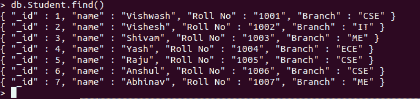
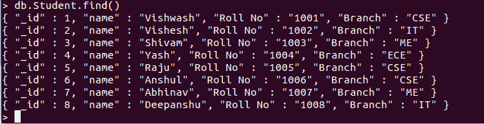

# 如何用 Python 为 MongoDB Collection 创建索引？

> 原文:[https://www . geesforgeks . org/如何使用 python 为 mongodb-collection 创建索引/](https://www.geeksforgeeks.org/how-to-create-index-for-mongodb-collection-using-python/)

**先决条件:** [MongoDB Python 基础知识](https://www.geeksforgeeks.org/mongodb-and-python/)

本文主要讨论 PyMongo 库的 create_index()方法。索引可以高效地执行查询请求，因为它以一种快速且易于遍历的方式存储数据。

让我们从 create_index()方法开始:

1.  **Importing PyMongo Module:** Import the PyMongo module using the command:

    ```
    from pymongo import MongoClient
    ```

    如果您的机器上尚未安装 MongoDB，您可以参考指南:[使用 Python 安装 MongoDB 的指南](https://www.geeksforgeeks.org/guide-install-mongodb-python-windows/)

2.  **创建连接:**现在我们已经导入了模块，是时候建立与 MongoDB 服务器的连接了，该服务器大概运行在端口 27017(端口号)的 localhost(主机名)上。

    ```
    client = MongoClient(‘localhost’, 27017)
    ```

3.  **访问数据库:**由于与 MongoDB 服务器的连接已经建立。我们现在可以创建或使用现有的数据库。

    ```
    mydatabase = client.name_of_the_database
    ```

4.  **访问集合:**我们现在使用以下语法从数据库中选择集合:

    ```
    collection_name = mydatabase.name_of_collection
    ```

5.  **Creating a index:** Now we will create the index using create_index() function.

    **语法:**

    ```
    create_index(keys, session=None, **kwargs)
    ```

**示例:**

**样本数据库:**



```
# Python program to demonstrate
# create_index() method

# Importing Library
from pymongo import MongoClient, ASCENDING

# Connecting to MongoDB server
# client = MongoClient('host_name', 'port_number')
client = MongoClient('localhost', 27017)

# Connecting to the database named
# GFG
mydatabase = client.GFG

# Accessing the collection named
# gfg_collection
mycollection = mydatabase.Student

mycollection.create_index('Roll No', unique = True)

# Inserting into Database
mycollection.insert_one({'_id':8 , 
                         'name': 'Deepanshu', 
                         'Roll No': '1008',
                         'Branch': 'IT'})

# Inserting with the same Roll no again.
# As the Roll no field is the index and
# is set to unique it will through the error.
mycollection.insert_one({'_id':9 , 
                         'name': 'Hitesh', 
                         'Roll No': '1008',
                         'Branch': 'CSE'})
```

**输出:**

> 重复密钥错误追溯(最近一次调用最后一次)
> <ipython-input-49-c72d5798fc5a>在 <module>36“名称”:“Hitesh”，
> 37“Roll No”:“1008”，
> — > 38“分支”:“CSE”})</module></ipython-input-49-c72d5798fc5a>
> 
> 重复密钥错误:E11000 重复密钥错误集合:GFG。学生索引:Roll No_1 dup 键:{:“1008”}

**蒙戈布外壳:**



它会引发`DuplicateKeyError`，因为已经存在一个具有卷号`1008`的文档，并且我们正在尝试插入另一个具有相同卷号的文档。发生此错误是因为我们在“卷号”字段上创建了一个索引并将其标记为唯一。