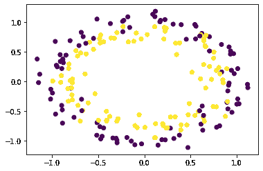
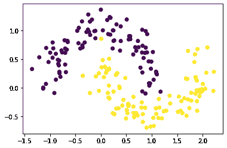
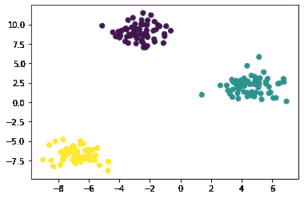
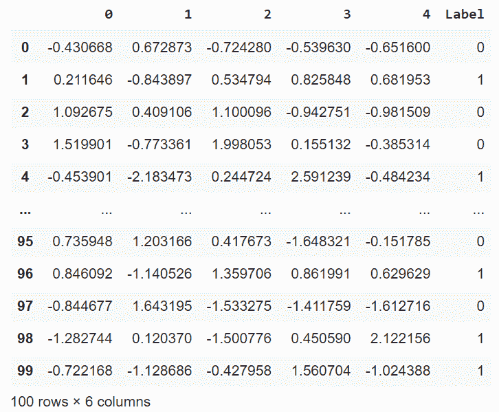
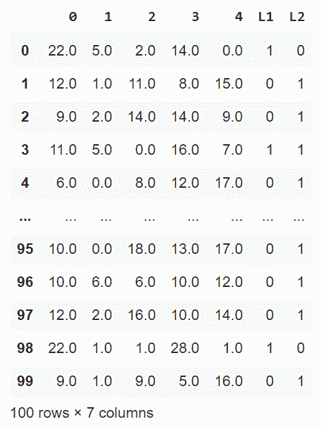

# 如何在 Python 中创建用于分类的模拟数据？

> 原文:[https://www . geeksforgeeks . org/如何用 python 创建分类模拟数据/](https://www.geeksforgeeks.org/how-to-create-simulated-data-for-classification-in-python/)

在本文中，我们将看到如何在 Python 中创建用于分类的模拟数据。

我们将使用 sklearn 库，它为模拟分类数据提供了各种生成器。

## 单一标签分类

这里我们将看到单标签分类，为此我们将使用一些可视化技术。

### 示例 1:使用 **make_circles()**

**make_circles** 生成具有球形决策边界的二维二进制分类数据。

## 蟒蛇 3

```
from sklearn.datasets import make_circles
import pandas as pd
import matplotlib.pyplot as plt

X, y = make_circles(n_samples=200, shuffle=True, 
                    noise=0.1, random_state=42)
plt.scatter(X[:, 0], X[:, 1], c=y)
plt.show()
```

**输出:**



### **示例 2:使用 make_moons()**

**make_moons()** 生成两个交错半圆形状的 2d 二进制分类数据。

## 蟒蛇 3

```
from sklearn.datasets import make_moons
import pandas as pd
import matplotlib.pyplot as plt

X, y = make_moons(n_samples=200, shuffle=True,
                  noise=0.15, random_state=42)
plt.scatter(X[:, 0], X[:, 1], c=y)
plt.show()
```

**输出:**



### 例 3。使用 **make_blobs()**

**make_blobs()** 以 blob 的形式生成可用于聚类的数据

## 蟒蛇 3

```
from sklearn.datasets import make_blobs
import pandas as pd
import matplotlib.pyplot as plt

X, y = make_blobs(n_samples=200, n_features=2, centers=3,
                  shuffle=True, random_state=42)
plt.scatter(X[:, 0], X[:, 1], c=y)
plt.show()
```

**输出:**



### 例 4。使用**make _ classing()**

**make_classification()** 生成随机 n 类分类问题

## 蟒蛇 3

```
from sklearn.datasets import make_classification
import pandas as pd
import matplotlib.pyplot as plt

X, y = make_classification(n_samples=100, n_features=5,
                           n_classes=2,
                           n_informative=2, n_redundant=2,
                           n_repeated=0,
                           shuffle=True, random_state=42)
pd.concat([pd.DataFrame(X), pd.DataFrame(
    y, columns=['Label'])], axis=1)
```

**输出:**



## 多标签分类

**make _ multi label _ classification()**生成随机多标签分类问题。

## 蟒蛇 3

```
from sklearn.datasets import make_multilabel_classification
import pandas as pd
import matplotlib.pyplot as plt

X, y = make_multilabel_classification(n_samples=100, n_features=5, 
                                      n_classes=2, n_labels=1,
                                      allow_unlabeled=False,
                                      random_state=42)
pd.concat([pd.DataFrame(X), pd.DataFrame(y, 
                                         columns=['L1', 'L2'])],
          axis=1)
```

**输出:**

