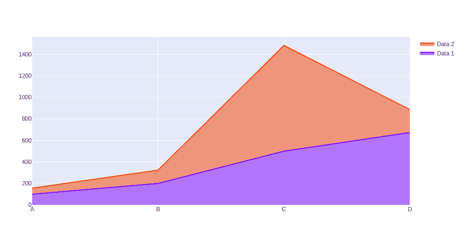
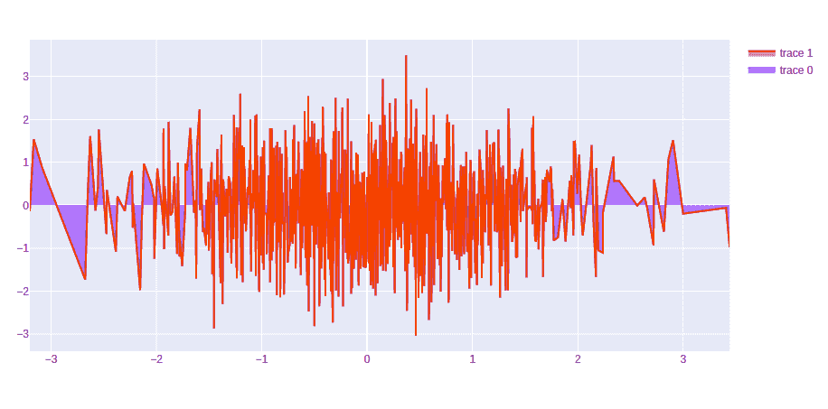
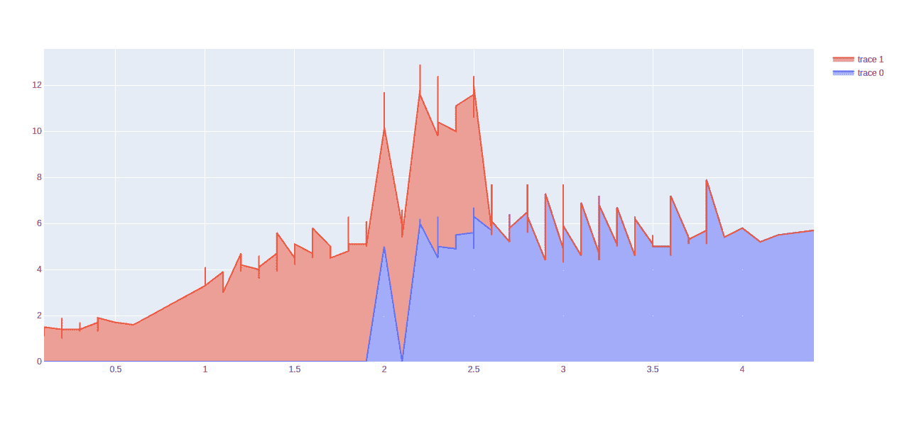

# 如何在 Python 中使用 Plotly 创建堆叠面积图？

> 原文:[https://www . geeksforgeeks . org/如何使用 python 中的 plotly 创建堆叠区域图/](https://www.geeksforgeeks.org/how-to-create-stacked-area-plot-using-plotly-in-python/)

**Plotly** 是一个 Python 库，用来设计图形，尤其是交互图形。它可以绘制各种图形和图表，如直方图、条形图、箱线图、展开图等。它主要用于数据分析以及财务分析。plotly 是一个交互式可视化库。

## 堆叠面积图

堆叠面积图是基本面积图的放大图，用于显示同一图形上几组数值的放大图。每组的值显示在彼此的顶部。这是最好的图表，用来显示类别的分布，作为整个地区的一部分，累积总数是不必要的。可以通过传递 **graph_objects** 类的**散点()**方法中的**堆栈组**参数来创建

**例 1:**

## 蟒蛇 3

```
import plotly.graph_objects as px
import numpy

# creating random data through randomint 
# function of numpy.random 
np.random.seed(42)

random_x= np.random.randint(1,101,100) 
random_y= np.random.randint(1,101,100)

x = ['A', 'B', 'C', 'D']

plot = px.Figure()

plot.add_trace(go.Scatter(
    name = 'Data 1',
    x = x,
    y = [100, 200, 500, 673],
    stackgroup='one'
   ))

plot.add_trace(go.Scatter(
    name = 'Data 2',
    x = x,
    y = [56, 123, 982, 213],
    stackgroup='one'
   )
)

plot.show()
```

**输出:**



**例 2:**

## 蟒蛇 3

```
import plotly.graph_objects as go
import numpy

plot = go.Figure(data=[go.Scatter(
    x = np.random.randn(1000),
    y = np.random.randn(1000),
    stackgroup='one'),
                       go.Scatter(
    x = np.random.randn(10),
    y = np.random.randn(50),
    stackgroup='one')
])

plot.show()
```

**输出:**



**例 3:**

## 蟒蛇 3

```
import plotly.graph_objects as go
import plotly.express as px
import numpy

df = px.data.iris()

plot = go.Figure(data=[go.Scatter(
    x = df['sepal_width'],
    y = df['sepal_length'],
    stackgroup='one'),
                       go.Scatter(
    x = df['petal_width'],
    y = df['petal_length'],
    stackgroup='one')
])

plot.show()
```

**输出:**

