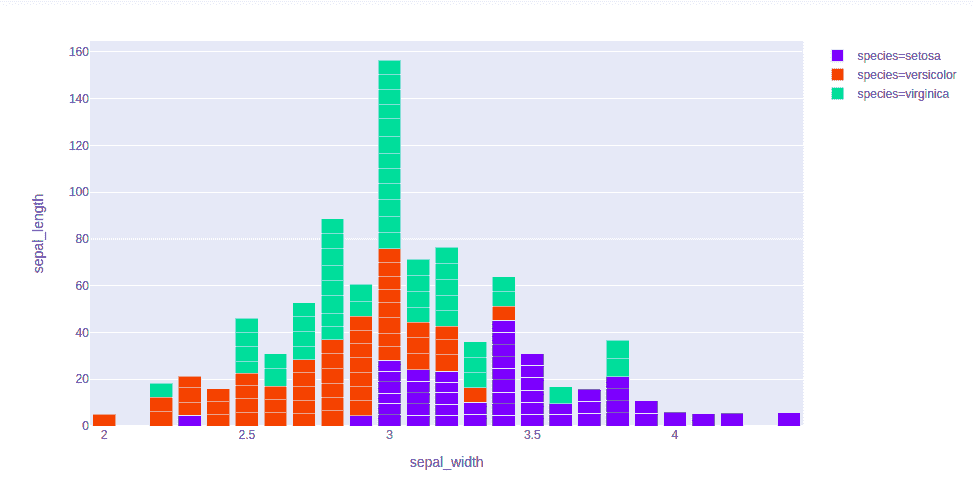
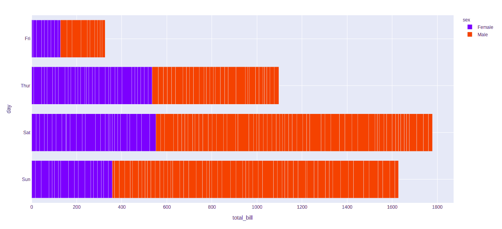
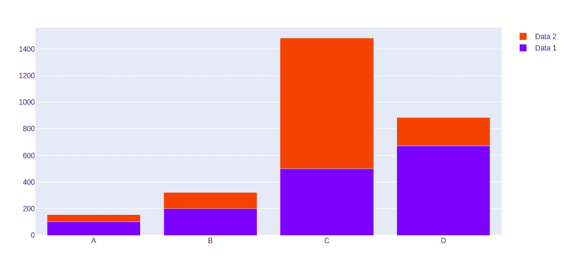

# 如何用 Python-Plotly 创建堆叠条形图？

> 原文:[https://www . geeksforgeeks . org/如何创建堆叠条形图 python-plotly/](https://www.geeksforgeeks.org/how-to-create-stacked-bar-chart-in-python-plotly/)

**Plotly** 是一个 Python 库，用来设计图形，尤其是交互图形。它可以绘制各种图形和图表，如直方图、条形图、箱线图、展开图等。它主要用于数据分析以及财务分析。plotly 是一个交互式可视化库。

## 堆叠条形图

**堆叠条形图**或图形是一种使用条形图来演示数据类别之间的比较的图表，但具有传递和比较整体部分的能力。图表中的每个条形代表一个整体，分段代表该整体的不同部分或类别。

**示例 1:** 使用虹膜数据集

## 蟒蛇 3

```
import plotly.express as px

df = px.data.iris()

fig = px.bar(df, x="sepal_width", y="sepal_length", color="species",
            hover_data=['petal_width'], barmode = 'stack')

fig.show()
```

**输出:**



**示例 2:** 使用 tips 数据集

## 蟒蛇 3

```
import plotly.express as px

df = px.data.tips()

fig = px.bar(df, x="total_bill", y="day",
             color="sex", barmode = 'stack')

fig.show()
```

**输出:**



**示例 3:** 使用 graph_objects 类

## 蟒蛇 3

```
import plotly.graph_objects as px
import numpy as np

# creating random data through randomint
# function of numpy.random
np.random.seed(42)

random_x= np.random.randint(1,101,100)
random_y= np.random.randint(1,101,100)

x = ['A', 'B', 'C', 'D']

plot = px.Figure(data=[go.Bar(
    name = 'Data 1',
    x = x,
    y = [100, 200, 500, 673]
   ),
                       go.Bar(
    name = 'Data 2',
    x = x,
    y = [56, 123, 982, 213]
   )
])

plot.update_layout(barmode='stack')

plot.show()
```

**输出:**

