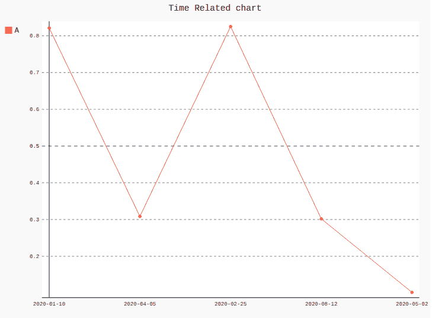

# 如何在 Pygal 中创建时间相关折线图？

> 原文:[https://www . geesforgeks . org/如何创建时间相关折线图 in-pygal/](https://www.geeksforgeeks.org/how-to-create-time-related-line-chart-in-pygal/)

Pygal 是一个 Python 模块，主要用于构建 SVG(标量矢量图形)图形和图表。SVG 是一种基于矢量的 XML 格式的图形，可以在任何编辑器中编辑。Pygal 可以用最少的代码行创建图表，这些代码行易于理解和编写。

## 时间相关图表

可以使用折线图绘制与时间相关的图表。折线图或折线图是一种图表类型，它有助于将信息显示为一系列称为“标记”的数据点，这些标记通过线段直接相连。为了绘制与时间相关的图，我们必须格式化标签。为了更好的理解，请看下面的例子。

**Example 1:**

```py
# importing pygal
import pygal
from datetime import datetime
import numpy

# creating line chart object
line_chart = pygal.Line()

# naming the title
line_chart.title = 'Time Related chart'

# Formatting labels
line_chart.x_labels = map(lambda d: d.strftime('% Y-% m-% d'),
                          [datetime(2020, 1, 10),
                          datetime(2020, 4, 5),
                          datetime(2020, 2, 25),
                          datetime(2020, 8, 12),
                          datetime(2020, 5, 2)])

# adding lines
line_chart.add('A', numpy.random.rand(5))

line_chart
```

**输出:**



**例 2:**

```py
# importing pygal
import pygal
from datetime import datetime
import numpy

# creating line chart object
line_chart = pygal.StackedLine(fill ="True")

# naming the title
line_chart.title = 'Time Related chart'

# Formatting labels
line_chart.x_labels = map(lambda d: d.strftime('% Y-% m-% d'),
                          [datetime(2020, 1, 10),
                          datetime(2020, 4, 5),
                          datetime(2020, 2, 25),
                          datetime(2020, 8, 12),
                          datetime(2020, 5, 2)])

# adding lines
line_chart.add('A', numpy.random.rand(5))

line_chart
```