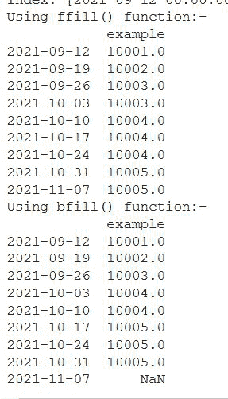
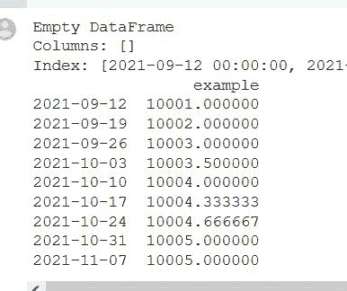
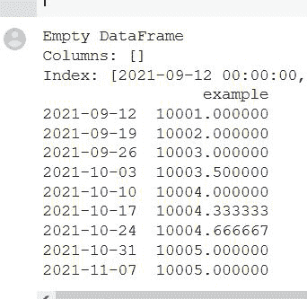

# Python 中如何处理时间序列中的缺失值？

> 原文:[https://www . geeksforgeeks . org/如何处理 python 中的时间序列缺失值/](https://www.geeksforgeeks.org/how-to-deal-with-missing-values-in-a-timeseries-in-python/)

在本文中，我们将讨论如何使用 Python 编程语言处理时间序列中的缺失值。

时间序列是以规则的时间间隔记录的一系列观察结果。时间序列分析有助于了解给定资产、证券或经济变量如何随时间变化。这里的另一个大问题是，为什么我们需要处理数据集中的缺失值，以及缺失值为什么会出现在数据中？

*   在数据集的预处理过程中，缺失数据的处理非常重要，因为许多机器学习算法不支持缺失值。
*   由于在读取或记录数据时出现问题，时间序列可能会有缺失点。

为什么我们不能用全球平均值来改变缺失的值，因为时间序列数据可能有一些像季节性或趋势？均值和模式插补、删除和其他方法等传统方法不足以处理缺失值，因为这些方法会对数据造成偏差。用某些程序或算法产生的值对缺失数据进行估计或插补，可能是使传统数据方法的偏差效应最小化的最佳解决方案。这样最后，数据将被完成，并准备好用于分析或数据挖掘的另一个步骤。

## 方法 1:使用 ffill()和 bfill()方法

该方法根据顺序和条件填充缺失的值。这意味着该方法用上一次观察到的非 nan 值或下一次观察到的非 nan 值替换“nan”值。

1.  回填–[b 填充](https://www.geeksforgeeks.org/python-pandas-dataframe-bfill/):根据上次观测值
2.  forward fill–[ffill](https://www.geeksforgeeks.org/python-pandas-dataframe-ffill/):根据下一个观测值

## 蟒蛇 3

```py
# import the libraries
import pandas as pd
import numpy as np

# dataframe with index as timeseries
time_sdata = pd.date_range("09/10/2021", periods=9, freq="W")

df = pd.DataFrame(index=time_sdata)
print(df)

# there are four missing values
df["example"] = [10001.0, 10002.0, 10003.0, np.nan,
                 10004.0, np.nan, np.nan, 10005.0, np.nan]

gfg1 = df.ffill()
print("Using ffill() function:-")
print(gfg1)

# here we are doing Backfill Missing Values
# in the output the last value has NaN because 
# there is no backward value for that
gfg2 = df.bfill()
print("Using bfill() function:-")
print(gfg2)
```

**输出:**



## 方法二:使用[插值()](https://www.geeksforgeeks.org/python-pandas-dataframe-interpolate/)方法

该方法比上述 [fillna()](https://www.geeksforgeeks.org/python-pandas-dataframe-fillna-to-replace-null-values-in-dataframe/) 方法更复杂。它由不同的方法论组成，包括‘线性’、‘二次’、‘最近’。插值是填补时间序列数据中缺失值的有力方法。查看下面提供的链接，了解更多示例。

## 蟒蛇 3

```py
# import the libraries
import pandas as pd
import numpy as np

# dataframe with index as timeseries
time_sdata = pd.date_range("09/10/2021", periods=9, freq="W")

df = pd.DataFrame(index=time_sdata)
print(df)

# there are four missing values
df["example"] = [10001.0, 10002.0, 10003.0, np.nan,
                 10004.0, np.nan, np.nan, 10005.0, np.nan]

# using interpolate() to fill the missing 
# values in a specific order
# dealing with missing values
dataframe1 = df.interpolate()
print(dataframe1)
```

**输出:**



## 方法 3:使用带极限参数的插值()方法

这是向前/向后填充的连续 NaN 值的最大数量。换句话说，如果有一个超过这个数量的连续 nan 的间隙，它将只被部分填充。

**语法:**

> DataFrame.interpolate(方法='linear '，轴=0，限制=无，inplace=False，limit _ direction =无，limit _ area =无，向下转换=无，**kwargs)

**注意:**带有多索引的数据帧/系列只支持方法=“线性”。

## 蟒蛇 3

```py
# import the libraries
import pandas as pd
import numpy as np

# dataframe with index as timeseries
time_sdata = pd.date_range("09/10/2021", periods=9, freq="W")

df = pd.DataFrame(index=time_sdata)
print(df)

# there are four missing values
df["example"] = [10001.0, 10002.0, 10003.0, np.nan,
                 10004.0, np.nan, np.nan, 10005.0, np.nan]

# Interpolating Missing Values to two values
dataframe = df.interpolate(limit=2, limit_direction="forward")
print(dataframe)
```

**输出:**

