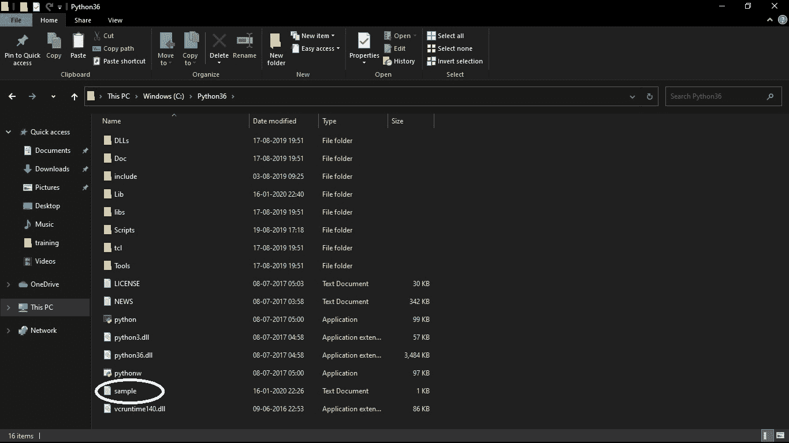
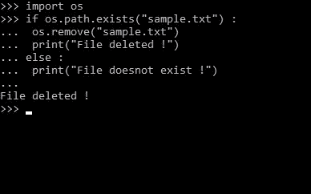
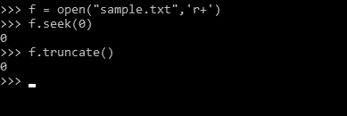
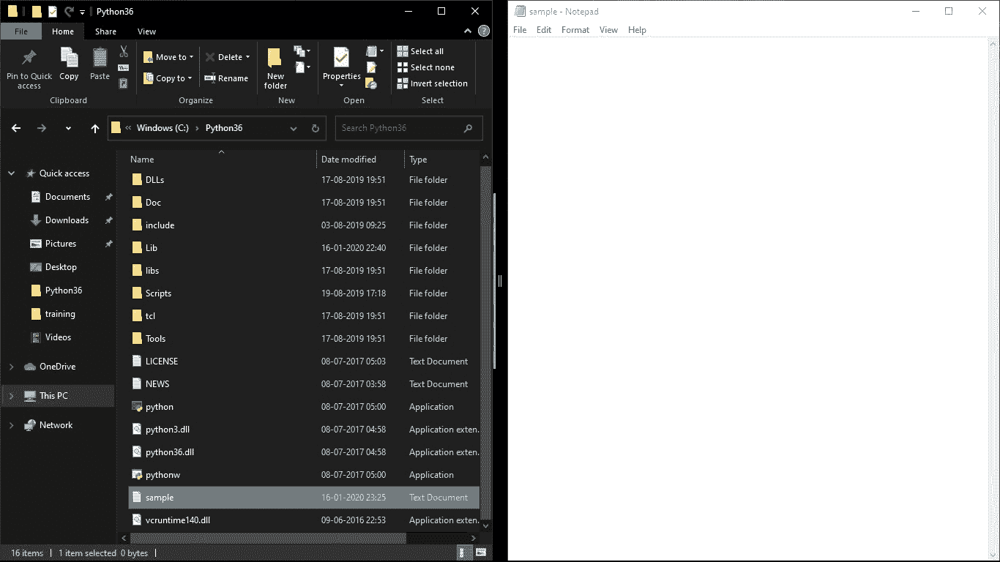
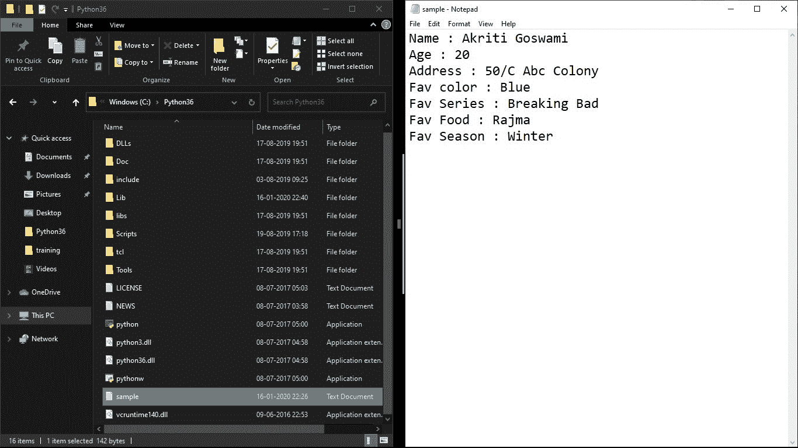
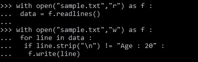
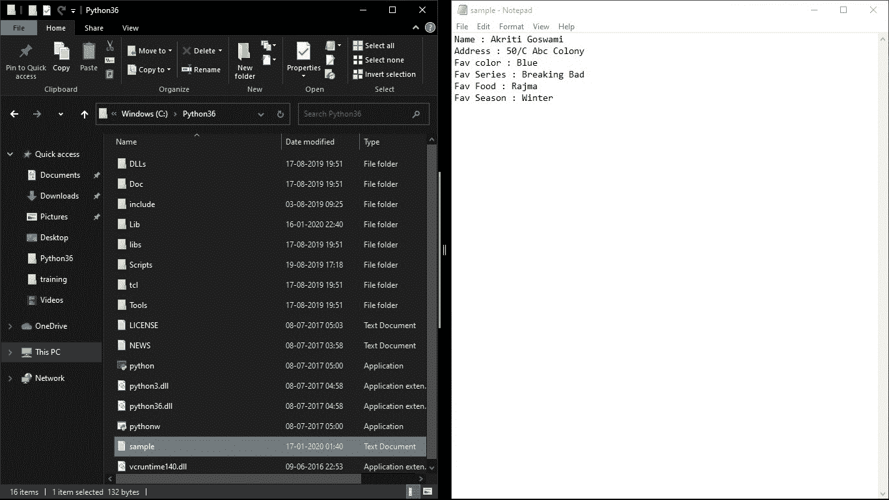

# 如何在 Python 中删除文件中的数据

> 原文:[https://www . geesforgeks . org/如何从 python 文件中删除数据/](https://www.geeksforgeeks.org/how-to-delete-data-from-file-in-python/)

当我们不再需要数据时，我们通常更喜欢将其擦除或删除，以便空间可以被其他对我们很重要的数据占用。Python 也支持文件处理，并允许用户处理文件，即读写文件，以及许多其他文件处理选项，对文件进行操作。

> **参考下面的文章，了解 Python 中文件处理的思路。**
> 
> *   [Python 中的文件处理](https://www.geeksforgeeks.org/file-handling-python/)
> *   [Python 中文本文件的读写](https://www.geeksforgeeks.org/reading-writing-text-files-python/)

在这里，我们将学习在 Python 中从文件中删除数据时使用的不同方法。

**方法 1:当整个数据连同文件都在时，必须删除！**

Python 中的 os.remove()方法用于移除或删除文件路径。此方法不能删除目录。如果指定的路径是目录，则该方法将引发 OSError。os.rmdir()可用于删除目录。

**示例:**

**执行前:**



```py
# code to delete entire data along with file
import os

# check if file exists
if os.path.exists("sample.txt"):
    os.remove("sample.txt")

    # Print the statement once
    # the file is deleted 
    print("File deleted !") 

else:

    # Print if file is not present 
    print("File doesnot exist !") 
```



**执行后:**


**注意:**更多信息请参考 [Python | os.remove()方法](https://www.geeksforgeeks.org/python-os-remove-method/)

**方法 2:当必须删除整个数据，但不删除它所在的文件时！**

`[Truncate()](https://www.geeksforgeeks.org/python-file-truncate-method/)`方法截断文件的大小。如果存在可选的大小参数，文件将被截断到(最多)该大小。大小默认为当前位置。当前文件位置不变。请注意，如果指定的大小超过文件的当前大小，则结果取决于平台:可能包括文件可能保持不变，增加到指定的大小，就像零填充一样，或者增加到具有未定义新内容的指定大小。要截断文件，可以在追加模式或写入模式下打开文件。

**示例:**

**执行前:**


```py
# code to delete entire data 
# but not the file, it is in

# open file 
f = open("sample.txt", "r+") 

# absolute file positioning
f.seek(0) 

# to erase all data 
f.truncate() 
```

**输出:**



**执行后:**



**注意:**更多信息请参考 [Python 文件截断()方法](https://www.geeksforgeeks.org/python-file-truncate-method/)。

**方法 3:从文件中删除特定数据**

这可以通过以下方式实现:

1.  以读取模式打开文件，从文件中获取所有数据。以写模式重新打开文件，并写回所有数据，但要删除的数据除外
2.  在新文件中重写文件，除了我们想要删除的数据。更快)

让我们看看第一个。

**示例:**

**执行前:**



```py
# code to delete a particular
# data from a file

# open file in read mode
with open("sample.txt", "r") as f:

    # read data line by line 
    data = f.readlines()

# open file in write mode
with open("sample.txt", "w") as f:

    for line in data :

        # condition for data to be deleted
        if line.strip("\n") != "Age : 20" : 
            f.write(line)
```

**输出:**



**执行后:**

