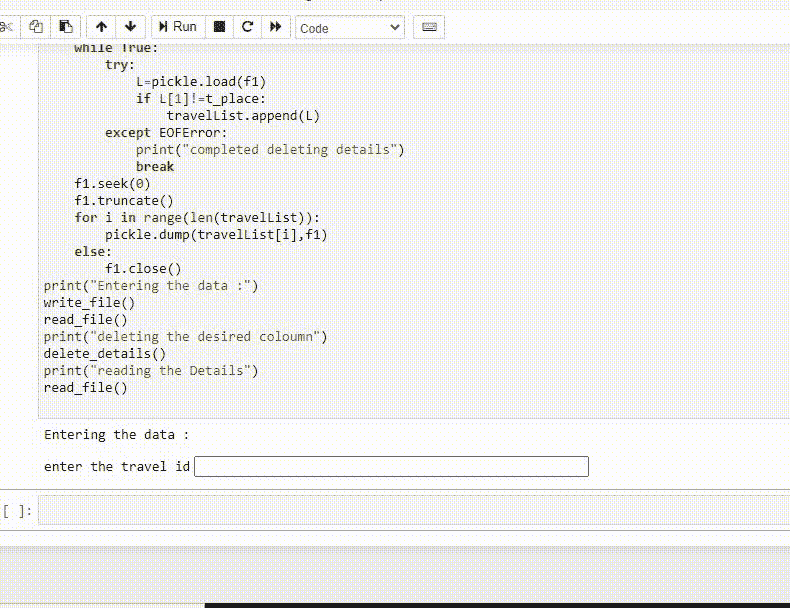

# 如何在 Python 中从 pickle 文件中删除？

> 原文:[https://www . geeksforgeeks . org/如何从 python 泡菜文件中删除/](https://www.geeksforgeeks.org/how-to-delete-from-a-pickle-file-in-python/)

Python [pickle](https://www.geeksforgeeks.org/pickle-python-object-serialization/) 模块用于对 Python 对象结构进行序列化和反序列化。Python 中的任何对象都可以被腌制，以便保存在磁盘上。pickle 所做的是在将对象写入文件之前先“序列化”对象。酸洗是一种转换 python 对象(列表、字典等)的方法。)转换成字符流。想法是这个字符流包含在另一个 python 脚本中重建对象所需的所有信息

Pickle 一次序列化一个对象，并回读一个对象—酸洗后的数据按顺序记录在文件中。如果简单地执行 pickle.load，您将读取序列化到文件中的第一个对象(而不是您编写的最后一个对象)。在取消第一个对象的序列化后，文件指针位于下一个对象的开头——如果您简单地再次调用 pickle.load，它将读取下一个对象——这样做直到文件结束。

### 使用的功能:

*   **dump()**–用于将 obj 的腌制表示写入打开的文件对象文件。

**语法:**

> pickle.dump(对象、文件、协议=无，* fix _ imports =真)

*   **load()**–用于从打开的文件对象文件中读取一个腌制对象表示，并返回指定的重构对象层次。

**语法:**

> pickle.load(文件，* fix _ imports = True，编码=“ASCII”，错误=“strict”)

*   **seek(0)-** Pickle 记录可以连接成一个文件，所以是的，你可以多次 pickle.load(f)，但是文件本身没有索引，这样你就可以在给定的记录中进行 seek。f.seek(0)正在查找文件中的第三个字节，该字节位于 pickle 记录的中间，因此是不可取出的。如果您需要随机访问，您可能希望查看内置的搁置模块，该模块使用数据库文件模块在 pickle 之上构建类似字典的接口。
*   **truncate()-** 更改文件大小

要从 pickle 文件中删除内容，我们首先需要向其中添加内容，下面给出了一种方法来实现同样的操作:

**接近**

*   导入模块
*   以写入模式打开文件
*   输入数据
*   将数据转储到文件
*   继续，直到选择是
*   关闭文件

**程序:**

## 蟒蛇 3

```py
import pickle

def write_file():

    f = open("travel.txt", "wb")
    op = 'y'

    while op == 'y':

        Travelcode = int(input("enter the travel id"))
        Place = input("Enter the Place")
        Travellers = int(input("Enter the number of travellers"))
        buses = int(input("Enter the number of buses"))

        pickle.dump([Travelcode, Place, Travellers, buses], f)

        op = input("Dp you want to continue> (y or n)")

    f.close()

print("entering the details of passengers in the pickle file")
write_file()
```

既然我们已经将数据输入到文件中，下面给出了从文件中删除数据的方法以及基于该方法的实现:

**接近**

*   导入模块
*   开文件
*   输入一些关于要删除的数据的信息
*   删除适当的数据
*   关闭文件

**程序:**

## 蟒蛇 3

```py
import pickle

def delete_details():

    f1 = open("travel.txt", 'rb+')
    travelList = []
    t_place = input("Enter the place to delete :")

    while True:
        try:
            L = pickle.load(f1)
            if(L[1] != t_place):
                travelList.append(L)
        except EOFError:
            print("completed deleting details")
            break

    f1.seek(0)
    f1.truncate()

    for i in range(len(travelList)):
        pickle.dump(travelList[i], f1)
    else:
        f1.close()

# reading content in the file.
def read_file():

    f = open("travel.txt", 'rb')
    while True:
        try:
            L = pickle.load(f)
            print("Place", L[1], "\t\t Travellers :",
                  L[2], "\t\t Buses :", L[3])

        except EOFError:
            print("Completed reading details")
            break
    f.close()

print("deleting the desired column")
delete_details()

print("Reading the file")
read_file()
```

**输出:**

