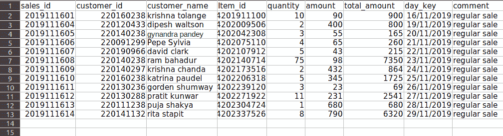
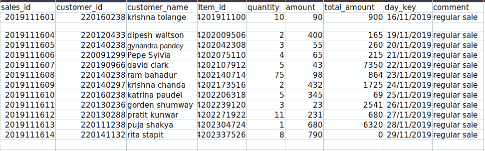
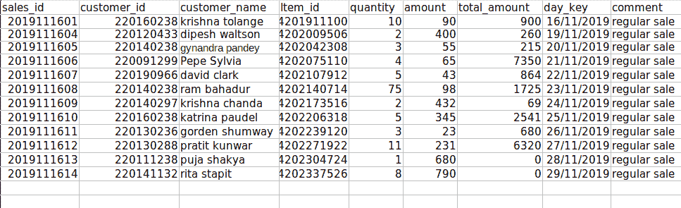
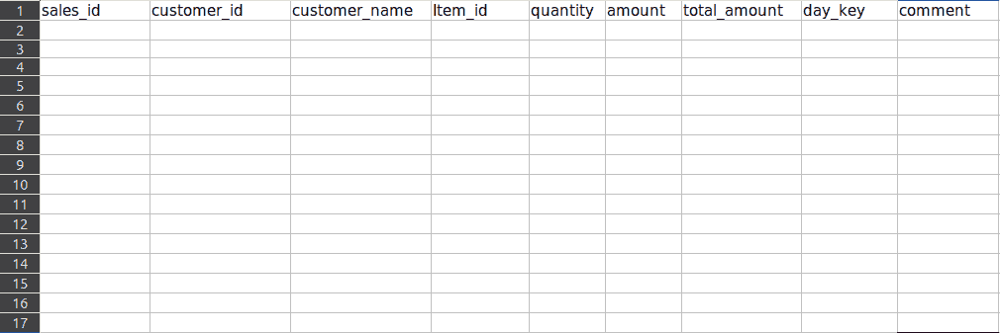

# 如何使用 Openpyxl 删除 excel 中的一行或多行？

> 原文:[https://www . geeksforgeeks . org/如何使用-openpyxl/](https://www.geeksforgeeks.org/how-to-delete-one-or-more-rows-in-excel-using-openpyxl/) 在 excel 中删除一行或多行

**Openpyxl** 是一个操作 xlsx/xlsm/xltx/xltm 文件的 Python 库。使用 Openpyxl，您可以创建新的 Excel 文件或工作表，也可以在现有的 Excel 文件或工作表中使用。

### 装置

这个模块没有内置 Python。要安装此软件，请在终端中键入以下命令。

```
pip3 install openpyxl
```

在本文中，我们将讨论如何使用 openpyxl 删除 Excel 工作表中的行。你可以在这里找到本文[使用的 Excel 文件。](https://drive.google.com/file/d/1ly9SHEGk8xUNLR3MltEufrdE4bw6e8Aj/view?usp=sharing)



### 删除空行(一行或多行)

**方法 1:**

此方法删除空行，但不继续空行，因为当您删除第一个空行时，下一行将获得其位置。所以没有经过验证。因此，这个问题可以通过递归函数调用来解决。

**进场:**

*   导入 openpyxl 库。
*   用 openpyxl 加载 Excel 文件。
*   然后从文件中加载工作表。
*   迭代加载的工作表中的行。
*   传递要移除函数的行。
*   然后检查每个单元格是否为空，如果任何非空单元格返回函数，那么只有空行将退出 for 循环而不返回。
*   只有当所有行都为空时，才会执行 remove 语句。
*   最后，将文件保存到路径中。

## 蟒蛇 3

```
# import openpyxl library
import openpyxl

# function to remove empty rows

def remove(sheet, row):
    # iterate the row object
    for cell in row:
          # check the value of each cell in
        # the row, if any of the value is not
        # None return without removing the row
        if cell.value != None:
              return
    # get the row number from the first cell
    # and remove the row
    sheet.delete_rows(row[0].row, 1)

if __name__ == '__main__':

    # enter your file path
    path = './delete_empty_rows.xlsx'

    # load excel file
    book = openpyxl.load_workbook(path)

    # select the sheet
    sheet = book['daily sales']

    print("Maximum rows before removing:", sheet.max_row)

    # iterate the sheet object
    for row in sheet:
      remove(sheet,row)

    print("Maximum rows after removing:",sheet.max_row)

    # save the file to the path
      path = './openpy.xlsx'
    book.save(path)
```

**输出:**

```
Maximum rows before removing: 15
Maximum rows after removing: 14
```

删除后的文件:



第一种方法只删除第一个空行，第二个连续空行不删除。

**方法二:**

此方法通过使用递归方法移除空行，包括连续空行。关键是将修改后的工作表对象作为参数传递给递归函数。如果没有空行，则立即返回函数。

**进场:**

*   导入 openpyxl 库。
*   用 openpyxl 加载 Excel 文件。
*   然后从文件中加载工作表。
*   将加载的工作表传递给移除功能。
*   使用 iter_rows()迭代行。
*   如果一行中的任何单元格为非空，any()将返回 false，因此会立即返回。
*   如果一行中的所有单元格都为空，则使用 delete_rows()删除该行。
*   然后将修改后的工作表对象传递给删除功能，这个过程一直重复到工作表结束。
*   最后，将文件保存到路径中。

## 蟒蛇 3

```
# import openpyxl library
import openpyxl

# function to remove empty rows

def remove(sheet):
  # iterate the sheet by rows
  for row in sheet.iter_rows():

    # all() return False if all of the row value is None
    if not all(cell.value for cell in row):

      # detele the empty row
      sheet.delete_rows(row[0].row, 1)

      # recursively call the remove() with modified sheet data
      remove(sheet)

      return

if __name__ == '__main__':

    # enter your file path
    path = './delete_empty_rows.xlsx'

    # load excel file
    book = openpyxl.load_workbook(path)

    # select the sheet
    sheet = book['daily sales']

    print("Maximum rows before removing:", sheet.max_row)

    # iterate the sheet
    for row in sheet:
      remove(sheet)

    print("Maximum rows after removing:",sheet.max_row)

    # save the file to the path
      path = './openpy.xlsx'
    book.save(path)
```

**输出:**

```
Maximum rows before removing: 15
Maximum rows after removing: 13
```

删除后的文件:



此方法按预期删除了两个连续的空行。

### 删除所有行

**方法 1:**

在这个方法中，我们重复删除第二行，直到剩下一行(列名)。

**进场:**

*   导入 openpyxl 库。
*   加载 Excel 文件和要使用的工作表。
*   传递工作表对象删除功能。
*   删除第二行，直到剩下一行。
*   最后，返回函数。

## 蟒蛇 3

```
import openpyxl

def delete(sheet):

    # continuously delete row 2 untill there
    # is only a single row left over 
    # that contains column names 
    while(sheet.max_row > 1):
        # this method removes the row 2
        sheet.delete_rows(2)
    # return to main function
    return

if __name__ == '__main__':

        # enter your file path
    path = './delete_every_rows.xlsx'

    # load excel file
    book = openpyxl.load_workbook(path)

    # select the sheet
    sheet = book['sheet1']

    print("Maximum rows before removing:", sheet.max_row)

    delete(sheet)

    print("Maximum rows after removing:", sheet.max_row)

    # save the file to the path
    path = './openpy.xlsx'
    book.save(path)
```

**输出:**

```
Maximum rows before removing: 15
Maximum rows after removing: 1
```

删除后的文件:



**方法二:**

在这个方法中，我们使用 openpyxl sheet 方法用一个命令删除整行。

**进场:**

*   导入 openpyxl 库。
*   加载 Excel 文件和要使用的工作表。
*   使用 delete_rows 函数删除除列名以外的所有行。
*   所以剩下一个空行。

## 蟒蛇 3

```
import openpyxl

if __name__ == '__main__':

    # enter your file path
    path = './delete_every_rows.xlsx'

    # load excel file
    book = openpyxl.load_workbook(path)

    # select the sheet
    sheet = book['sheet1']

    print("Maximum rows before removing:", sheet.max_row)

    # sheet.max_row is the maximum number
    # of rows that the sheet have
    # delete_row() method removes rows, first parameter represents row
    # number and sencond parameter represents number of rows
    # to delete from the row number
    sheet.delete_rows(2, sheet.max_row-1)

    print("Maximum rows after removing:", sheet.max_row)

    # save the file to the path
    path = './openpy.xlsx'
    book.save(path)
```

**输出:**

```
Maximum rows before removing: 15
Maximum rows after removing: 1
```

删除后的文件:

