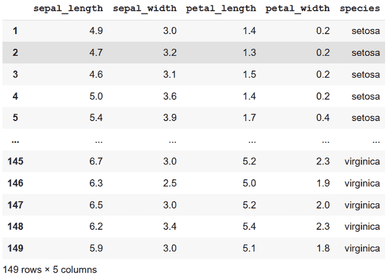
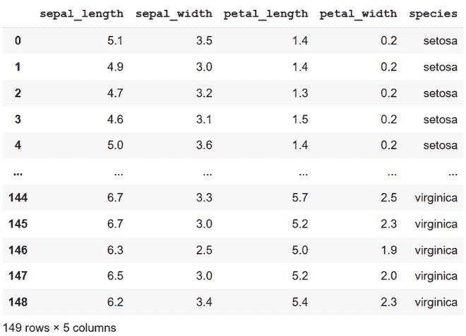
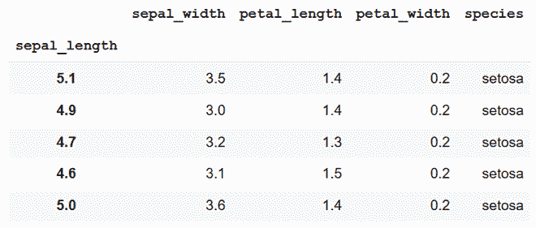
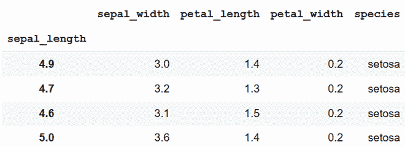
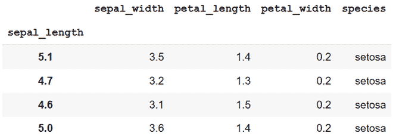
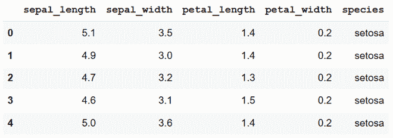
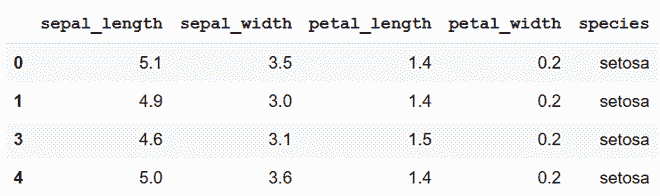
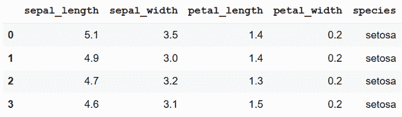

# 如何用 Python 只删除 CSV 中的一行？

> 原文:[https://www . geeksforgeeks . org/如何使用 python 删除仅一行 CSV/](https://www.geeksforgeeks.org/how-to-delete-only-one-row-in-csv-with-python/)

**先决条件:**T2】熊猫

人们可以通过熊猫库在 Python 中打开和编辑 CSV 文件。编辑文件时，可能需要删除文件中的整行。以下是一些不同的方法来做到这一点:

**正在使用的数据集:** [iris.csv 数据集](https://gist.githubusercontent.com/curran/a08a1080b88344b0c8a7/raw/0e7a9b0a5d22642a06d3d5b9bcbad9890c8ee534/iris.csv)

### 方法 1:使用切片

此方法仅适用于从数据集中移除第一行或最后一行。下面两行代码虽然意思相同，但代表了。大熊猫的 iloc[]方法。

**语法:**

> df . ilog[<row_number>、 <column_number>]</column_number></row_number>

或者

> df . ilog[

**方法:**移除第一行

*   导入库
*   用 python 加载数据集
*   使用切片移除第一行。由于索引列默认为数字，因此索引标签也将是整数。

(将删除 0 个索引，因为 python 中的索引从 0 开始):

**程序:**

## 蟒蛇 3

```
import pandas as pd

url = "https://gist.githubusercontent.com/curran/a08a1080b88344b0c8a7/raw/0e7a9b0a5d22642a06d3d5b9bcbad9890c8ee534/iris.csv"
df = pd.read_csv(url)

df = df.iloc[1:]

print(df)
```

**输出**



删除第一行

**方法:**删除最后一行

*   导入库
*   用 python 加载数据集
*   使用切片删除最后一行。由于索引列默认为数字，因此索引标签也将是整数。

(这里-1 代表数据的最后一行)

**程序:**

## 蟒蛇 3

```
import pandas as pd

url = "https://gist.githubusercontent.com/curran/a08a1080b88344b0c8a7/raw/0e7a9b0a5d22642a06d3d5b9bcbad9890c8ee534/iris.csv"
df = pd.read_csv(url)

df = df.iloc[:-1]

print(df)
```

**输出**



删除最后一行

### 方法 2:使用 drop()方法

使用标签删除意味着行的名称在代码中指定，而使用索引意味着行的索引(位置/行号从 0 开始)在代码中指定。

**使用中的数据集:**



子集–前 5 项

**方法:**使用行标签

*   进口熊猫图书馆
*   加载数据集
*   选择所需数据
*   使用行标签(这里是 5.1)删除对应于同一标签的行。标签可以是任何数据类型(字符串、整数或浮点数等)。

**程序:**

## 蟒蛇 3

```
import pandas as pd

url = "https://gist.githubusercontent.com/curran/a08a1080b88344b0c8a7/raw/0e7a9b0a5d22642a06d3d5b9bcbad9890c8ee534/iris.csv"
df = pd.read_csv(url)

# 2.
df_s = df[:5]

# 3.
df_s.set_index('sepal_length', inplace=True)

# 4.1.
df_s = df_s.drop(5.1)

print(df_s)
```

**输出**



使用行标签

**方法:**使用行索引

*   进口熊猫图书馆
*   加载数据集
*   选择所需数据
*   使用行索引时，需要传递要删除的行的索引。

df.index[ ]将索引号作为从 1 开始的参数，而在 python 中，索引从 0 开始。

**程序:**

## 蟒蛇 3

```
import pandas as pd

url = "https://gist.githubusercontent.com/curran/a08a1080b88344b0c8a7/raw/0e7a9b0a5d22642a06d3d5b9bcbad9890c8ee534/iris.csv"
df = pd.read_csv(url)

df_s = df[:5]

df_s.set_index('sepal_length', inplace=True)

df_s = df_s.drop(df_s.index[1])
#df_s.drop(df_s.index[1],inplace = True)

print(df_s)
```

**输出**



使用行索引

### 方法 3:移除使用条件

**使用中的数据集:**



子集–前 5 项

**方法 1:**

*   导入模块
*   加载数据
*   选择所需数据
*   查找指定了指定条件的行
*   使用 drop()方法，并将提取的行的索引作为参数传递给 drop 方法。

**程序:**

## 蟒蛇 3

```
import pandas as pd

url = "https://gist.githubusercontent.com/curran/a08a1080b88344b0c8a7/raw/0e7a9b0a5d22642a06d3d5b9bcbad9890c8ee534/iris.csv"
df = pd.read_csv(url)

df_s1 = df[:5]

df_s1 = df_s1.drop(df_s1[(df_s1.sepal_length == 4.7) &
                         (df_s1.petal_length == 1.3)].index)

print(df_s1)
```

**输出**



第一种方法——有条件移除

**方法 2:**

*   导入模块
*   加载数据
*   选择所需数据
*   使用 query()方法查找指定指定条件的行
*   使用 drop()方法，并将提取的行的索引作为参数传递给 drop 方法。

**程序:**

## 蟒蛇 3

```
import pandas as pd

url = "https://gist.githubusercontent.com/curran/a08a1080b88344b0c8a7/raw/0e7a9b0a5d22642a06d3d5b9bcbad9890c8ee534/iris.csv"
df = pd.read_csv(url)

df_s1 = df[:5]

df_s1 = df_s1.drop(df_s1.query('sepal_length==5.0').index)

print(df_s1)
```

**输出:**



第二种方法——有条件移除