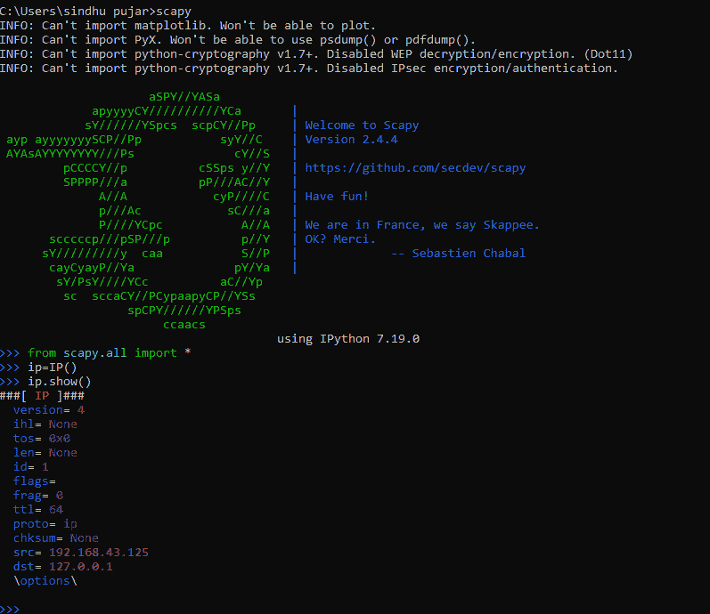
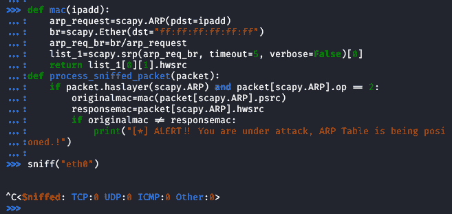

# 如何利用 Python 中的 Scapy 检测 ARP 欺骗攻击？

> 原文:[https://www . geesforgeks . org/如何检测-ARP-欺骗-攻击-使用 python 中的 scapy/](https://www.geeksforgeeks.org/how-to-detect-arp-spoof-attack-using-scapy-in-python/)

**ARP 欺骗**也称为 ARP 中毒，这是一种网络攻击，恶意用户通过**局域网**发送**伪造的 ARP(地址解析协议)消息**。这导致攻击者的媒体访问控制地址与网络上合法计算机或服务器的 IP 地址相链接。

在这里，我们将执行被动监控或扫描来嗅探网络中的数据包。在我们收到一个 ARP 数据包后，有两件事需要分析，如果它们不匹配，用户将受到 ARP 欺骗攻击。为了欺骗和检测网络内部的 ARP 数据包，使用 Python 中的 Scapy 借助于 MAC 地址和接口来执行 ARP 数据包的检测。

*   源媒体访问控制地址
*   发送方的真实媒体访问控制地址

## 什么是 Scapy？

**Scapy** 是一个用于计算机网络的数据包操纵工具，最初是用 Python 编写的。它可以伪造或解码数据包，通过网络发送，捕获，匹配请求和回复。它还可以处理扫描、跟踪路由、探测、单元测试、攻击和网络发现等任务。它在 Linux、macOS 和 Windows 上运行，但是最新版本的 Scapy 支持 Windows 开箱即用，因此也可以在 Windows 机器上使用 Scapy 的所有功能。Scapy 可以执行以下操作

*   制作任何数据包并进行编码
*   嗅探网络数据包
*   发送有效/无效帧
*   注入自己的 802.11 帧
*   编辑网络数据包
*   扫描网络
*   跟踪路由和探测
*   攻击网络和网络发现。

## 软盘安装

要安装 Scapy，必须安装 Python 2.7 或 Python 3.9+版本。如果没有安装，请参考本 [Python 安装](https://www.geeksforgeeks.org/download-and-install-python-3-latest-version/)。为了防止恶意拦截，请使用动态 ARP 检查，这是一项安全功能，可以自动拒绝检测到的恶意 ARP 数据包。

### Linux 操作系统

对于一个 Linux 用户来说，在没有 libcap 的情况下运行 scapy 是可能的。

*   安装 **tcpdump** 并确保其在 **$PATH** 中

```
$ sudo apt-get tcpdump
```

*   内核必须选择数据包套接字–**配置数据包**
*   如果内核小于 2.6，确保选择了套接字过滤–**配置 _ 过滤器**

在 Linux 上安装 Scapy 的另一种方法是在 Linux 机器上安装 Python，然后在 Python Shell 中安装 Scapy 包。

```
$ sudo apt-get install python3
```

在终端安装 python 后，打开 python shell 并执行命令安装 scapy，然后使用 scapy 进行 ARP 欺骗检测打开 Scapy 编写您的代码，以便欺骗和检测网络内部的数据包，

```
$ sudo apt-get install scapy (OR)
$ python -m install scapy
$ python
>> scapy
```

### Debian/Fedora/Ubuntu

```
# Debian
$ sudo apt-get install tcpdump

# Fedora 
$ yum install tcpdmp
```

然后通过 pip 或 apt 安装 Scapy。所有依赖项都可以通过特定于平台的安装程序或 PyPI 来安装

### Windows 操作系统

要在 windows 上安装 scapy，可以通过命令提示符轻松完成，但是对于 Windows，Python 也应该预先安装在系统上。然后将执行安装 scapy 的命令。

```
C:\> python -m install python-scapy
C:\> python
>> scapy
```

现在让我们开始使用 Python 中的 Scapy 进行 ARP 欺骗攻击检测



## 利用 Scapy 检测 ARP 欺骗攻击

现在我们已经成功地在系统上安装了 python 和 scapy，让我们继续从 scapy 导入必要的库。

## 蟒蛇 3

```
# importing libraries form scapy
from scapy.all import Ether, ARP, srp, sniff, conf
import scapy as scapy

# to import all libraries from scapy
# irrespective of which one to use execute the code
from scapy.all import *
```

该程序将检测任何类型的数据包是否有一层欺骗的 ARP 来执行代码。**嗅探()功能**将进行**回调**以应用于将被嗅探的每个数据包。在 **store=False 告诉 sniff()** 函数丢弃嗅探到的数据包，而不是将其存储在内存中，这在脚本运行很长时间时非常有用。

```
Use this code to check the interface of the machine you want to sniff
>> conf.iface
```

## 蟒蛇 3

```
# importing all libraries of scapy
import scapy.all as scapy

# taking interface of the system as an argument
# to sniff packets inside the network
def sniff(interface):
    # store=False tells sniff() function to discard sniffed packets
    scapy.sniff(iface=interface, store=False, prn=process_sniffed_packet)

def process_sniffed_packet(packet):
  # if it is an ARP Packet and if it is an ARP Response
    if packet.haslayer(scapy.ARP) and packet[scapy.ARP].op == 2:
        print(packet.show())

# machine interface is "eth0", sniffing the interface
sniff("eth0")
```

嗅探到 **eth0** 接口后，会显示该接口的内容，这里我们看到该接口是**以太网**，其相关内容显示为 **IP 目的地(dst)、接口类型(ARP)、源(src)**


创建一个功能 **mac** ，给定的 IP 地址使用 arp 功能发出/创建一个 ARP 请求 **arp_request，并检索实际的 mac 地址而不是 IP 地址。使用以太功能将广播媒体访问控制地址设置为**“ff:ff:ff:ff:ff”**。 **srp 功能**返回响应数据包的两个 IP 地址列表。具有所请求的匹配 IP 地址的媒体访问控制地址将存储在 **hwsrc** 字段中。**

将创建一个函数来获取媒体访问控制地址并处理嗅探到的数据包，在变量**中获取旧媒体访问控制的值，在响应中获取媒体访问控制的值作为变量 **repsonsemac。** Scapy 在字段**“op”**中编码 ARP 数据包类型进行操作，默认 op 为 1 或**“谁有”**，这是一个 ARP 请求。**

## 蟒蛇 3

```
# code to get MAC Address
def mac(ipadd):
  # requesting arp packets from the IP address 
  # if it's wrong then will throw error
    arp_request = scapy.ARP(pdst=ipadd)
    br = scapy.Ether(dst="ff:ff:ff:ff:ff:ff")
    arp_req_br = br / arp_request
    list_1 = scapy.srp(arp_req_br, timeout=5, 
                       verbose=False)[0]
    return list_1[0][1].hwsrc

# defining function to process sniffed packet
def process_sniffed_packet(packet):
  # if it is an ARP packet and if it is an ARP Response
    if packet.haslayer(scapy.ARP) and packet[scapy.ARP].op == 2:

       # originalmac will get old MAC whereas
        originalmac = mac(packet[scapy.ARP].psrc)
        # responsemac will get response of the MAC
        responsemac = packet[scapy.ARP].hwsrc
```

现在比较这两个值，检查它们是否相似。如果它们不相似，这意味着这些值被欺骗了。比较的值是真实的媒体访问控制地址和响应媒体访问控制地址。

## 蟒蛇 3

```
# comparing values of real MAC Address and response MAC Address
if originalmac != responsemac:
    print("[*] ALERT!!! You are under attack, ARP table is being poisoned.!")
```



以下是完整的代码

## 蟒蛇 3

```
# Implementing ARP Spoof Attack Detection Using Scapy

# import modules
import scapy.all as scapy

# code to get MAC Address
def mac(ipadd):
  # requesting arp packets from the IP address
  # if it's wrong then will throw error
    arp_request = scapy.ARP(pdst=ipadd)
    br = scapy.Ether(dst="ff:ff:ff:ff:ff:ff")
    arp_req_br = br / arp_request
    list_1 = scapy.srp(arp_req_br, timeout=5,
                       verbose=False)[0]
    return list_1[0][1].hwsrc

# taking interface of the system as an argument
# to sniff packets inside the network
def sniff(interface):
    # store=False tells sniff() function 
    # to discard sniffed packets
    scapy.sniff(iface=interface, store=False, 
                prn=process_sniffed_packet)

# defining function to process sniffed packet
def process_sniffed_packet(packet):
  # if it is an ARP packet and if it is an ARP Response
    if packet.haslayer(scapy.ARP) and packet[scapy.ARP].op == 2:

       # originalmac will get old MAC whereas
        originalmac = mac(packet[scapy.ARP].psrc)
        # responsemac will get response of the MAC
        responsemac = packet[scapy.ARP].hwsrc

# machine interface is "eth0", sniffing the interface
sniff("eth0")
```

**输出:**

<video class="wp-video-shortcode" id="video-567456-1" width="640" height="360" preload="metadata" controls=""><source type="video/mp4" src="https://media.geeksforgeeks.org/wp-content/uploads/20210303214516/vid.mp4?_=1">[https://media.geeksforgeeks.org/wp-content/uploads/20210303214516/vid.mp4](https://media.geeksforgeeks.org/wp-content/uploads/20210303214516/vid.mp4)</video>