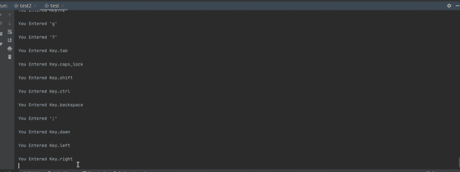

# 如何使用 Python 检测特定按键是否被按下？

> 原文:[https://www . geeksforgeeks . org/如何使用 python 检测特定按键是否被按下/](https://www.geeksforgeeks.org/how-to-detect-if-a-specific-key-pressed-using-python/)

在本文中，我们将学习如何检测用户是否按下了特定的键。检测一个键对于一个编码器来说是非常重要的，因为程序的整个执行仅仅依赖于单个/模式键的按下。
你可能在日常生活中体验到，在你的 PIN 码刚一按下回车键，整个 ATM 交易要么被接受，要么被拒绝。同样，你会在日常生活中看到很多活生生的例子。
整个模块分为 3 段，第一段处理简单整数，第二段处理字母数字字符，第三段我们将使用 python 模块来检测一个键。

**方法 1:** 使用 [pynput。](https://www.geeksforgeeks.org/how-to-use-pynput-to-make-a-keylogger/)

在这个方法中，我们将使用 pynput python 模块来检测任何按键。“pynput.keyboard”包含用于控制和监视键盘的类。它从任何地方调用 pynput.keyboard.Listener. stop，或者从回调返回 False 来停止侦听器。该库允许您控制和监控输入设备。

**进场:**

*   输入键，从键盘输入监听器
*   创建 with 语句:with 语句用于用上下文管理器定义的方法包装块的执行。
*   定义函数

安装时，将此代码运行到您的终端中。

```
pip install pynput
```

**例 1:** 这里你会看到哪个键被按下了。

## 蟒蛇 3

```
from pynput.keyboard import Key, Listener

def show(key):

    print('\nYou Entered {0}'.format( key))

    if key == Key.delete:
        # Stop listener
        return False

# Collect all event until released
with Listener(on_press = show) as listener:   
    listener.join()
```

**输出:**



**示例 2:** 在这里，您可以检测特定的键是否被按下。

## 蟒蛇 3

```
from pynput.keyboard import Key, Listener

def show(key):

    if key == Key.tab:
        print("good")

    if key != Key.tab:
        print("try again")

    # by pressing 'delete' button 
    # you can terminate the loop 
    if key == Key.delete: 
        return False

# Collect all event until released
with Listener(on_press = show) as listener:
    listener.join()
```