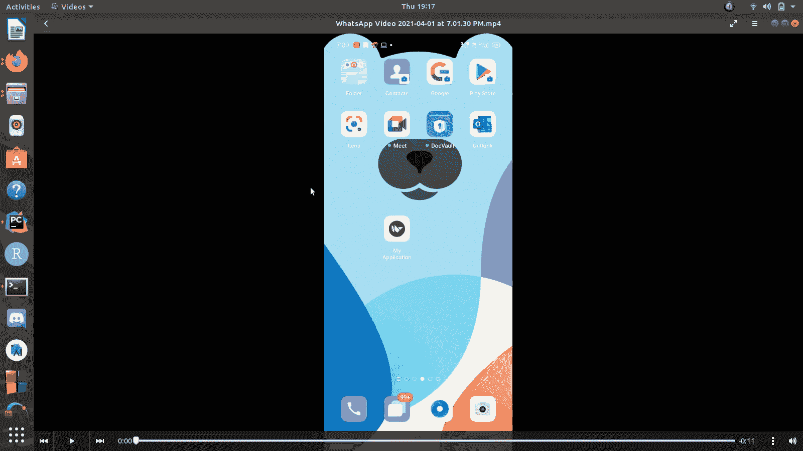

# 【kivy app 如何禁用安卓上的后退按钮？

> 原文:[https://www . geesforgeks . org/如何禁用 kivy-app 上的安卓后退按钮/](https://www.geeksforgeeks.org/how-to-disable-back-button-on-android-for-kivy-app/)

在本文中，我们将使用 python 的 kivy 框架开发一个 GUI 窗口，并且我们将从窗口中禁用 android back 按钮。

### 方法

*   当 kivy 应用程序启动时， **on_start()** 方法将自动调用，该方法将从 kivy 导入**事件循环**。
*   使用这个 EventLoop，我们将一个方法 **hook_keyboard()** 绑定到当前窗口，用于检测按键按下情况，这意味着每当我们按下任何一个键，这个 hook_keyboard()方法都会自动调用，它会检查我们是否按下了后退按钮(这个后退按钮的代码是 27)。
*   然后，我们检查我们是否在主屏幕上，如果是，那么我们只需返回真(这个应用程序将被终止)，否则我们不会返回任何东西，这个程序也不会在按键时做任何事情。

### 履行

## 蟒蛇 3

```
# importing kivy App
from kivy.app import App

# importing BoxLayout from kivy
from kivy.uix.boxlayout import BoxLayout

# importing ScreenManager and Screen from kivy
from kivy.uix.screenmanager import ScreenManager, Screen

class MainWindow(BoxLayout):
    pass

class uiApp(App):
    def on_start(self):
        from kivy.base import EventLoop

        # attaching keyboard hook when app starts
        EventLoop.window.bind(on_keyboard=self.hook_keyboard)

    def hook_keyboard(self, window, key, *largs):

        # key == 27 means it is waiting for 
        # back button tobe pressed
        if key == 27:

            # checking if we are at mainscreen or not
            if self.screen_manager.current == 'mainscreen':

                # return True means do nothing
                return True
            else:

                # return anything except True result in 
                # closing of the app on button click
                # if are not at mainscreen and if we press 
                # back button the app will get terminated
                pass

    def build(self):
        self.screen_manager = ScreenManager()

        # adding Designed screen to ScreenManager
        self.mainscreen = MainWindow()
        screen = Screen(name='mainscreen')
        screen.add_widget(self.mainscreen)
        self.screen_manager.add_widget(screen)

        # returning screen manager
        return self.screen_manager

if __name__ == "__main__":

    # running the object of app
    uiApp().run()
```

**输出:**



这是可视屏幕的主要设计:

```
<MainWindow>:
    BoxLayout:
    BoxLayout:
        canvas.before:
            Color:
                rgba:[0,1,0,1]
            Rectangle:
                pos:self.pos
                size:self.size
    BoxLayout:
```

**注**:这款应用在电脑上运行不会做任何事情，它只是在电脑上显示一个屏幕，而这款应用的输出可以在安卓设备上完美检查。