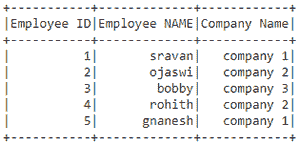
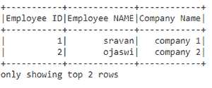
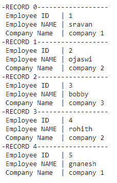
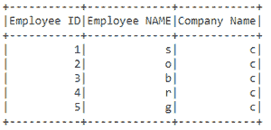
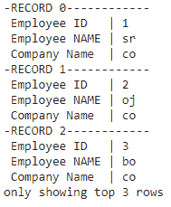
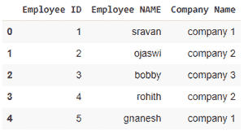

# 如何以表格格式显示 PySpark 数据帧？

> 原文:[https://www . geesforgeks . org/how-display-a-py spark-data frame-in-table-format/](https://www.geeksforgeeks.org/how-to-display-a-pyspark-dataframe-in-table-format/)

在本文中，我们将以表格格式显示 PySpark 数据帧的数据。我们将使用 **show()** 功能和**topands**功能以所需的格式显示数据帧。

**show():** 用于显示数据帧。

> **语法** : dataframe.show( n，垂直= True，截断= n)
> 
> **在哪里，**
> 
> 1.  数据帧是输入数据帧
> 2.  n 是要从顶部显示的行数，如果未指定 n，它将打印数据框中的整行
> 3.  vertical 参数指定以垂直格式显示的数据框中的数据(如果为 true ),否则它将像数据框一样以水平格式显示
> 4.  truncate 是一个参数 us，用于修剪数据框中作为要修剪的数字给出的值

**toPanads():** Pandas 代表一种面板数据结构，用于以像表格一样的二维格式表示数据。

> **语法** : dataframe.toPandas()
> 
> **其中，**数据帧是输入数据帧

让我们创建一个示例数据帧。

## 蟒蛇 3

```py
# importing module
import pyspark

# importing sparksession from
# pyspark.sql module
from pyspark.sql import SparkSession

# creating sparksession and giving
# an app name
spark = SparkSession.builder.appName('sparkdf').getOrCreate()

# list  of employee data with 5 row values
data = [["1", "sravan", "company 1"],
        ["2", "ojaswi", "company 2"],
        ["3", "bobby", "company 3"],
        ["4", "rohith", "company 2"],
        ["5", "gnanesh", "company 1"]]

# specify column names
columns = ['Employee ID', 'Employee NAME', 'Company Name']

# creating a dataframe from the lists of data
dataframe = spark.createDataFrame(data, columns)

print(dataframe)
```

**输出:**

> 数据框[员工标识:字符串，员工姓名:字符串，公司名称:字符串]

**示例 1:** 使用不带参数的 show()函数。它将产生我们所拥有的整个数据帧。

## 蟒蛇 3

```py
# Display df using show()
dataframe.show()
```

**输出:**



**示例 2:** 使用以 n 为参数的 show()函数，显示前 n 行。

> **语法:**数据帧显示(n)
> 
> 其中，n 是一行

**代码:**

## 蟒蛇 3

```py
# show() function to get 2 rows
dataframe.show(2)
```

**输出:**



**例 3:**

使用 show()函数，垂直=真作为参数。垂直显示数据框中的记录。

> **语法:**数据帧显示(垂直)
> 
> 垂直可以是真的也可以是假的。

**代码:**

## 蟒蛇 3

```py
# display dataframe evrtically
dataframe.show(vertical = True)
```

**输出:**



**示例 4:** 使用 show()函数，参数为 truncate。在所有列的每个值中显示第一个字母

## 蟒蛇 3

```py
# display dataframe with truncate
dataframe.show(truncate = 1)
```

**输出:**



**示例 5:** 对所有参数使用 show()。

## 蟒蛇 3

```py
# display dataframe with all parameters
dataframe.show(n=3,vertical=True,truncate=2)
```

**输出:**



**示例 6:** 使用 toPandas()方法，该方法将其转换为熊猫数据帧，该数据帧看起来非常像表格。

## 蟒蛇 3

```py
# display dataframe by using topandas() function
dataframe.toPandas()
```

**输出:**

