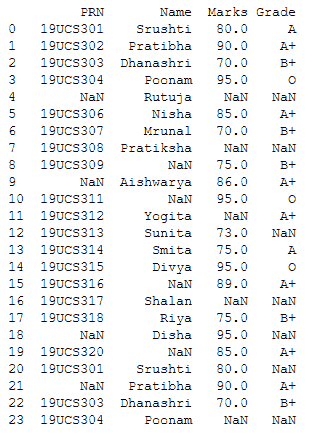
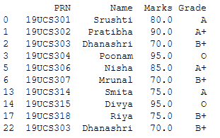
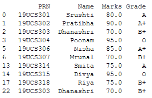
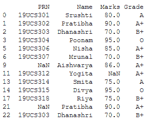

# 如何在 Python 数据框中显示非空的行和列？

> 原文:[https://www . geesforgeks . org/how-display-not null-行和列-in-a-python-dataframe/](https://www.geeksforgeeks.org/how-to-display-notnull-rows-and-columns-in-a-python-dataframe/)

在 Python 中，非空的行和列是指具有 **Nan** 值的行和列，尤其是在 Pandas 库中。为了在 python 数据框中显示非空的行和列，我们将使用不同的方法，如 dropna()，not null()，loc[]。

*   [**【drop na()**](https://www.geeksforgeeks.org/python-pandas-dataframe-dropna/):此功能用于删除缺失值为 NaN 值的行和列。dropna()函数有轴参数。如果设置为 0，那么它将删除所有具有 NaN 值的行，如果设置为 1，那么它将删除所有具有 NaN 值的列。默认情况下，轴参数的值为 0。
*   [**【not null()**](https://www.geeksforgeeks.org/python-pandas-dataframe-notnull/):此函数检测非缺失值，并为 DataFrame 中的每个元素返回一个布尔值掩码，该掩码指示某个元素是否不是安娜值。
*   [**【loc】**](https://www.geeksforgeeks.org/python-pandas-dataframe-loc/):此方法通过标签或布尔数组过滤行和列。在我们的例子中，这个方法通过一个由 notnull()方法返回的布尔数组来过滤行。

**步骤:**

*   进口熊猫图书馆
*   阅读 CSV 文件，或者您可以创建自己的数据框。
*   如下所述，使用 dropna()、notnull()、loc[]等方法之一。
*   显示结果

**下图**[**studentdata . CSV**](https://drive.google.com/file/d/1BMuemPte3-adbit0P_wJ4CRasjv7x88E/view?usp=sharing)**文件中使用的** **程序:**



**方法 1:使用 dropna()方法**

在此方法中，我们使用 dropna()方法，该方法删除空行并显示修改后的数据框。

## 蟒蛇 3

```
# Import library
import pandas as pd

# Reading csv file
df = pd.read_csv('StudentData.csv')

# using dropna() method
df = df.dropna()

# Printing result
print(df)
```

**输出:**



**方法二:使用 notnull()和 dropna()方法**

在这个方法中，我们将首先使用 notnull()方法，该方法返回一个具有真值和假值的布尔对象。如果有 NaN 值，它将返回 false，否则返回 true。然后将这些布尔对象作为输入参数提供给 where 函数，与此函数一起使用 drpna()删除 NaN 行。

## 蟒蛇 3

```
# Import library
import pandas as pd

# Reading csv file
df = pd.read_csv('StudentData.csv')

# using notnull() method ,it will return 
# boolean values
mask = df.notnull()

# using dropna() method to drop NaN 
# value rows
df = df.where(mask).dropna()

# Displaying result
print(df)
```

**输出:**



**方法 3:使用 loc[]和 notnull()方法**

在这个方法中，我们使用了两个概念，一个是方法，另一个是属性。因此，首先，我们找到一个每个特定列都有非空实例的数据框，然后在整个数据中定位实例以获得数据框。

## 蟒蛇 3

```
# Import library
import pandas as pd

# Reading csv file
df = pd.read_csv('StudentData.csv')

# Here filtering the rows according to 
# Grade column which has notnull value.
df = df.loc[df['Grade'].notnull()]

# Displaying result
print(df)
```

**输出:**

如输出图像所示，只有等级为的行！=显示 NaN。

